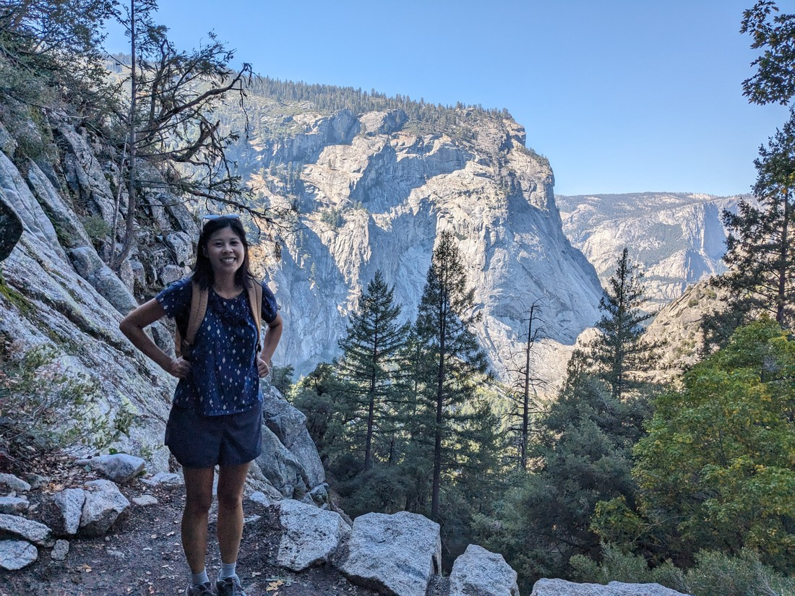

Today we're returning to Yosemite, and things are a lot different to yesterday. The sky is blue and we're early. This was the Yosemite that we wanted.

> We even had time to stop and take a picture with the park sign

Actually we're not that early, but more on that later. Today we plan to hike inside the valley - which is where all the trees and pleasant weather is.

> And upward views of stunning cliffs

We hadn't yet done the park's most popular hike. This was a 10 kilometre, 4+ hour loop to two waterfalls. We managed to secure parking outside the "village" we stayed in last time. Then we had to wait to catch the bus to where the walk starts.

At the start of the trail was a sign warning about bears. It was meant to educate how far away you should stay if you see a bear. However again, this is the most heavily trafficked path in the park. I don't think we're going to see any bears. And to show how un-serious I was taking this warning I then proceed to fake-ride the sign.

> It's funny - if this was a real bear then this would be really scary

The first part of the trail was fully paved and not as flat as I was expecting.

> This is just a photo stop - not a catch my breath stop

Were it not for all the people around, you can tell when a walk is super popular based on how ball-shaped the squirrels are.

> "Don't eat human food!"

The most popular part of this path is called the Mist Trail. We don't know much about it other than it is closed for maintenance on weekdays. And yep - today is a weekday. Fortunately it is only closed until 3pm. Our plan is to go the other way round the loop and hopefully if we take enough time it will be 3pm by the time we get to the Mist section.

For now we had to take the John Muir trail, which is unpaved but otherwise still an excellent trail. The John Muir trail runs all the way back to Sequoia National Park and is part of the prestigious Pacific Crest Trail. But that's a bit more ambitious than what we're doing today.

The path started climbing giving us some nice lookouts back towards the main valley. It was certainly stunning - the far walls were awash with sunlight. But something we noticed is that our photos we were taking were a bit lacklustre. This was because when we stood in the foreground we were still in shadow.

I suppose it's a blessing that we still had shade this late in the morning. We are going up a pretty steady incline after all.

We arrived at the next junction and were greeted with the sight of a waterfall.

> Also a dome

But which waterfall is this? There's two on this trail - Vernal and Nevada. Had we been able to walk the Mist trail first then we would have encountered Vernal first with Nevada being the furthermost point in the loop. Judging distances is hard so while we had taken a photograph of the trail map, we still weren't sure which this was.

We soon figured out it was Nevada Falls. We're not sure where Vernal Falls was but we missed it (although we will see it later).

> Getting closer

It was around this time we figured we should stop for lunch. Except we were currently on a path looking out toward Nevada Falls with a steep drop on one side and a solid rock wall on the other.

So naturally we figured, why not stop here?

> After all the view is excellent

It was a bit close to the people walking by (and also very close to the cliff edge) but it was a scenic place to eat our Subway sandwich.

The top of Nevada falls is also the furthermost point in the loop. From here you also get the highest view back over this section of the valley.

> At the top of those cliffs is Glacier Point - where we were yesterday. It would be a lot nicer to be up there today.

Some might say this would have been a better place to eat lunch, considering it was only five minutes of walking from that scary ledge where we stopped.

Naturally there was a lot of people up here. Fair enough since there's a waterfall, a ridge-like view, a stream and pool - lots of places to take photos.

> Wasn't actually that comfy - don't know why I wanted to do this

There's a fair chance many of these people are also doing the same thing we are - delaying their descent until 3pm. Anyway one of them wanted a photo with the big rock dome so we exchanged photos.

This should surprise no one but did you know that Betty and I are not the same height. This makes our selfies together a bit uneven. Sometimes Betty might stand on a raised area to help reduce the height difference and this is one of these times. However, I don't think we got it quite right.

> Angular Betty

After spending a while attempting to get a good view of the waterfall and failing (because we're standing directly above/behind it) we started down the path to continue our loop.

Here we got the best views of Nevada Falls yet.

> When we could find a gap in the trees anyway

Following the stream we came to the top of Vernal Falls. Like Nevada - we can't really see it from the top. However this one has a more pronounced edge where the water goes from flowing to falling. The lake above the waterfall had a very strict no swimming policy, probably for that reason.

To get down from the top of Vernal Falls it was now time to take the Mist Trail. There was still 10-15 minutes until 3 o'clock but it must have opened early. I could also see why this particular trail might need some work done on it occasionally.

> How did they even build this?

While Nevada falls was certainly nice (as well as taller), there was just something about Vernal falls that made it more pleasing somehow.

It was nice the path down ran so close to it too. At this time of the day there was even a consistent rainbow.

But boy was it busy here. I guess that's what happens when the most popular trail in the park is only open a few hours a day. We definitely had the right idea, coming down the steep trail. One pair of teenagers asked us how far they needed to walk - clearly already over all the stair climbing.

The mist trail ended up being shorter than we were expecting. Before long we were back on the paved trail that we started on. However the walk back was longer than I remembered. The shadows of the afternoon were starting to grow.

We didn't trust the buses to come on time so we walked back to our car. Then we stopped at the main gift shop on the way out of the park. Here Betty finally found some earrings she'd been thinking about since she first saw them in Glacier National Park in June, right before we left USA, and hasn't seen since. Luke had his eye (or more accurately - his nose) on some hot chips although sadly he reminded himself that we had food at home.

The last event for today is we were driving along the main road out of the park. This passed El Capitan and we noticed some people staring up at it. So we did a small stop.

In the shadow towards the bottom we spotted a bright orange... something. Someone was climbing El Capitan.

But we couldn't see much from this distance so we continued on relatively quickly.

So that was the Vernal + Nevada Falls loop. It is rated a staggering 4.9/5 on AllTrails. I think I said in a previous blog post that this type of rating is impossible unless only like 5 people have walked the trail. Well, this walk has 14,654 ratings - a lot more than 5. And honestly, it does deserve such a high rating - especially on a day like this.

I definitely think Yosemite is one of the best parks in the country. There's just something about the combination of landscape and climate that makes it quite the adventurer's paradise. It's a shame we weren't able to stay inside the park like last time. It's also a shame we had a couple of bad days of weather to start. However we do get to leave this continent knowing that we returned to where our North American parks journey all began and it was just as good as it was then.
