This sucks. Somehow it's already time to leave Yosemite. It feels like there's so much we haven't done. In fact, we made a list - of all the walks we could have done if we had one more day here. But no, we have 5.5 hours to drive today and Yosemite is in the opposite direction that we need to drive.

So we picked a walk that was \*only\* several hours long.

And only two hours drive from our AirBnB. It's a nice place to have stayed but staying outside Yosemite has meant a good chunk has been eaten away by driving in and out. But we can't complain since this trip was booked last minute, and the weather has been nice for two of the three days. Plus there is a lot more food places out here.

Much to Betty's chagrin she was hustled out the door before 8am.

We drove to the Tioga Road - which is a road that goes over the Tioga pass. This was the road that we needed to drive in 2019 to cross from California to Nevada. The road usually opens in late May for summer traffic. But in 2019 they had a hard winter and the road didn't open until mid June - two days before we needed to use it.

(Side story - we had some friends travelling in this area earlier this year and they were also planning to travel the Tioga Road. I told them our story but mentioned that they should be fine since they were visiting Yosemite in July. Well, nope - extra, extra helping of snow this year and the road stayed closed well into July.)

The walk we were planning was to Watkin Mountain. This trail wasn't on any of the official guides. It wasn't even on Google Maps. To find the start I had to cross reference Google Maps and Alltrails and put the destination in well in advance. We'll get no cellphone signal out here. There also wasn't even any signage at the start of the trail. Well, except for this one directing us back to Yosemite Valley.

> That's a bit further than we were expecting

Another couple had arrived a few minutes before us. They looked a bit lost so I checked and they were going to Watkin Mountain too. Also just as we were starting the walk another vehicle pulled up and asked if this was the Watkin Mountain trail. Seems like no one quite knows where this trail is.

There was also a potential problem. We needed to follow the Yosemite trail then turn off it to go to Watkin Mountain. But if there's no signs here, chances are there would be no signs at the turnoff. In fact, there was a barely an indication where the path was.

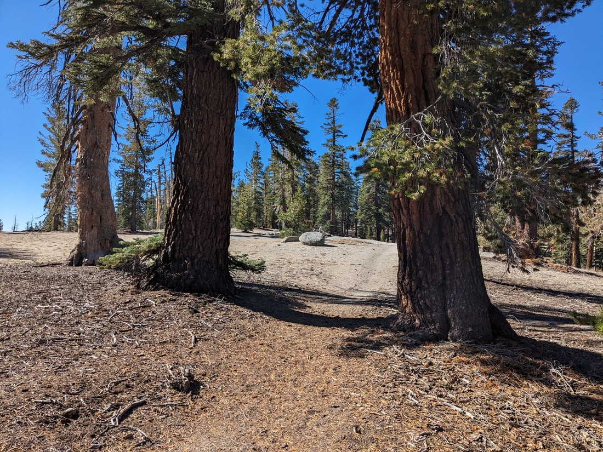

> As you can see the path was somehow hard to see

Fortunately I had put down another custom destination where I thought the turnoff might be and it's a good thing I did. The only reason we found the turnoff was because we knew roughly where to look for it.

As you can see from the photos the forest was rather sparse. I guess this is what you get at 2,600 metres above sea level. Yosemite has such a wide variety of forests. There's the dry, hot forest outside the park where we are staying. There's the lush forest in the canyon. Then there's this tundra.

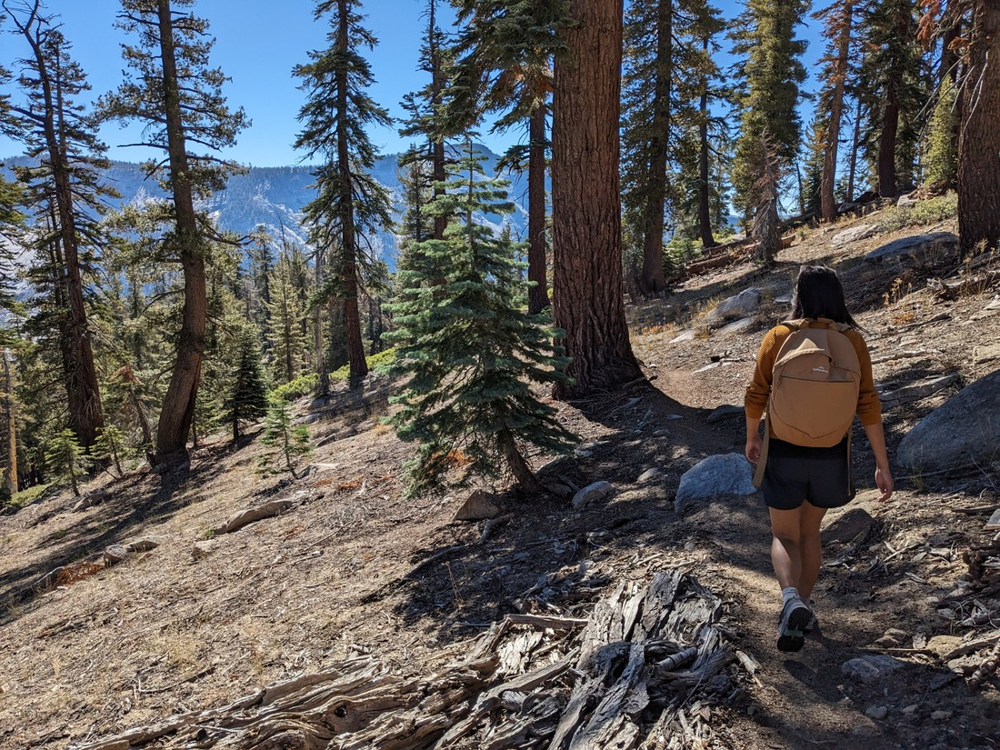

> Not a lot of shrubs and grasses

Once we got to a certain point in the trail we began to get views. The views weren't of much - just more rolling hills, but it was still nice. And especially today, with not a cloud in the sky.

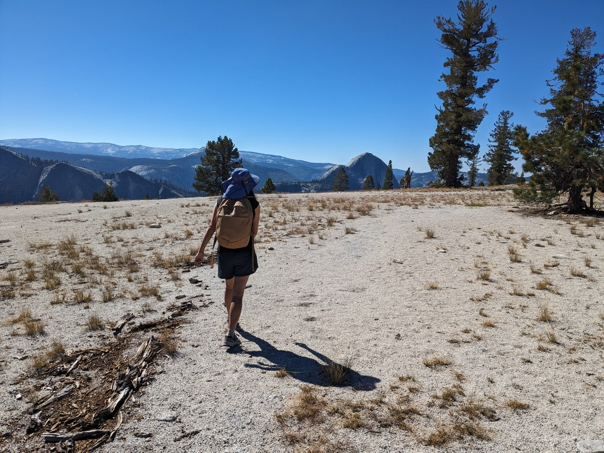

> It's somehow more blue than yesterday

This is what Sentinel Dome was supposed to feel like on Monday - this type of landscape, this type of weather. This is what we had back in 2019. I suppose we should count ourselves lucky that we got more of it. I heard that earlier in summer there was flooding in Yosemite.

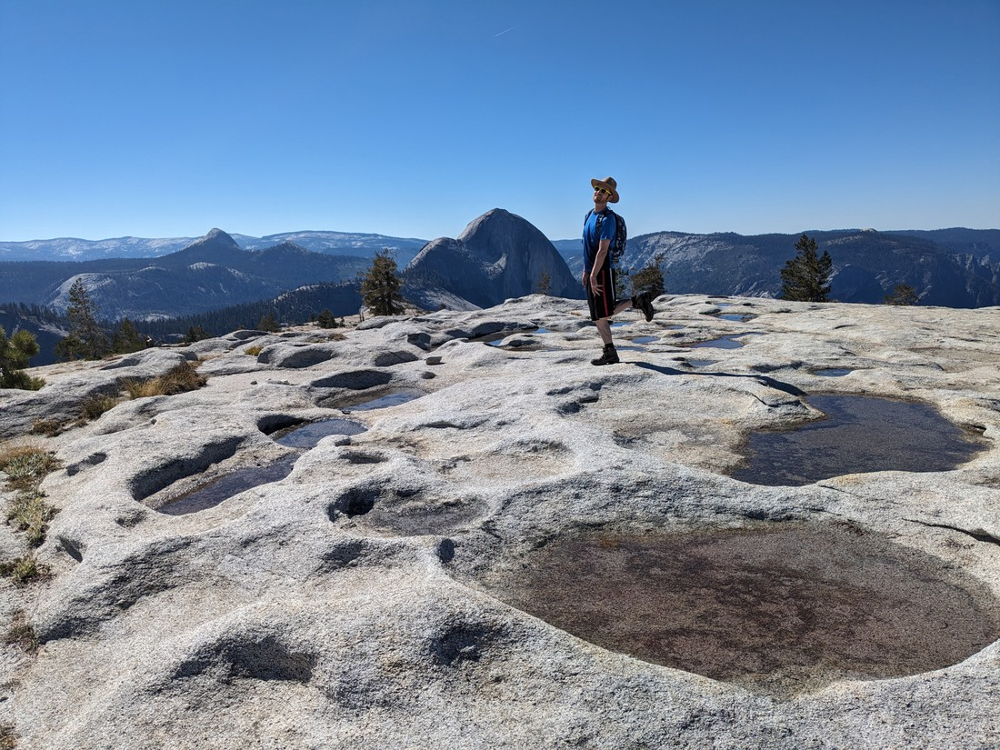

> In the valley anyway

Watkin Mountain wasn't much of a mountain. Sure it did feel like we were going up, but it didn't really have a peak. Like the many domed hills, it was kind of rounded so our angle of ascent just slowly lessened. Then we started going down.

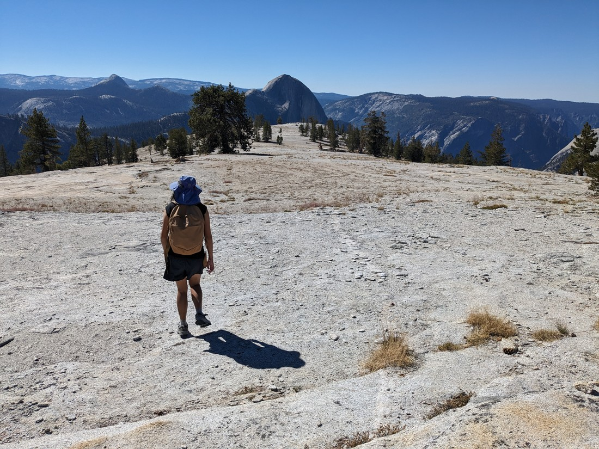

> This is the summit apparently

By this point we'd actually lost the trail. Or perhaps more accurately the trail had ceased to exist. There were no obvious places that a lot of people had walked before.

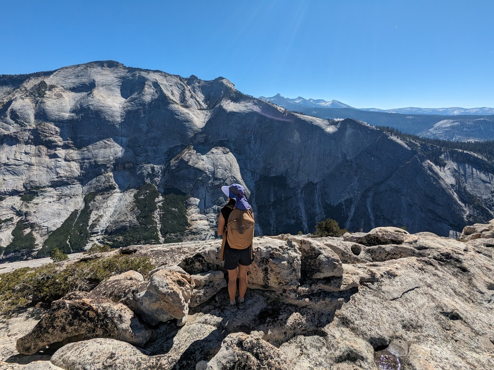

But I knew where we should be going - and where we would need to go to get back. As I said, we no longer had trees blocking our field of view. We could see where we were walking to and where we were walking from.

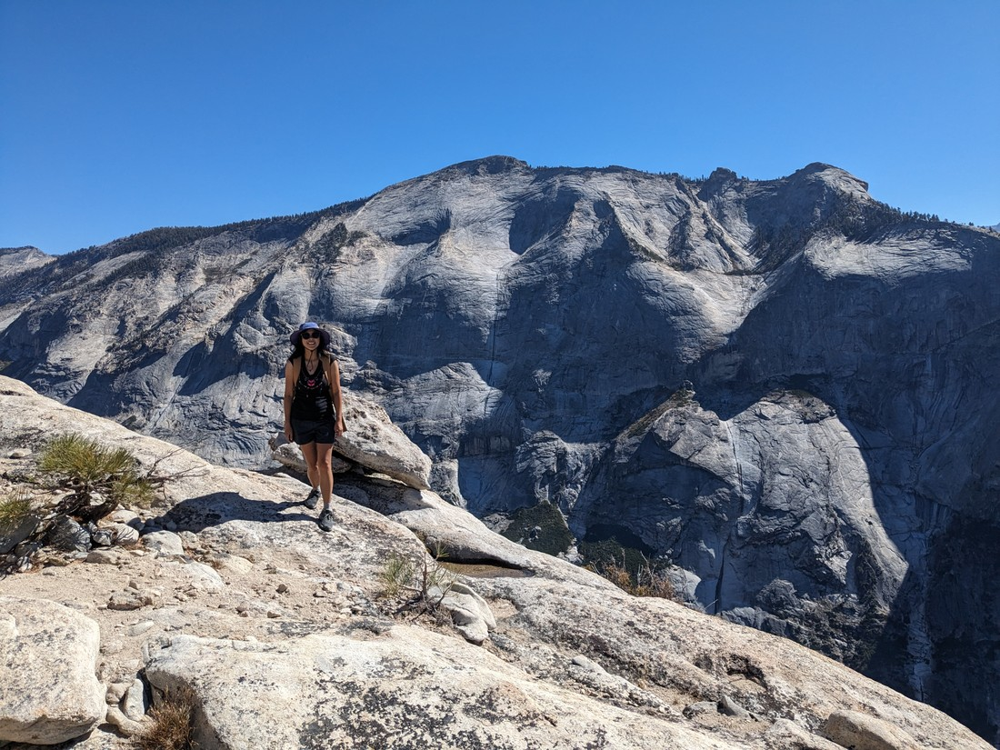

From the "summit" we descended, just following the highest parts of the hills. It feels wrong to call it a "ridge" because it was so rounded but that's what it was. And slowly the angle of descent started getting greater and greater until we got to a point where we felt we could now see well enough into Yosemite Valley.

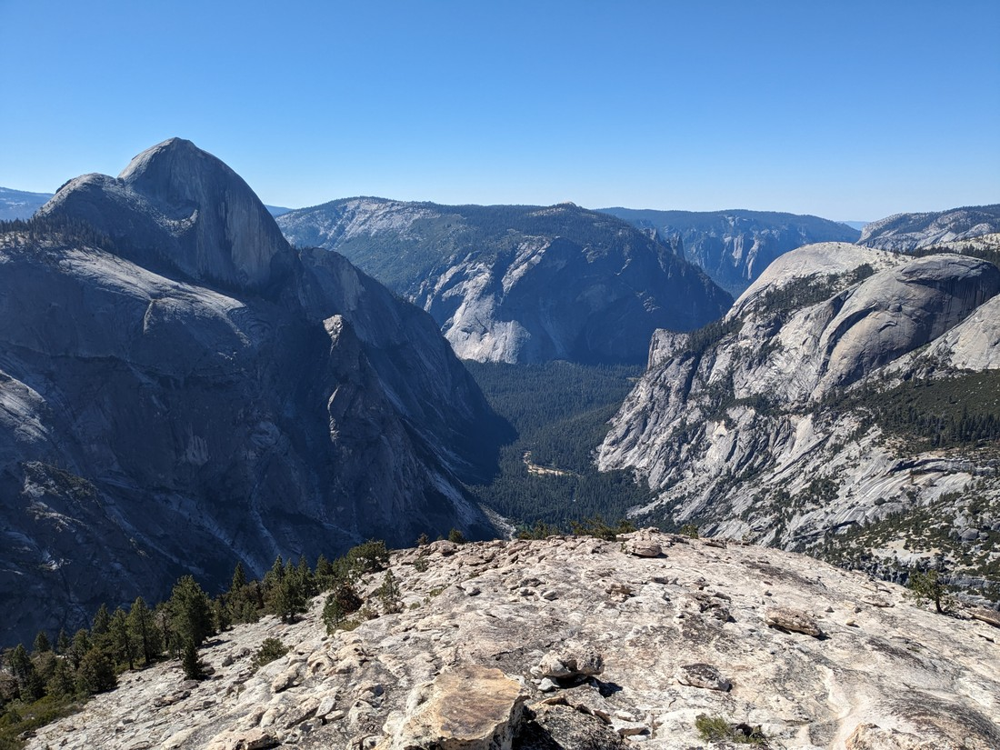

> There are roads, camping grounds, and a village of semi-glamping tents somewhere amongst those trees down there

The other couple had stopped about 100 metres earlier. But they shouldn't have - the extra distance improved the view quite a lot. However it did mean that we got to sit on the side of the mountain looking out over the valley and feel like we had the whole park all to ourselves. There was no need for any photo magic people removal in today's photos.

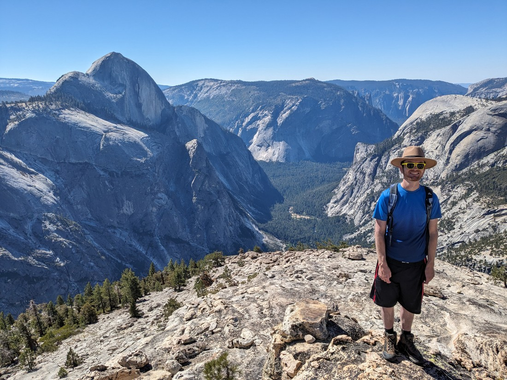

> Unless you think I should remove that blue guy

I think we hung out there for a long time - longer than we usually stop for, and probably longer than we should have (we have somewhere to be today). It's just so nice to be up here.

On the walk back (and once we found the trail again) we passed the people we had talked to at the very start. If I remember correctly, they and the other couple were the only other people on this trail. Sure this trail isn't well signposted but it's certainly a nice walk. But perhaps there are ample other walks up here on the Tioga road like this. Again, it sucks that we have to leave.

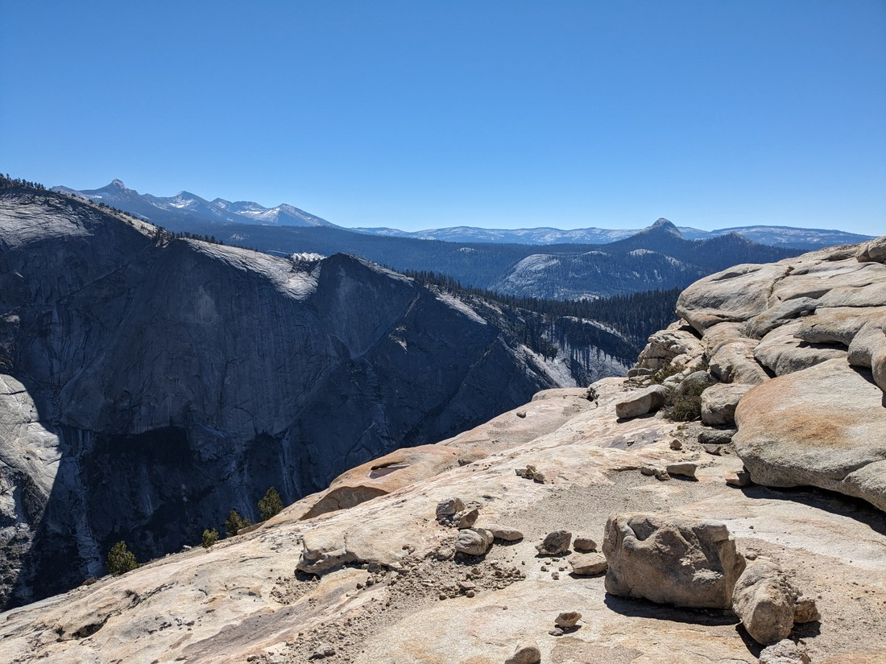

Afterwards we had to drive on to Santa Rosa. It took a long time to drive down from the hills of Yosemite. Again I was worried about our brakes. We never did get round to having them looked at. It also took us quite a while to find somewhere that had cell phone reception. While we knew where we needed to get to, we didn't know how to get there and so we needed to use Google Maps. There is no highway from Yosemite to Santa Rosa so we were taking a lot of backroads.

The sun set as we drove the Sears Point road, crossing the low lying marsh North of the San Pablo bay. It was an easy road to drive. One lane only, no offramps, with the orange glow from behind the hills providing the last illumination we'll get today. "Life is good". However we may have been thinking that because now the sun was no longer in our eyes. We had been driving west for several hours after all.

But then we were back to frenzied freeway driving now in full darkness. We definitely miss those long June evenings.

And that wraps up our time in the Californian mountains. We definitely didn't explore them to the fullest. Instead we just got a taste of what they offer. And when the weather was fine it sure was a good taste. However I still feel like we were only scratching the surface of what we could do at Yosemite and the Tioga Pass.

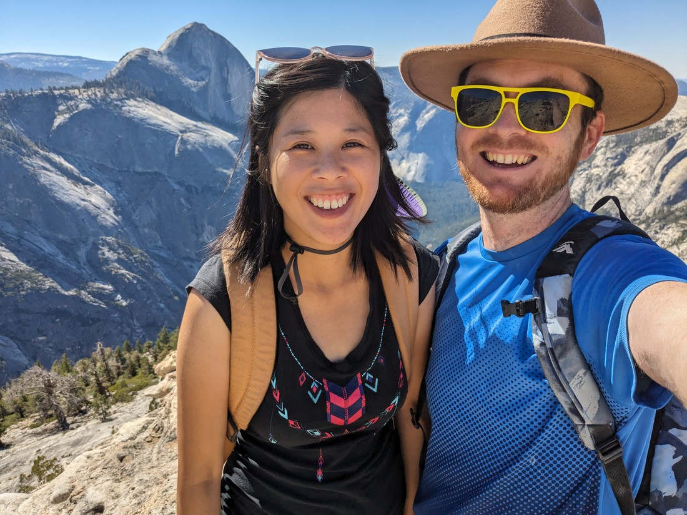

Maybe one day (probably a long time in the future) we'll do a thorough west USA holiday and we'll come back.
