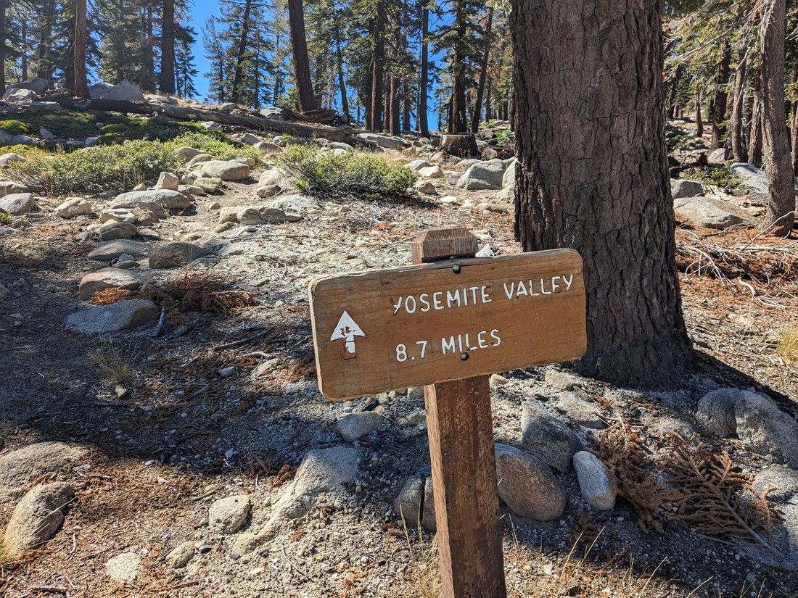

// A lot of walks we haven't done. Made a shortlist, but basically all required us to get up a bit earlier than usual.

// Decided to do a walk called Watkin Mountain. It was on the Tioga Road, which we hadn't seen before but it was almost an extra hour of drive for us

// The trailhead wasn't marked, but I had planned ahead and put down a marker on Google Maps. Arrived at the same time as a couple of other couples, but none of them seemed super confident about where the trail started.

// The trail went along a longer path, but then split off. Fortunately I had placed another marker on where the junction was, otherwise we totally would have missed it.

// A nice view

// Afterwards drove to Santa Rosa. Fell dark at 7pm while we were still driving, but that was a good thing because we were driving west and the sun had been a real issue. We did see two car accidents along the way though.
