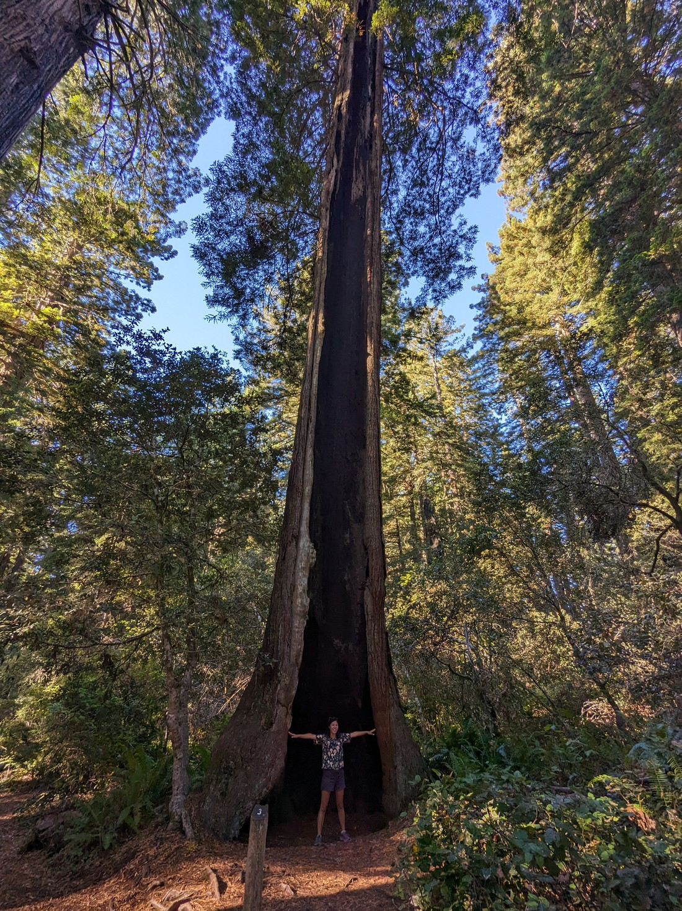

The great thing about California is its landscape. It has mountains, deserts, coasts, and lakes. It has the most national parks of any US state at nine and lucky us we have one more to visit...

...wait, did I say "nine"?

Sequoia, Yosemite... but we’ve only visited two. What happened to all the rest?

Well Death Valley is a barren desert - plus we already visited it in 2019. Joshua Tree is somewhat similar and we didn’t feel like going several hours out of our way to see it. Kings Canyon is basically the same park as Sequoia. Then we have the one we're about to see.

That still only accounts for six. What about the other three?

Well I forgot about them okay. They weren’t famous or named after giant trees and so I forgot they existed. Had we more time to plan then perhaps we could have stayed in California another week. But we don’t have unlimited time to do things. We also had very limited time to plan this journey. Southern Utah, Los Angeles, and Yosemite were our priorities – everything else is a bonus.

So on to today’s bonus – Redwoods National Park.

> And some state parks apparently

There is something different about this park. It has something we haven’t seen in months – arguably not since we left New Zealand. We have beaches.

> And the answer to the question, "What's greater than a great lake?"

The Pacific Ocean is looking really good right now. This beach also feels a lot like New Zealand coastline so in many ways this beach is a reminder that our journey is coming to an end soon. By returning to the west coast we're getting back to more familiar places (at least as familiar as a person can be with the Pacific Ocean). It's a shame we never made it to the Atlantic.

Anyway, we detoured off the main north road out of the state to come to Redwoods National Park because it sounded cool. What's not to like about giant trees? We had to make a stop of the visitor centre to find out what walks in the park were good. They had a handy map with recommended trails. So we made mental notes of a few (along with photographic notes) and set off.

The trail we went to first was called Lady Bird Johnson Grove. The map had noted that the carpark here fills up quite easily. That must mean it must be popular and if it is popular then it must be good. As you could imagine from the name, this was a grove of redwoods.

Even though we know we enjoy places like this, much to our surprise it was even more amazing than we were expecting. In one word, this place was peaceful. You can't tell from the photos but it was strangely quiet. There was no road noise, no wind noise, no insect or bird sounds, and relatively few other people around.

It was also a rather nice time of the day to be. The afternoon sun streamed through the trees in a warm and calming way.

We would come to notice later that our necks were a bit sore - and that was from all the staring up at the magnificent redwoods.

> They're big alright

Unfortunately we didn't have a lot of time today. We'd driven a long way to get here from Santa Rosa (and listen to a lot of Wheel of Time audiobook chapers) and it was now past 5pm. It was time to get to our accommodation.

Which is a camp site!

Woooo!

Betty wasn't so enthusiastic. She'd really liked the Santa Rosa motel and was now relucant to return to camping. But I couldn't have us leave this continent without one more stay in a national park. And fortunately the climate here was rather nice - even if we were surrounded by tall sun-obscuring trees.

> Here's a picture of the campground amphitheatre because I didn't get round to taking a campsite photo

After setting our tent up we decided to go for another walk. We'd really enjoyed the earlier redwood grove and so we wanted more. So we set out from the campground to do some sort of loop. We didn't know how long it would take and it would likely be night soon so I brought a headlamp just in case.

The walk was nice, even though there was a lot less light around.

Lots of redwoods, as you would imagine for a park called Redwoods National Park.

Apparently there used to be a lot more redwood trees like this and it was only through the work of activists that kept them from all disappearing. It's hard to imagine people wanting to cut these down but I guess logging is an industry, as is farming. I'm shocked that these groves are so rare now - who would want to cut these down?

There's just something about walking here that makes you feel so small and insignificant. And somehow that is a welcoming thing to feel?

I'd like to now compare this park and Sequoia National Park. Like I said at the start, we hadn't done as much research for this trip. We came here based on the name alone. We always enjoy the Rotorua Redwoods and so figured we ought to see their homeland. Even as we set out from Los Angeles I couldn't have told you a single thing that differentiated Sequoia National Park from Redwoods National Park. To me they were just both big parks where we'd get to see big trees. I don't think I even understood that they were different types of trees.

I think the main difference between the park is elevation. Redwoods National Park only gets to 1,000 metres in elevation while Sequoia National Park shares the tallest mountain in the continental USA.

Well Redwoods National Park is clearly the best of the two. Is it because the trees are redder? Or is it because the park just seems more lush - probably a lot less snow down here.

Somehow the trees here just seemed taller. However that might stem back to weather related reasons. We certainly weren't encouraged to look up at Sequoia since we'd get hit in the face by all the rain falling down. And perhaps the weather issues also relate back to the elevation. But who knows what a nice day in Sequoia National Park would be like.

Also apparently the trees are bigger here.

> Such a redundant sign

But Luke? Didn't you see the world's biggest tree back at Sequoia? Why yes, in Sequoia we did see the world's biggest tree... by volume! It turns out there's a lot of different ways to measure the "bigness" of a tree. Redwoods National Park has the world's tallest tree (which interestingly has less mass than General Sherman).

> "Big Tree" - another redundant name

Although I don't think this was the record-holder. This one is taller than General Sherman but apparently there are trees elsewhere in the park that reach 116 metres. I can't decide if that is taller or shorter than I expected.

After leaving Big Tree it now was getting quite dark. I turned on my headlamp although it didn't seem to do much in such a vast area. I guess it wasn't that dark (there was still light in the sky) but rather these darn trees were getting in the way.

As we were walking along the road back to the campground, an RV approached us. They informed us that we were just about to walk past a large Elk with horns and we should be careful. We likely would have seen it anyway, but the warning was perhaps still worthwhile.

> Note that the long exposure is making it seem a lot lighter than it actually was

The night wasn't quite as warm as we were hoping. This isn't too unexpected - the "off-season" just started. However like I said before, it was really nice to have one last night of camping. Very soon we'll be back in the real world and so one last night in the forest was much appreciated.
