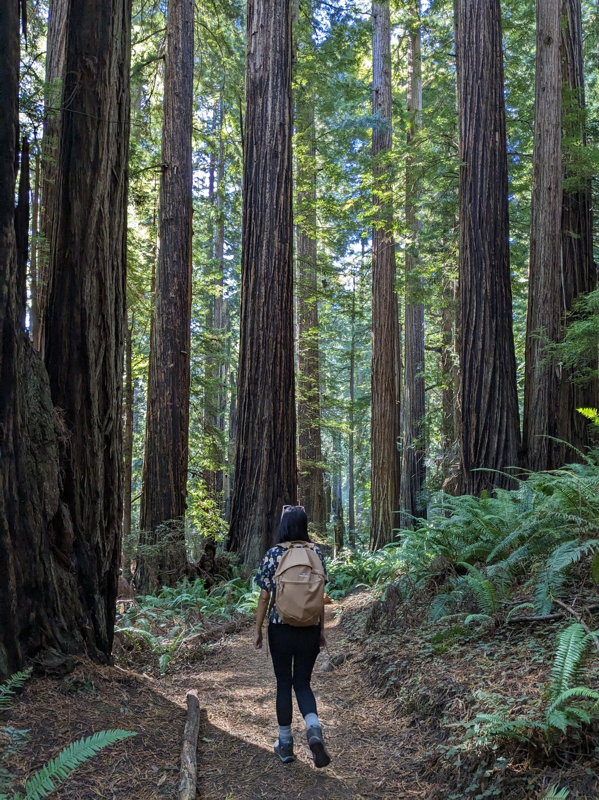

// Up relatively early - thanks to going to bed early - thanks to getting dark early. A bit of mist about.

// Fern Canyon was highly recommended so we went there. We had to drive the unpaved "Davison" road but fortunately it must have been recently graded as no washboards, though some very large water filled potholes, and a stream crossing.

// Fern Canyon was fine. It might have been nicer later in the day. Perhaps that's why it has a gate that doesn't open until 9am. We had to hop over the stream many times. Apparently there are bridges during the "on" season.

// Lots of cars arriving as we drove out. Stopped at Trillium Falls. The falls were awful, but it was another nice redwood grove walk so we did the whole thing

// Taco Bell lunch. Their "value meal" has some excellent options for $2 - and quite large options too.

// Stout Grove. Another gravel road unfortunately.

// We noticed signs on the way in about forest fires and a forest being closed. Google Maps refused to direct us along the road to Grants Pass road, which was clearly the most direct road. We asked and were told that they were "piloting" people along the road and it likely would still be quicker than going round. Further along we found out that they were only piloting people three times a day, and not until 4pm (it was 2:15pm). Again it was suggested we just wait, although not at the end of the road. We found another grove walk to do instead - Simpson-Reed.

// Drove along the road. Lots of brown trees. Looks like lightning resulted in "27 confirmed fires" here back in August.

// Dinner in Grants Pass

// Car did a big shudder and Check oil light came on just outside of Grants Pass. It was now quite late and we still had more than two hours to drive. No oil places were open. One option was to return to Grants Pass, find a motel and get it fixed tomorrow. However when we started the car again the oil light was off. As it didn't come back on again we drove carefully on to our intended destination. Took much longer than two hours due to the lower-than-limit speed. Lots of cars and trucks overtook us.
