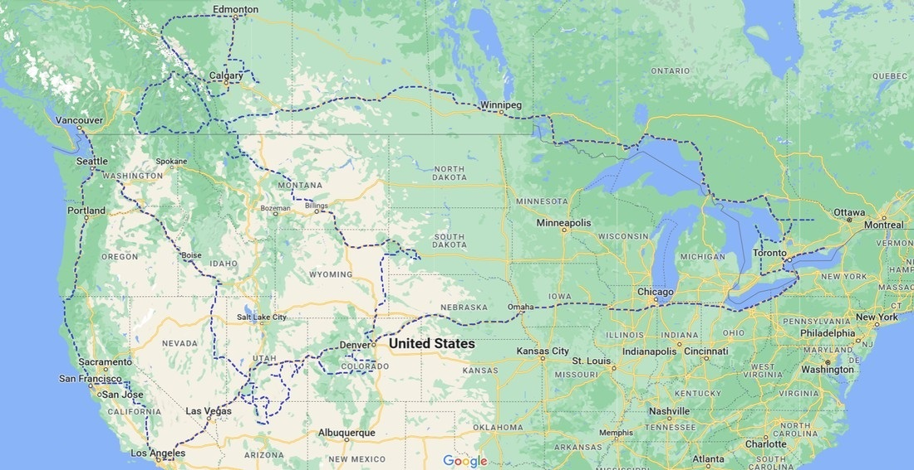
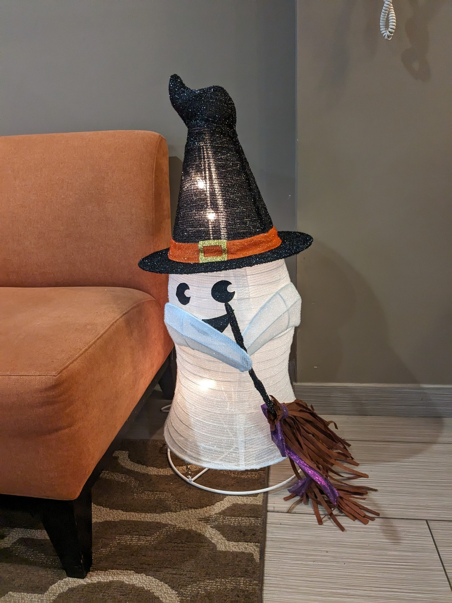
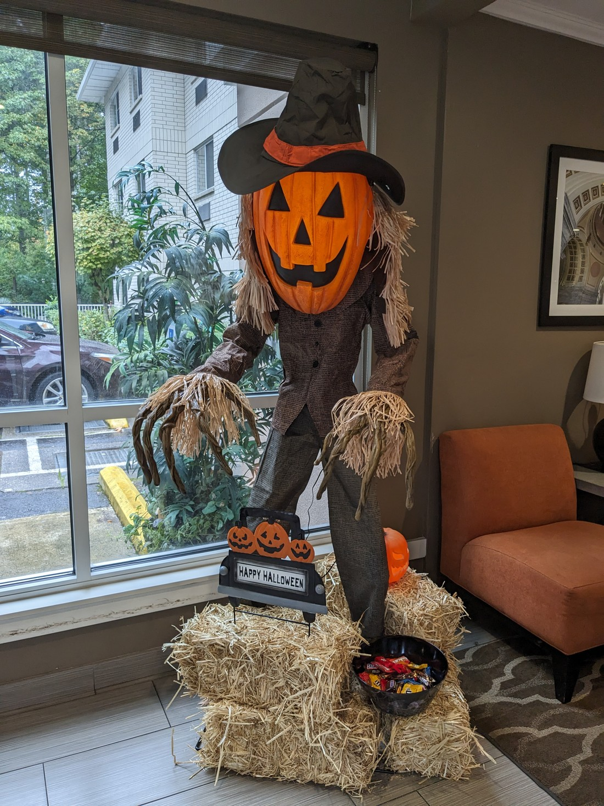
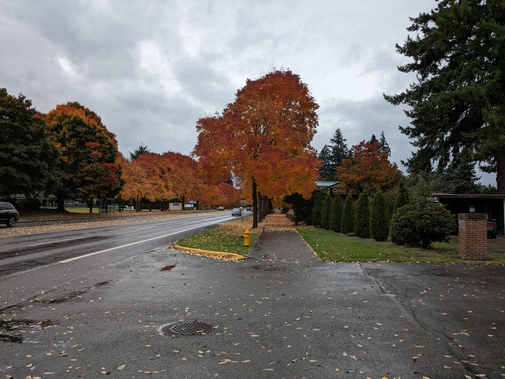
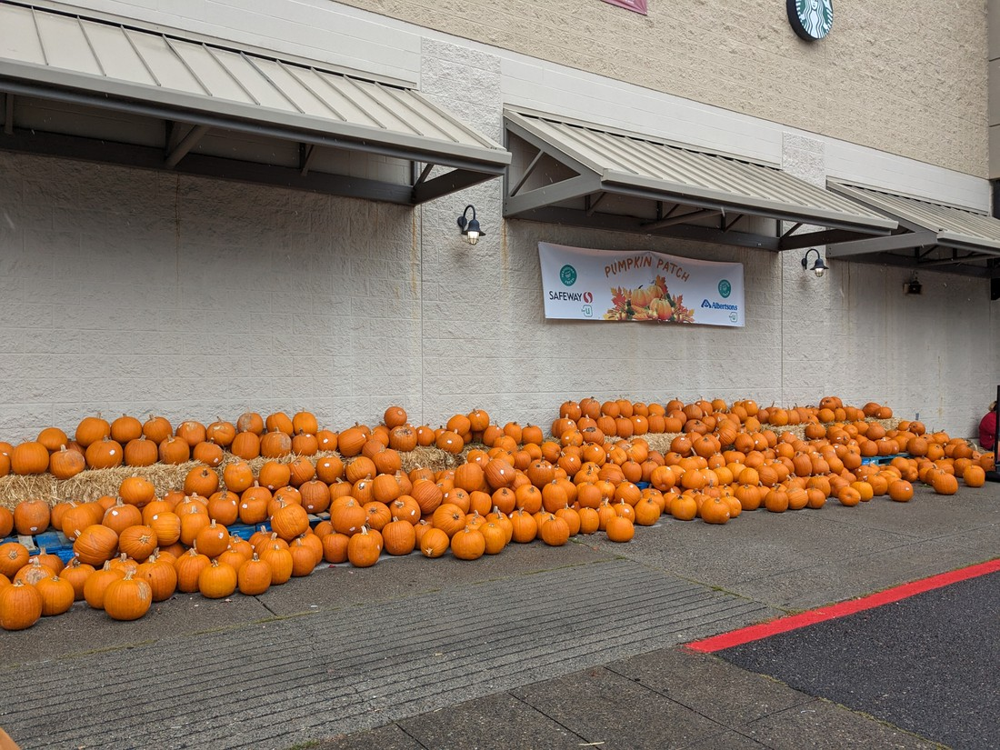
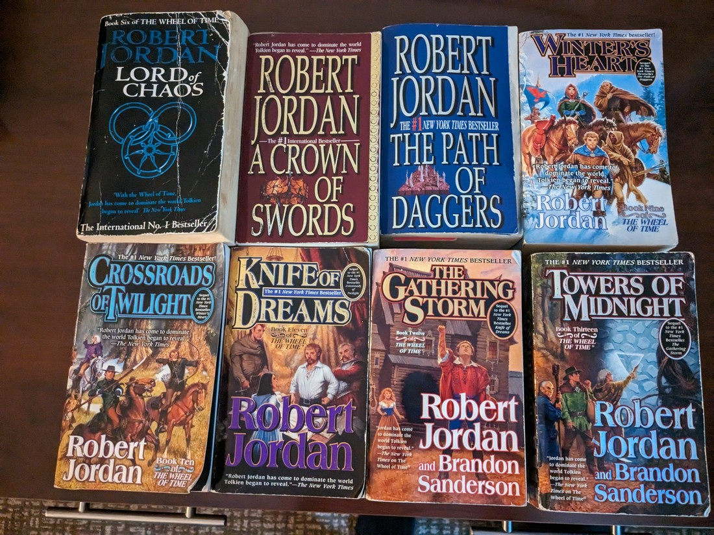

// Stayed with Luke

// Delicious dinner with Chicken-of-the-Woods

// Rainy near Seattle. Hotel had put up Halloween decorations

// At Luke's suggestion we listed our car on Facebook marketplace because it seemed like it might be quicker, and we might be able to get more than essentially trading it in

// Lots of responses. Almost 70 people contacted me about it.

// Sold to a dealer who had this weird story about collecting them. He seemed the most passionate. He also helped us figure out how to set up e-transfer, which was an almost instantaneous payment method. He did try to argue us down $300 due to brakes needing some work, but we knew how in-demand our car was and refused.

// He did one last check before buying and found there was a lien on the car. This was news to us. The lien was 2 years old, but we'd bought the car only months ago. A lien would prevent us from selling. After ten panicked minutes, we reached someone who supposedly held the debt who very quickly acknowledged it was wrong and issued a letter stating they no longer had a claim. The sale could proceed.

// Walked to autoplan since we no longer had a car. Told that because we had previously made a change, they had to refund us by cheque. Walked back home and called ICBC. Told to set up a direct deposit bank account. Unfortunately couldn't do this online. Walked back to autoplan and set up direct deposit. Still had to refund by cheque. Have to wait for bank account to stop being pending. At least it was a nice day to be out walking.

// Donated our tent and bedroll after we realised that we'd need to pay for checked baggage multiple times. They would have been nice mementos but it was difficult to foresee when we might use them again.

// Difficult to pack bags. Lots of stuff.

// Walked to the airport to save $30. Rather strenuous pulling such heavy bags.v

// Rugby World Cup quarterfinals
