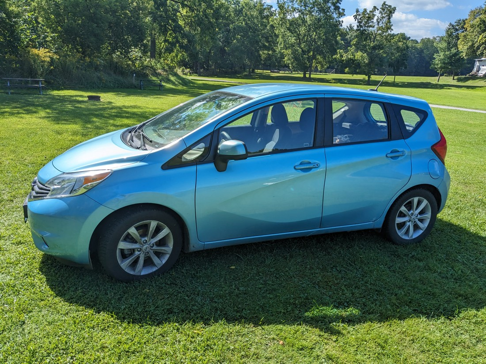
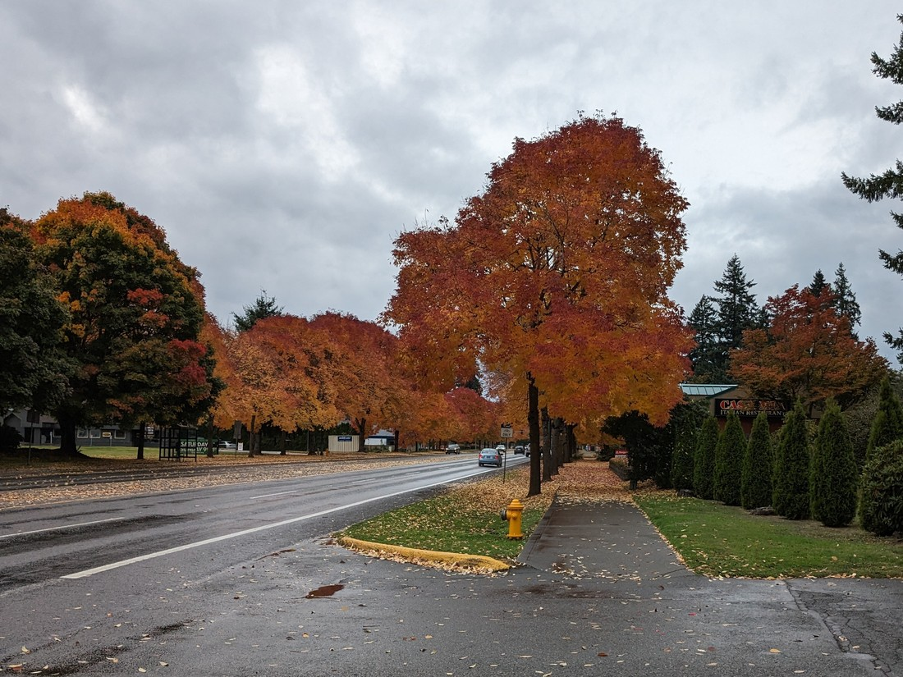
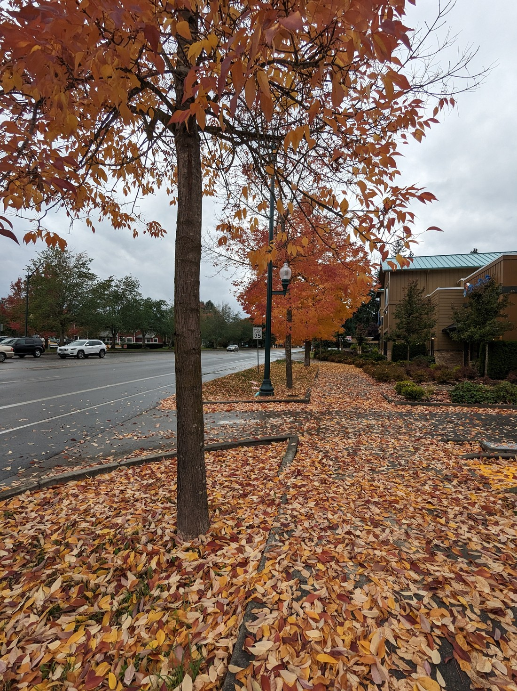

Well, it had to come eventually. This is going to be our last blog post from North America.

This blog going to be a bit of a mixed bag, covering eight days worth of stuff. And it's probably not going to very interesting stuff. Just as this blog post is wrapping up our holiday, we spent this week wrapping up our journey. There's no one last big adventure this time - just a bunch of offloading the gear we no longer need and attempting to cram into our suitcases everything we want to take back.

On the way north we spent a night near Portland with Luke (who I will from now on call Other Luke for the purposes of not being too confusing). Despite being a good 500 kilometres from our final destination I would say here is where our journey unofficially ended. With one week to go until we would fly out, it was here where we finally mentally snapped out of "holidaying and travelling" mode and back into "duties and obligations" mode. This was a bit unfortunate because Washington state has three national parks yet to be explored by us.

However, as I said, we weren't thinking "how do we have fun?" any more. We were thinking "oh my god there's so much we have to do!"

Let's talk about our car. We had bought it back in April and we now needed to sell it to recoup some of what we'd paid. We didn't fully understand all the complexities of selling cars in Canada but we understood that it would be easier if we sold in the same province that we bought in - hence why we are travelling back to Vancouver.

We had booked five nights of accommodation in Richmond (which is to Vancouver like Manukau is to Auckland). We hoped that would be enough time to sell our car. Five days seemed like the right amount of time - not too long and not too short. However while at Other Luke's we finally started investigating what would be required to sell it. It was then we realised that we might have a problem.

We were hoping to find some sort of car auction place. That way we could get a reliable value for our car and the transaction would be done through an organisation with repute. But there didn't seem to be any in-person places we could take it (other than approaching dealers directly). There were some websites which offered "cash for cars". Some were more specialised in scrap cars and wouldn't offer much. However some would do the auction-thing for us and five days was an appropriate time frame.

Except of the five days that we had two of them happened to weekends. Since lots of businesses don't operate in the weekends we really only had three work days to organise the sale. Also when we got estimates from some of those websites, the values were disappointingly low. I felt like I could foresee how this was going to go. We'd be rushing round places trying to find a buyer and we'd probably only be getting back a quarter of what we paid for it. Maybe not even that.

It was then that Other Luke recommended selling through Facebook Marketplace. He described it as easy. Well, we hadn't wanted to do this due to the hassle and potential issues with selling privately but at this stage we didn't have many options. And since it cost us nothing to try, the next day we put it up for sale with some pictures I took back in Ontario and we waited.

> We've kept it in reasonably good condition, although I suppose we bought it not that long ago

But we didn't have to wait for long. Within minutes I had a message pop up asking about the car. Then another. Then another. Over the next couple of days 70 people messaged me about the car. Many were actively interested, often asking "How soon can I see it?" Some asked if we were flexible on price. We were initially, but then we started getting responses for people who made it clear that they would pay our asking price. Like jobs and housing, it seems cars are in high demand in Canada I (especially at the price we'd picked anyway). It was nice to be on the other side for once.

We had put up the listing before we even arrived back into Canada so no one could pressure us into a quick sale. But the problem was still, who do we pick to sell it to? One person ended up standing out. I had originally told him "no" because we already had enough interest but he was insistent. He told us that he was collecting cars of this model in different colours and really wanted ours. He told us about the other cars he'd bought as well as the other models they've done this type of thing with. He was also buying on behalf of a dealership - which sounds like a red flag but it is actually a good thing because it means we're dealing with someone who knows the buy/sell process. And by telling us all this, he built rapport with us and so we decided to go with him. I don't know if being so talkative was a deliberate strategy but it certainly worked on us.

He turned up to have a look at the car the morning after we arrived in Vancouver. He did the usual inspections then we took it for a test drive round the block. He tried to haggle us down $300 because he'd noticed the brakes were bad - but we'd already decided we wouldn't budge on the price. From the feedback we'd received we knew we'd under-priced the car so someone would pay what we were asking if he did not. He clearly knew that too but I don't blame him for giving it a shot.

So he made a phone call to do one final check and that's when we got some bad news. He had acquired the car history report and apparently there was a lien on the car. We were like, "Uh, we don't know anything about that." To which he replied, "Uh, a car with a lien can't be sold."

This was the worst case scenario! We're leaving the country in a few days and now we have a car that can't be sold. Before I was worrying that we wouldn't get much money back - now it was possible we'd end up with nothing. It's not like this guy could even be trying to scam us to get it cheaper because he's just told us the province won't accept the sale at any amount. But wait, this lien was dated in 2022. Then how could we have purchased it in April 2023?

He called the company with the lien and got no answer. Then I called them. The person I spoke to was just like, "Oh that's not right. Let me issue you out a notice confirming we have no interest in the car". Our buyer then did our own checks and after a couple of hours we were all happy that the sale could go through. Crisis averted.

But how were we going to get paid? We didn't bank with any Canadian banks and we really wanted to ensure we got paid before we left the country. We discussed cash, but who wants to have to handle thousands of dollars in cash? Interestingly Canada has a system that allows near instant payments and all you need is the recipients email address. Fortunately Wise (the system we'd been using to transfer NZ dollars across) is part of this scheme and Betty was able to sign up for it. Then we had a weird moment where we had to ask the buyer in advance to test it by paying us money (at this point he hadn't even met us or seen the car yet). But he was agreed to send a dollar across and it came through within two minutes. Such a neat system and it meant we could get paid straight away without having to risk carrying around thousands in cash.

But the story doesn't stop there. We now had to deregister our plates and cancel our insurance. Fortunately in British Columbia these two things are done at the same place. So we had no problem deregistering our car but they wanted to send out a cheque for our insurance overpayment. "Can't you put it back onto our credit card like you did last time," we asked. The answer we got was, "No we can't \*because\* we already did it that way last time". We had to go back and forth several times to try and work out how we could get our refund. And because we didn't have a car it meant we had to walk half an hour to the nearest office each time. At least the weather was sunny (somewhat rare for Vancouver) so it was nice to be out walking.

In the end, we managed to get everything done with one or two days to spare. So our "five nights" estimate of how much time we needed was perfect. It meant after all our panicking we had some time to relax a bit. Of course we couldn't really go anywhere because we no longer had a car. We also still had some other things still to plan because (spoilers) our journey doesn't quite end here.

Before we left Ontario we had an idea about visiting Hawaii. And that is still the plan! This was partly because tickets direct from Vancouver to New Zealand aren't on special so there's no incentive to fly direct. Effectively we get to fly for free to Hawaii because we have to fly over it anyway. It'll be one last holiday before returning to the real world.

We ended up donating our bedroll and tent to a charity thrift shop. We would have been happy to pay for additional baggage to take it on a flight back to New Zealand. Except we're not going straight back to New Zealand. And because we're planning to island-hop in Hawaii, we're actually going to be taking four different flights in the next week. We decided it wouldn't be worth paying for additional baggage up to four times while also having to carry it round for a week. Realistically we're not likely to use them in New Zealand. They were mostly going to be mementos of our journey but we probably don't need $200 mementos that just take up space in the garage. If we ever want to reminisce about our camping adventures then these blogs are always going to be here.

Speaking of which, let's reflect on our journey. Here is a very basic map I made of where we've travelled.

It feels a bit weird to claim that we came here to live in Canada when judging from this map we appeared to travelled a lot further in the States. But overall we spent about four months in Canada while only two south of the border.

It does also feel like we're leaving prematurely. We're going to miss experiencing North American winter and potentially having a white Christmas. We are also leaving halfway through Autumn and therefore are missing seeing the wonderful Fall colours in the eastern Canadian forest parks. Down in Utah and California it didn't seem very much like Autumn but Washington certainly did. We went for a walk down the road to the supermarket and the trees were shedding a lot of orange leaves.

> It's definitely fall

Isn't this annoying - so many leaves on the ground. That seems like a lot of mess that someone will likely have to either sweep or unclog. However it was somewhat fun walking along trying to catch the falling leaves and see what colour we'd get.

And even before we get to Christmas, in the next few months we have the holiday cluster of Halloween, Thanksgiving, and Guy Fawkes (although that last one might be more of a British thing). The hotel we were staying at in Washington had joined in with Halloween decorations.

> Lots of popup and inflatable decorations around - I guess those are easier to store

> The chocolates was gone within 24 hours and only partly due to us

There was also a lot of pumpkin stuff around. I tried a pumpkin spice Frosty (Wendy's version of ice cream). It was fine but it has nothing on chocolate.

> Even if people are sick of pumpkin, they probably have to eat all the pumpkin stuff otherwise this would all go to waste

In Richmond we also found that they were now selling Eggnog at the supermarket. Naturally we felt like we had to try it. I am notoriously anti-egg so I wasn't expecting good things. Here is my expression after trying it for the first time.

I was actually not bad. Rather sweet - which is probably because this version has no alcohol. It was basically just a milkshake, which was confirmed when I saw that the main ingredients are milk, cream, and sugar (not egg - although it does feature).

Packing our bags on our last day was a bit of a challenge. We seem to have acquired more stuff. Either that or we've gotten worse at packing. Even after chucking a bunch of stuff out it still didn't all fit back in our suitcases. The rest of the items went in a laundry bag that we figured we'd carry onto the plane. Then we set out to walk to the airport.

It was a 110 minute walk. Fortunately it was cloudy and mostly flat. The only drama was one time where we crossed a road only to find that the sidewalk was unpaved and we had to cross back. However our arms did ache a lot afterwards. However we had killed some of the ample time we had and also saved some money.

At 5:40pm our plane took off and we said goodbye.

It has been a disappointing week. As I said at the start of this blog post, we didn't get up to anything fun. It's hard to enjoy yourself when you're stressing about your car. The highlight of our week was watching Nimona and Cunk on Earth on Netflix. Oh, also the All Blacks overcame Ireland to unexpectedly advance to the World Cup semifinals. We were out at the time and so had to spend an hour in a Tim Hortons, following the game by refreshing the live updates.

But back to the disappointment. There was so much we didn't get done. We never entered Quebec and spent no time on the East Coast. We never skied, skated, curled, or snowshoed. We never attended an ice hockey or American football game. And we never developed strong opinions about maple syrup.

However I think it is important to focus on what we did achieve. We visited 24 national parks including most of the popular ones and many other non-national parks. We camped our way from British Columbia all the way across to Ontario. We've seen wild moose and bears - both black and grizzly. We've seen Mount Rushmore and Niagara Falls, both by day and by night. We've been to Hollywood and Las Vegas. We've walked 700 kilometres of trails and climbed 24 kilometres worth of hills. We also made it through almost eight Wheel of Time novels.

> Goodbye books - you've been great

This holiday wasn't everything we dreamed that it could be but boy was it still an incredible experience. And the best part about it was that I had someone to share it with. It's nice to have someone around that gets excited about the same things you do.

Someone in New Zealand would later ask me, "After travelling with each other for so long, has your relationship with Betty improved or worsened?" And the answer I had was, "About the same". I think we enjoy each others' company just as much now as when we left - neither more, nor less. And I think that's a great sign for our future. However I probably won't put it to the test by suggesting too many more freezing nights of camping.

But again, this is not even the end of this holiday. We still have a week of adventuring to do in Hawaii. But for now this is Luke and Betty saying goodbye to Canada and USA for probably quite a long time.
