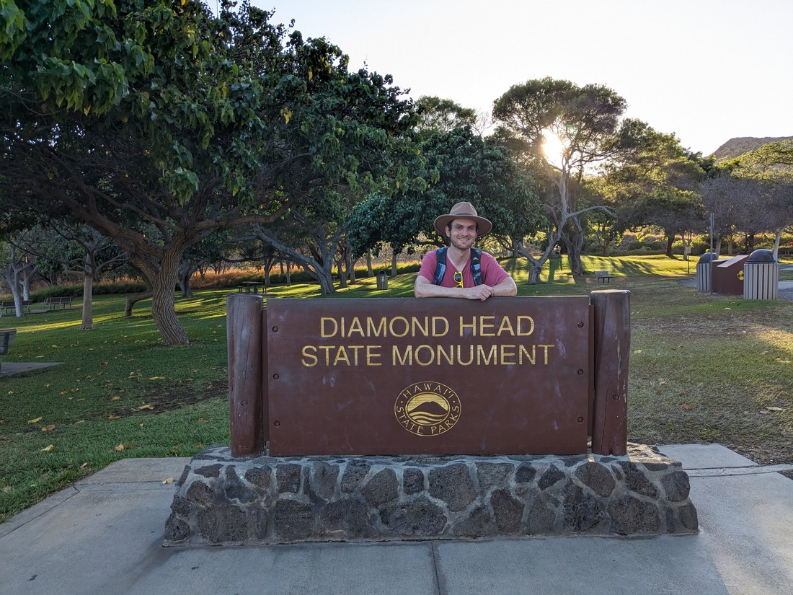
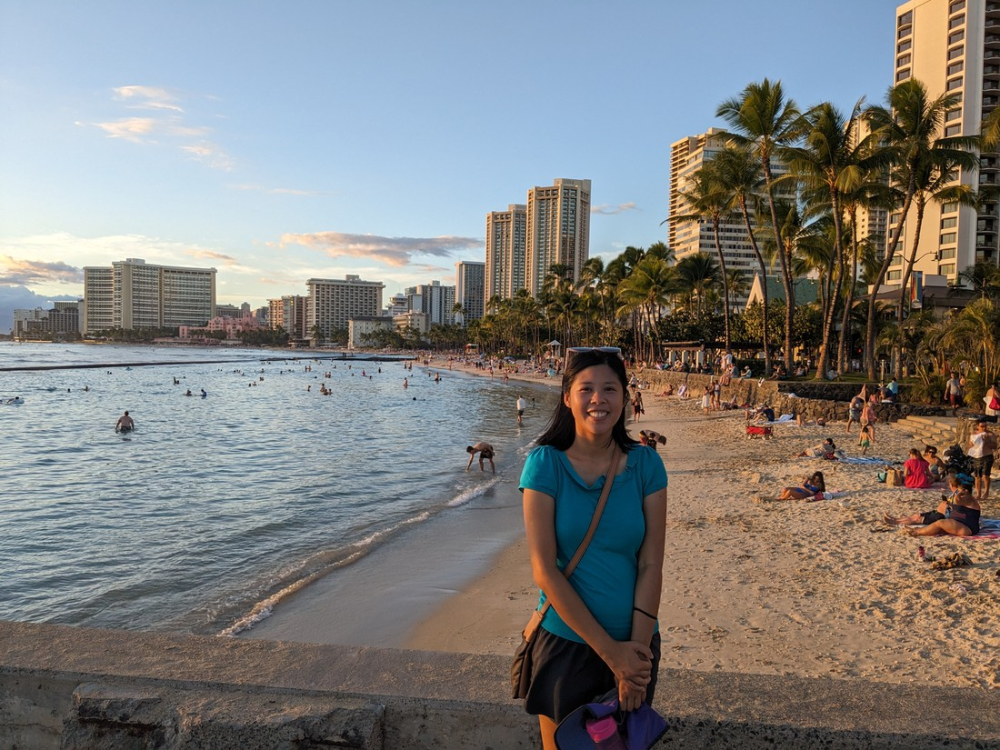

It's time to answer the big question: Is Hawaii part of North America? USA is a North American country and Hawaii is part of USA. But Hawaii is located near the middle of the biggest ocean on the planet. That doesn't sound like its part of any continent, never mind North America. To sum up, I have no idea.

We had flown into Honolulu the night before. We arrived after dark to find the airport strangely empty of places to eat. Air Canada hadn't provided us with meals and we were a bit peckish. Fortunately a 7-Eleven near our accommodation was the solution. As well as the regular convenience store stuff, it also had a range of ready to eat food, most with a Hawaiian flair. Hawaiian food seems to be a mixture between American and Japanese cuisine. The best example is spam musubi which is a piece of spam with nori holding it onto an oblong of rice. I didn't try this though as the chicken sushi sandwich thing looked too good to pass up.

Wow, I'm only two paragraphs in and I'm already talking about 7-Eleven.

We were up early the next day. This was because I still had my phone on Vancouver time. I woke and saw 10am and thought, "Oh, it's late. I'd better get up." But no, it was only 7am.

We came here for something a bit different, on the way home to New Zealand. Oahu (which is the name of the island we're on) has a very different climate to what we're used to. It has this thing called humidity. For the last five months we've often stuck to high mountain and dry desert areas so we weren't sure how we were going to fare against hot and humid Honolulu. We decided to start today with a simple walk to Manoa Falls.

This may have been a mistake. On paper the walk is rather straightforward - a mere 2.7 kilometres. However it was more uphill than I was expecting. Also the trail ran through the rainforest. While it was somewhat pleasing to look at, the humidity was even higher than what it was back in town.

> Why is everything wet?

This might also be an appropriate time to mention that we're not travelling alone here in Hawaii. We have company. Dad has been invited on this trip for a few reasons. The first is that I haven't seen him in a a while. The second is that he hasn't had an overseas holiday in an even longer while. The third is that Hawaii has a lot of those geocache things that he likes to collect. And there is a fourth reason but we won't get into that right now.

So regularly along the trail we had to stop while he snuck into the trees to try and find some geocaches. Unfortunately the key word here is "try". Something was going wrong today as I don't think he found any of them. The coordinates were just random places on the side of the trail. In a jungle this thick a small geocache container could be anywhere. Something also might have been going wrong with his GPS.

Fortunately the stops were a chance for us to recover. Or so we thought. Very quickly these stops became a chance for us to get bitten by bitey bugs. For some reason I (stupidly) hadn't considered that insect repellent would be a thing we would need. We had some back on the mainland but I got rid of it.

When we got to the end of the trail we found the waterfall was a bit lacking.

> There's more water running down my back

So this walk wasn't a success. This was just supposed to be a test walk to see how people would cope with the heat and while I was fine, Betty and Dad were not. So we figured we'd drop by the supermarket and pick up some supplies then head back to our accommodation for a rest. Except I foolishly suggested we walk to the supermarket.

While it was downhill and no longer amongst the rainforest, this walk through the suburbs was unsheltered from the mid morning sun. When we arrived at the supermarket we needed a sit-down first before we could do any shopping. However some cold drinks perked us all back up again. I don't think Dad had tried blue Powerade before but he seemed to enjoy it. And of course he would - it's cold and liquid.

The prices at the supermarket were a bit of a shock. We were used to the dollar amounts being the same in USA as they would be in NZ (but in USD rather than NZD) but in Hawaii stuff was even more pricier. $8 USD / $13 NZD for an otherwise ordinary box of cereal? I suppose that's what happens when you combine the high value of United States currency with the remoteness of a Pacific Island.

Back at our accommodation everyone rested while I blogged. I was two months behind with writing my blog posts (and looking at the publish date on this one, very little has changed since).

We were only going to be in this part of Hawaii for a couple of days. Wanting to maximise our time here I decided we should see Diamond Head - which was at the top of my things to see in the Waikiki area. After thinking about it, everyone else decided to tag along (possibly because there was geocaches there). So we grabbed some Subway lunch and headed off.

To get to Diamond Head we took an Uber - our fourth since arriving in Honolulu. Public transport is pretty cheap but sometimes it's just worth paying extra for the convenience and speed of an Uber. It's also nicer than taxis because we can order and pay through the app - knowing how much it will be in advance. Plus when the price is effectively split three ways then the price often seems reasonable.

Diamond Head is a volcanic cone at the eastern end of Waikiki. This area was strangely dry compared to the lush rainforest we saw this morning. While we found a grassy patch with trees to eat our lunch, the rest of the hill was covered in dry grasses. I imagine the volcanic rock in this area makes things hard to grow. Interestingly the yellow grass was introduced and became invasive - so that could be the reason why Diamond Head looks a lot different to what we saw earlier.

Despite starting the walk in the crater there was still a lot of "up" that we had to walk. Dad was stopping every few hundred metres to do geocache questions. Despite the climb and the afternoon sun it went by much easier than our morning walk.

> A lot LOT less bitey bugs up here

Diamond Head used to be a World War Two defence facility of some sort, so there were platforms and other remnants. Also a tunnel.

> No bugs at all in here. And no sun too! Although it was still warm.

We were forced to come here quite late, but that turned out to be a blessing in disguise. The sun was now past its peak and the hill was casting some welcome shadows on itself.

The actual peak provided a rather stunning view out over Waikiki.

> Especially at this time of day

Honolulu and Waikiki is a lot more vertical than I was expecting. Although to tell the truth, I don't know what I was expecting. I know Americans likely flock here for holidays, and there certainly is a lot of them.

> Yep, I can definitely see why people come here

While at the peak I noticed that Dad hadn't made it to the top. He had climbed most of the stairs but had sat down to presumably rest a mere five steps from the top. Well, I should have known better. He was stealthily accessing a geocache under the steps under the guise of taking a rest. Why would I have thought otherwise?

After seeing the view for a while, Dad then disappeared back the way we came. "I don't think he realises this is a loop trail," I thought to myself. However I can't blame him. To complete the loop we had to squeeze through the front of a bunker / fortification and then walk into the hill, then down a spiral staircase that looked like something out of a horror film, and the down an even longer flight of stairs.

Then came the question, "Does Dad know where we've gone?" He did not, but backtracking found him pretty quickly and we continued back down to the crater floor.

Overall Diamond Head was a nice place to visit.

> Obligatory sign photo

But the day isn't over yet. Apparently Waikiki beach is a great place to view the sunset from. Now, do we walk down or do we summon another Uber? Dad and Betty thought the answer was rather obvious.

We've now taken five Uber rides within 24 hours - five more than all of our holiday before this. The one from the airport last night was a bit expensive but the four today were all about $10 USD each - a pretty good deal since they get us exactly where we want to go and quickly. The drivers were all very nice as well, most of them chatty. However this last one made a comment that "Tourists always wants to climb the mountain but no one wants to walk to/from the beach" Sounds like someone is unhappy that at our incredibly short trip. He also drove improperly fast. He did not get a tip.

It turned out the decision to Uber was a good decision because the sun was very low in the sky when we arrived at the beach. We walked out on a bit of a pier (that was probably a sewage pipe or something less romantic like that).

The beach, water, and sidewalks were very populated - but what else would be expected?

And yeah, I 100% agree that it is the best place to view the sunset from. I had thought the beach faced south but nope - perfectly west. And it seems like everyone was flocking to the beach to either watch the sunset or photograph it.

> My pictures were not great - I'm no experts on sunsets

From here we walked back to our accommodation. No Uber this time - apparently five in one day would be too crazy. It was still several kilometres though. But the heat had dropped off a bit now that the sun was gone. The streets were also now filled with people traffic was rather jammed. Walking was definitely the simpler option.

It was now that we faced the hardest task of all - deciding where to have dinner. It didn't help that none of us were that enthusiastic about eating. But it was getting late so we felt obliged to have something. Near to our accommodation were some food trucks. Looking through them I couldn't help thinking, "What I really want is that 7-Eleven chicken, rice, and seaweed sandwich." Except I had one for breakfast, and for last night's dinner. The rules of being an adult says that you can't have the same thing for dinner and breakfast.

But screw those rules - we're on holiday. So back to 7-Eleven we go. And once again I have to say, "poor Dad". We invite him on holiday but then we cheap out on the food. I like to think of it like we're showing him how we travel. We focus more on the experiences and we just pick up whatever is convenient when we get hungry. However I will say that 7-Elven did provide a pretty good range.

And that ends day one of the first 7-Eleven blog post. I mean, day one of the first Hawaii blog post. Overall it was a really good day one. I'm glad we experienced the rainforest in the morning, even if it did lead to heat exhaustion. Travelling is about finding new experiences, and Hawaii certainly does seem to have a wide range of places to experience. Hopefully the next six days will be just as fun.
