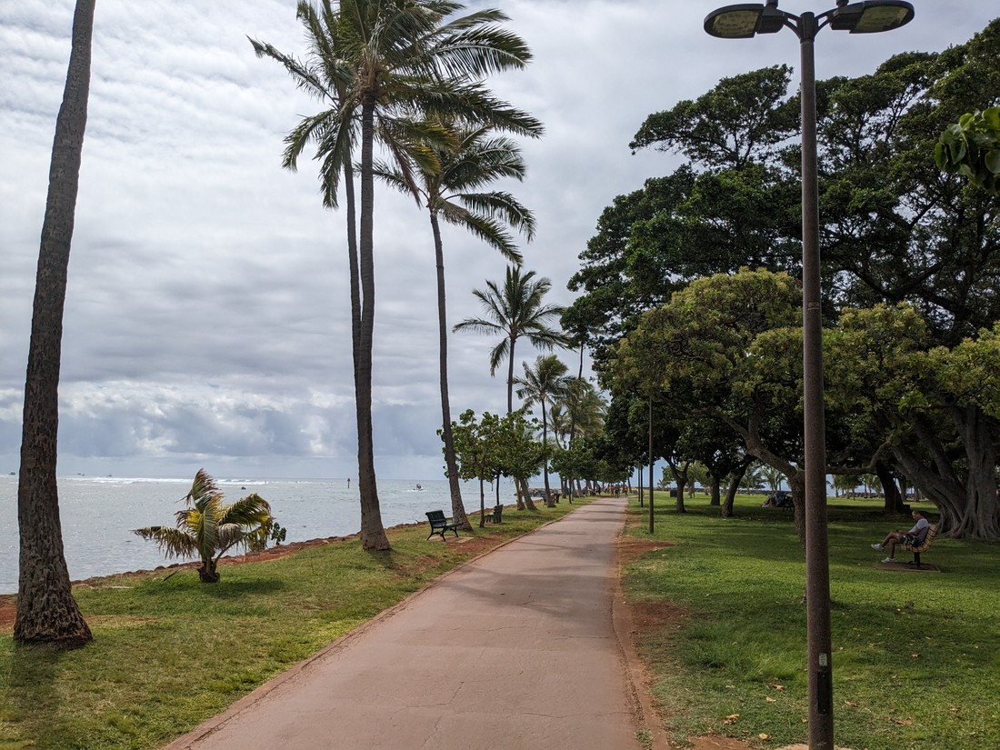
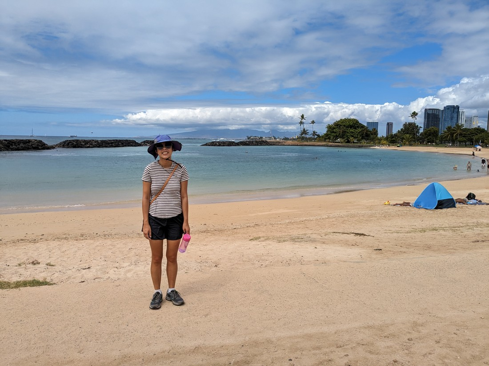
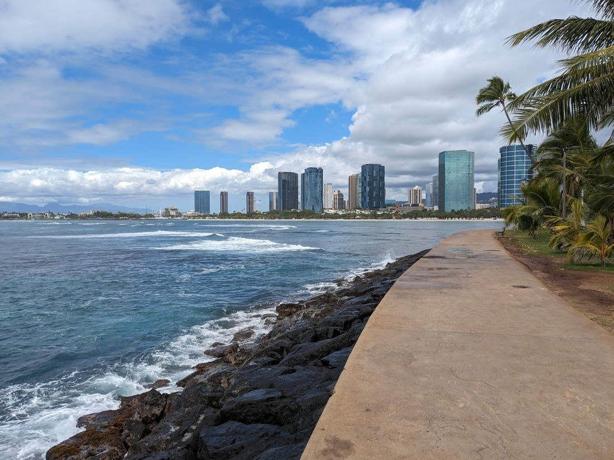
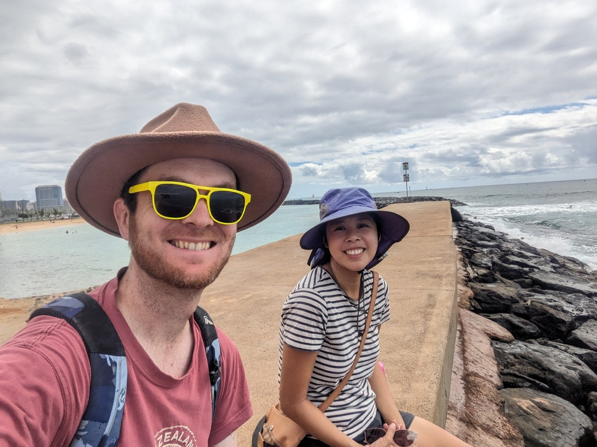

Today we got up with a less of a plan of what to do. This was despite the fact that we only had two days to spend in Honolulu and it was the second day already. Dad really wanted to go get a certain geocache. Something about it being really old. So he bought a bus pass from 7-Eleven and off he went for the day.

Betty and I had our eyes on a walk called the Koko Crater Railway trail. However there were a couple of problems. The first is that it was a bit further out than the walks we had done yesterday. I know it still might be cheaper than renting a car but paying $30 each way to go for a hike seemed a bit pricey. Also the trail followed an old World War II railway track straight up the side of the hill. It would be non-stop steps in the Hawaii heat. How much did we really want to do this?

It turns out not that much. Instead we went for a walk around town.

We walked to Magic Island, which is a park on the sea shore and definitely not an island at all. At the end of the peninsula was a lagoon.

> That's all Hawaii is apparently - craters and lagoons

We spent a good while hanging out on the path by the sea.

Watching the crabs scuttle around on the rocks below while the waves crashed over them.

And that's all the photos I have to post for today. We didn't really get up to much. After sitting outside for a while, we then sought out a cool place to have lunch. Then after a cool Walmart visit we returned to our accommodation.

However 5pm rolled around and I decided I really ought to try the water. The beach at sunset had been rather inviting yesterday. Surely it must be nicer than that surprisingly chilly Lake Superior.

At first it wasn't great. The sea floor was not pleasant to walk on. Not sure if it was coral or just spiky rocks. I suggested to Betty that we walk along further but she had got herself settled under a palm tree. So instead I tried a different and more populated part of the beach.

Here is where I found how nice it was to swim in Hawaii.

I was wondering how warm the ocean would be. It sounds silly but this is the same ocean that we have in New Zealand so maybe it would be the same temperature? Well obviously not. I slowly swam parallel with the beach. Then I just lay on my back and let the tiny current take me back along.

The last time I swam was in Lake Superior and this couldn't have been more different. That was cold and unsatisfying on an overcast day. Being saltwater, this was much easier to float in. I could usually stay afloat with just some small arm movements alone. The slight waves would provide a gentle rocking motion (and occasionally put some saltwater in my mouth). And of course this was all happening in the half hour before the sun set. The hour meant I didn't even need to go through the hassle of sunscreening everything.

Unfortunately it did rain, spoiling Betty's evening spent reading her book on the grass by the beach. The rainclouds also got in the way of today's sunset, spoiling the photos of the many Instagrammers about. Of course I didn't mind the rain - I was wet anyway.

I can certainly see why people love Hawaii. Even a day spent doing very little can be a day enjoyed. That being said, a fair amount of today was spent hanging out in air conditioned places so perhaps the best way to do Hawaii is to do a lot of nothing. At least until sunset.
