Today we're packing up and leaving. We're departing Waikiki, Honolulu, and Oahu altogether and flying to... Hawaii! As well as being the name of the state, Hawaii is also the name of the biggest island in the state. However to avoid confusion, it seems like everyone instead just calls it Big Island.

We flew into Kona International Airport on the island's west coast. However we were actually staying on the island's east coast. So why did we fly into Kona rather than the eastern Hilo, which is Big Island's largest city? Well, its because we booked these flights in a hurry and I didn't pay attention to what was where. However it should be fine, right? We can just travel from one side of the island to the other, right? It's not like this island's name is literally "big".

Back in September, when we decided to leave North America, booking our flights off the continent was one of the first things we did. The reason is that we wanted to do some border crossings and if questioned we wanted to ensure we could show that our plan was to leave USA. Since our Canadian licenses got lost in the mail we knew we wouldn't be able to hire a car in Hawaii so we only planned to spend three nights in Waikiki.

Then we had an idea. What if we had a driver?

You can see where this is going.

So we invited Dad to join us. It's a win / win situation. He gets a holiday and we get to visit some of the places we wouldn't have been able to visit without a rental car. However that meant we had to change our flights so that we could spend more than three nights in Hawaii - and in our hurry to do so we got the airport wrong.

But back to Dad. We didn't make him drive back on Oahu because it would have meant a lot of busy city driving and we thought that would be a bit mean - especially for day one. However Big Island is a lot less urban. Here there'll be a lot more open road driving. That is, as long as Dad can get used to driving on the right side of the road.

We hired a compact SUV to ensure we'd have enough room for all our bags. Well when we got the car it was definitely an SUV - but I don't know about "compact". Poor Dad, not only is he potentially jetlagged and driving on the wrong side of the road with strange signs and speed limits, he also has to do it in a vehicle that could more easily hit something.

But our adventure continues.

Even before we touched down we noticed that Big Island was different to where we'd come from. Oahu was lush. Outside of Honolulu there was forest and grass. Well surrounding Kona airport there was... nothing really. Just rocks and desert. This is certainly going to be a change from the resorts and beaches of Waikiki.

We had lunch watching a local baseball team practice, sharing a giant supermarket sandwich. We didn't even manage to finish it. Then we set off to cross the island, which meant driving into the mass of cloudy weather hiding the island mountain peak.

The road bisected the island but we took a detour halfway along to drive up the mountain of Mauna Kea. An interesting fact about Mauna Kea is that it is the tallest mountain in the world - roughly twice as tall as Everest. Of course, the top of Everest is considerably higher above sea level but Everest's problem is that the bottom of the mountain is also high above sea level.

I sound like I'm making a joke but Mauna Kea is still incredibly high - a good half a kilometre taller than Mount Cook. There's signs on the way up advising travellers not to drive up too fast in case of altitude sickness. We're actually required to stop at the visitor centre halfway up. So we did.

And unfortunately to drive any further we need a four-wheel-drive vehicle. Not because the road is unpaved, but because it's so steep that two-wheel-drive brakes just aren't reliable enough. So that puts an end to our plans to summit the mountain. But we're still 2,700-odd meters above where we set off from.

So let's go for a walk.

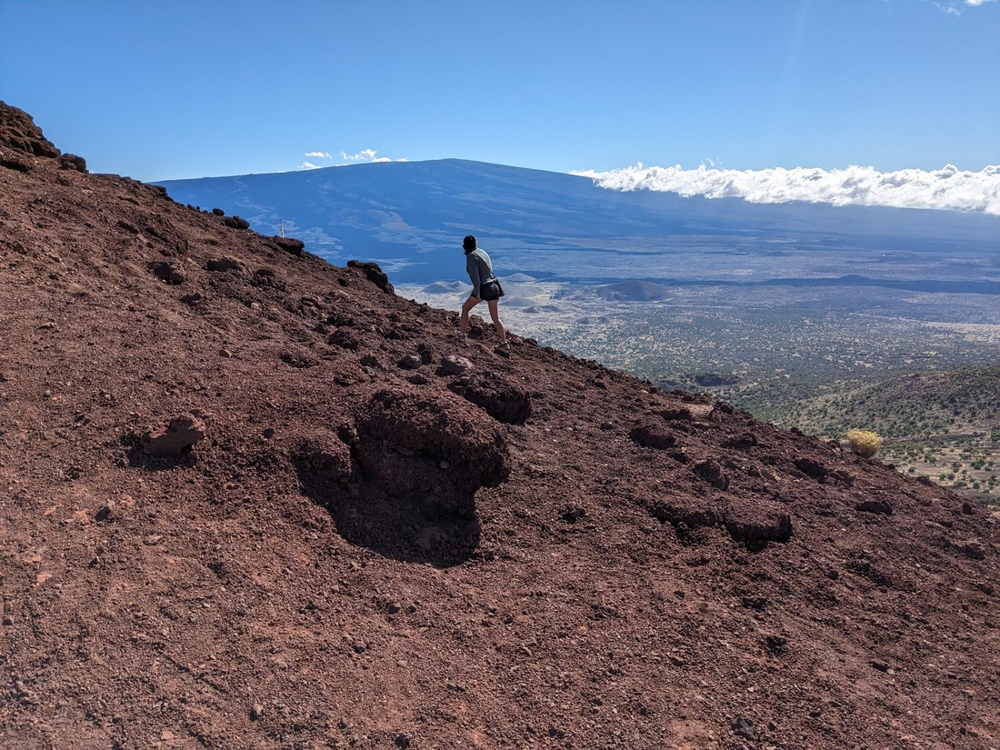

> Hooray?

Poor Dad. Not only does he have to drive, we bring him to the land of heat and humidity and make him climb mountains.

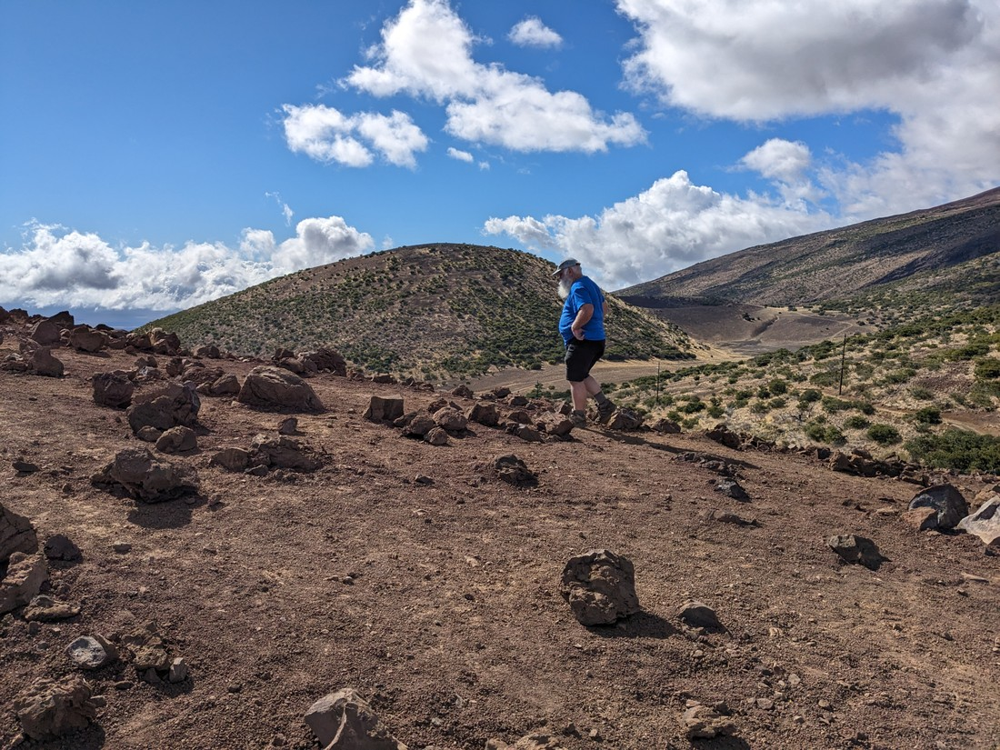

> And over such rocky terrain

Fortunately it wasn't a very long walk.

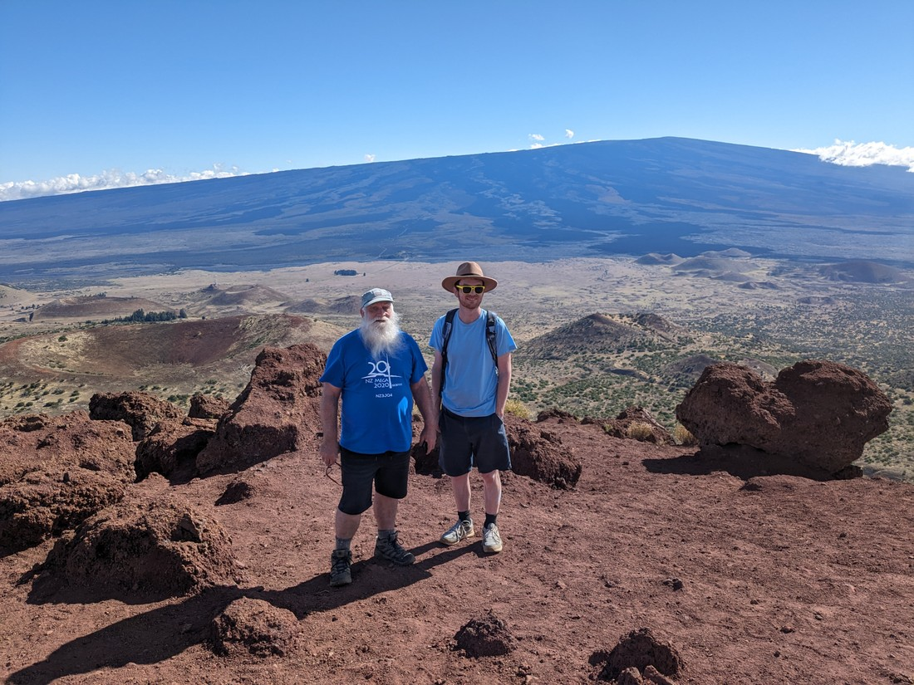

> We also seem to have worn matching outfits - although I think Dad needs a hat like mine

> Here already

It was just a little peak standing on the side of the mountain. Dad showed us how to take a proper hiking photo at the top.

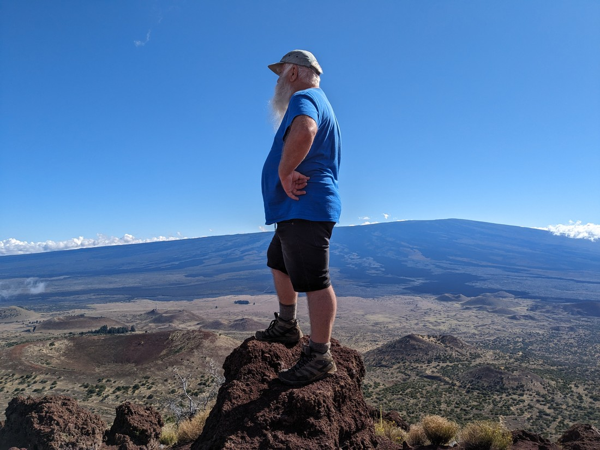

> Nicely done

Betty had a different stance in mind.

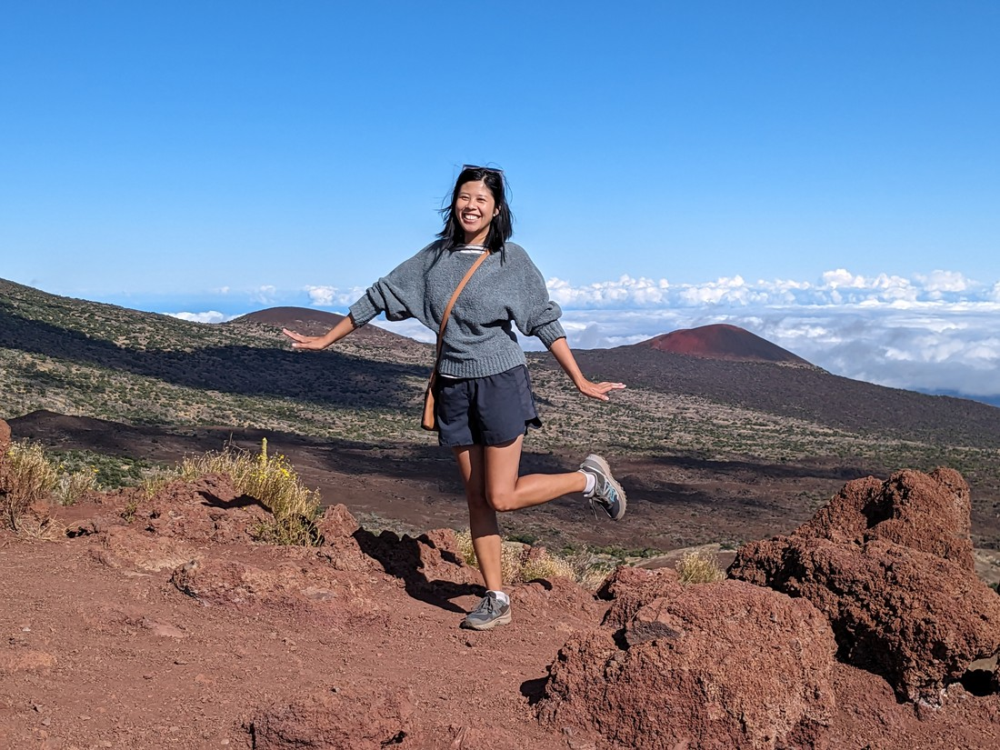

> Also nicely done

And no one offered to take a photo of me by myself so I had to selfie it.

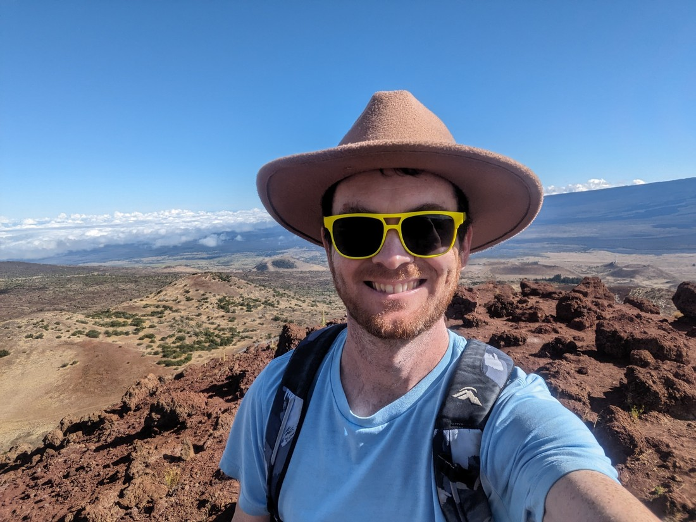

The other thing we had to do was search for a geocache. Dad seems to have downloaded all the caches for this island so wherever we end up, he's going to know if there's one of those small boxes nearby. Well the box this time was hidden underneath a rock, between some other rocks.

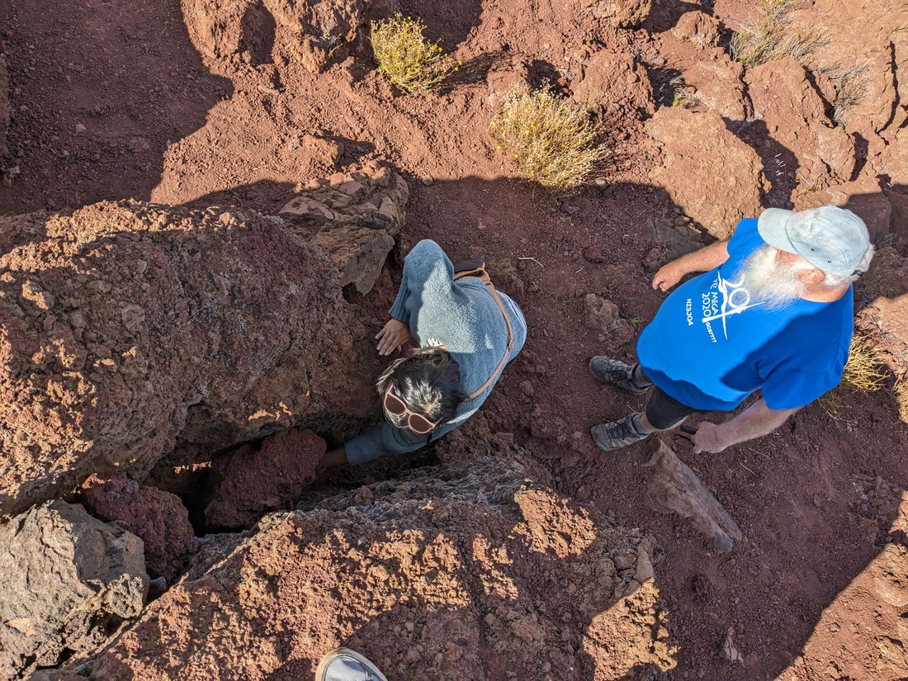

> Here is Betty, learning how to geocache

Now Mauna Kea has more than just volcanic rocks and geocaches - there is also an observatory up here. Something interesting about Mauna Kea is that it has an unbelievably high number of clear night skies each year. This is quite amazing as from here we're heading to the city of Hilo - which is apparently known for having an unbelievably high number of rainy days each year.

Anyway, there was a lot of space-related stuff at this visitor centre - including ice cream!

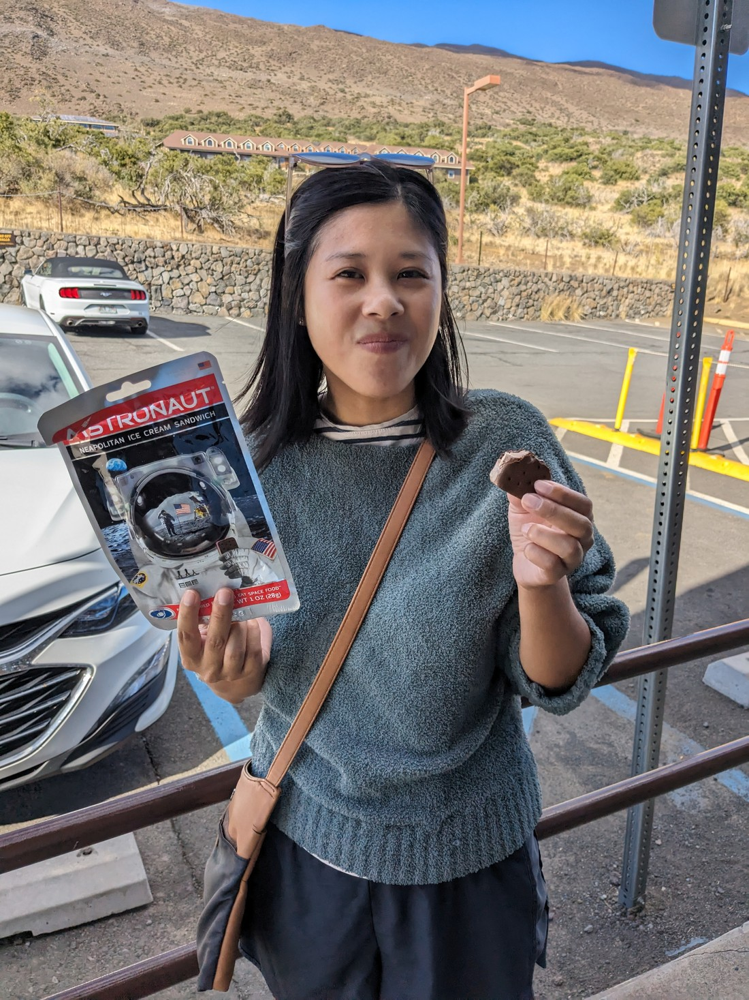

> Betty was not able to take a picture of me trying the ice cream because it got eaten too fast

This ice cream was freeze dried and other than taste, it did not feel like ice cream in any way. It felt more like a biscuit. It begs the question, "Why do astronauts have to have ice cream in space?" Well, I guess they do spend a lot of time up there so some treats are probably nice.

After we drove back down to the main road I spotted another trail on Google Maps. So I convinced everyone that we should stop for another walk.

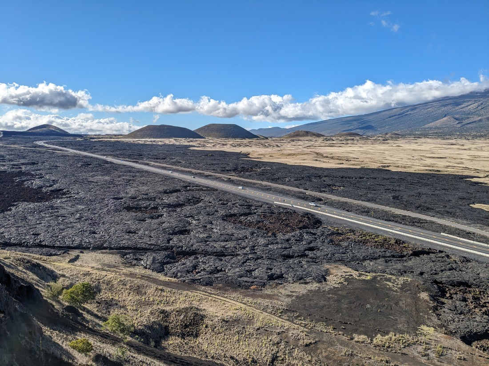

This walk was up and around / over another cone near the highway. Like the previous walk, it did involve some ascending. At the top we got to look out over the kind of valley area between Mauna Kea and the nearby Mauna Loa. There clearly has been an eruption at some point because much of the surrounding land was blackened by lava rock.

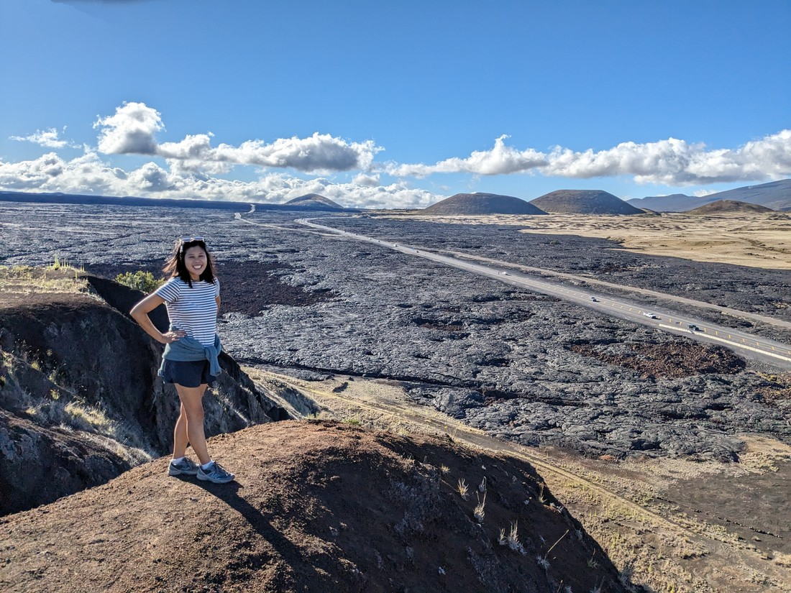

Naturally while we were up here Dad got out his list of geocaches and what do you know, of course there was another cache nearby. So we walked around in the forest a bit to find it.

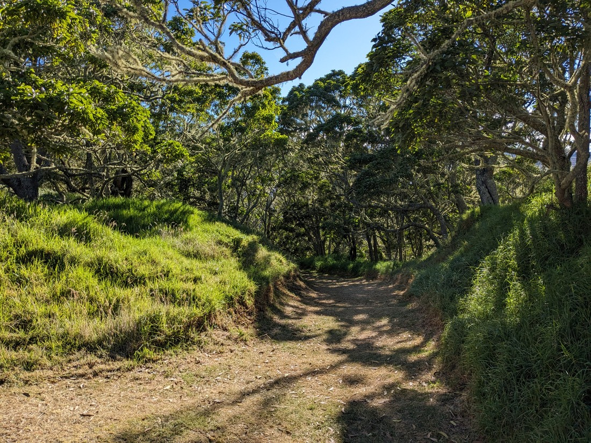

> A surprisingly green forest considering all the inhospitable volcanic rock about

Now all that was left was to pick up some supplies in Hilo and drive to our accommodation.

Perhaps now is a good time to discuss accommodation in Hawaii. Boy is it expensive - seemingly triple what it would have been on the mainland. With three of us, we're also a bit more limited in our options. We have found that hostels are the best value and often have private rooms with more than one bed - which are often cheaper or comparable to three beds in shared dorms. And the cheapest hostel on Big Island is in the small village of Pahoa on the eastern part of the island.

I didn't know what to expect from a "village" in Hawaii. It turned out to be much as expected. The village was little more than a main street, although there were a lot of farms and houses in the surrounding area. The hostel was small - a tiny kitchen area with three bookable private rooms upstairs. The showers were all in a separate building outside, along with the communal seating area. Notably there was no air conditioning in our rooms - hopefully that won't become an issue.

When the sun set we noticed something change. We hadn't noticed them earlier but there was now a lot of very loud jungle sounds coming from the dark beyond the chain link fence at the back of the property. The way I would describe it is a kind of "boo-beep" noise. And there was a lot of whatever it was that was making these sounds.

Sitting out here in the evening was quite a different experience to what we had in Waikiki. No huge buildings - just the sounds of nature. Oh, and also a cat.

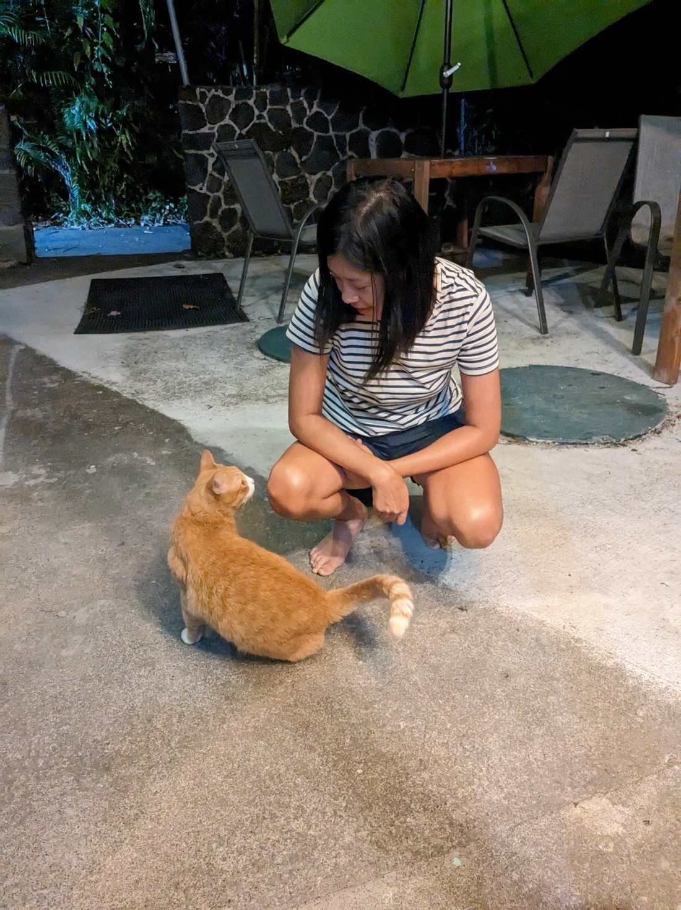

> Meet Bob Cat

Sitting there I researched what the jungle noises were. Apparently they were from the Coqui frog. These frogs can get quite loud apparently - you probably wouldn't want one perched outside your window while you're trying to sleep. Also, they aren't actually native to Hawaii. They are a Puerto Rican frog that first appeared in Hawaii in the 1980s. All attempts to get rid of the frogs have failed.

So the sounds aren't exactly authentic Hawaii noises. But I still like them. And Pahoa certainly feels "off-the-beaten-track" compared to the resort accommodations of Waikiki. For both good and bad.
