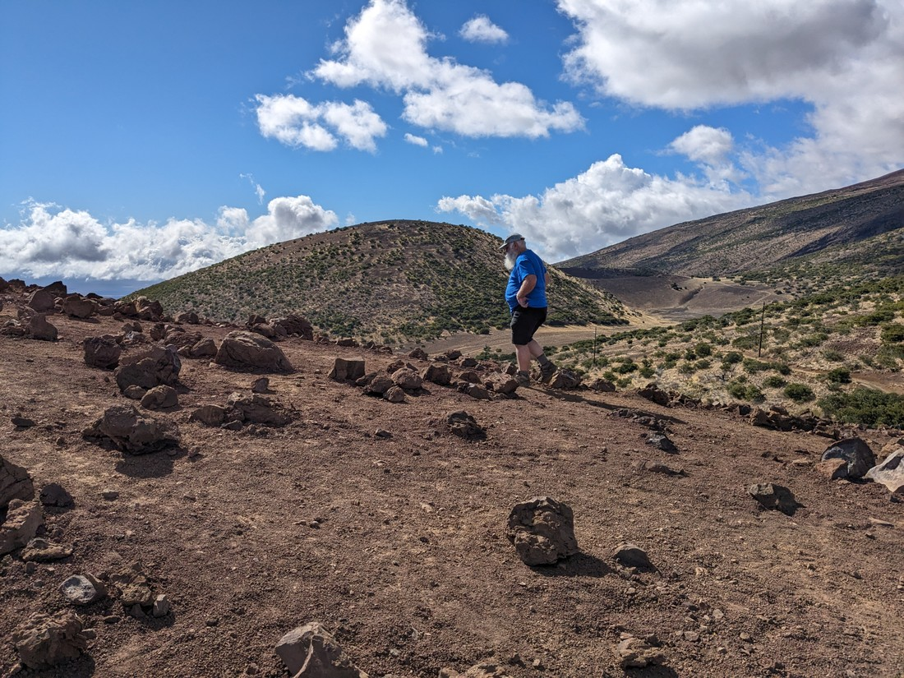
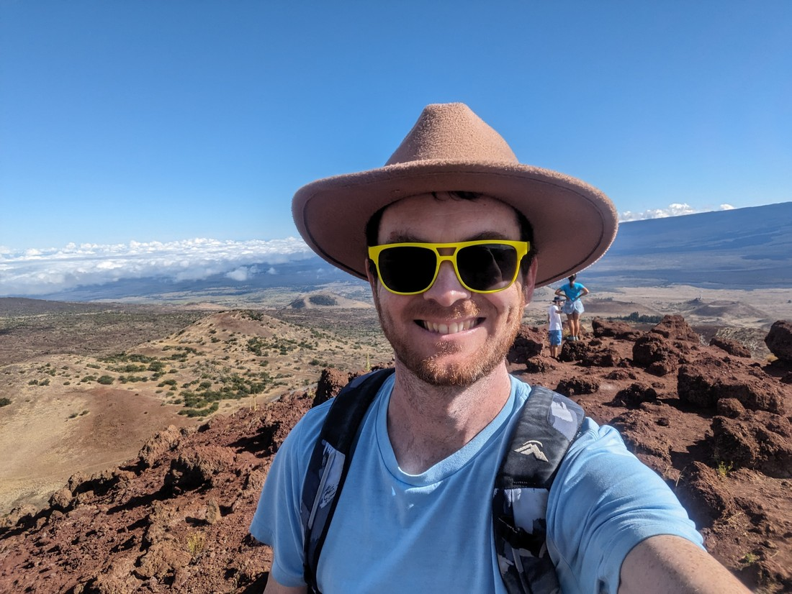

// Packed up early and caught an Uber to the airport

// Short flight

// Landscape of Big Island is really different. Very volcanic.

// Picked up car. It's huge. Dad has to drive.

// Bought a big sub to share with Dad for lunch, and then again for dinner

// Drove to Mauna Kea. The tallest mountain the world? Couldn't drive all the way up because the road is too steep for 2WD. Went for a walk. Dad found a geocache.

// Stopped on the highway to do another walk. Another geocache found.

// Walmart at Hilo. Nothing special happened here

// Hostel at Pahoa. Very rustic - shared toilets and showers, most of which are outside. No AC - windows open. Lots of insect / jungle noises
