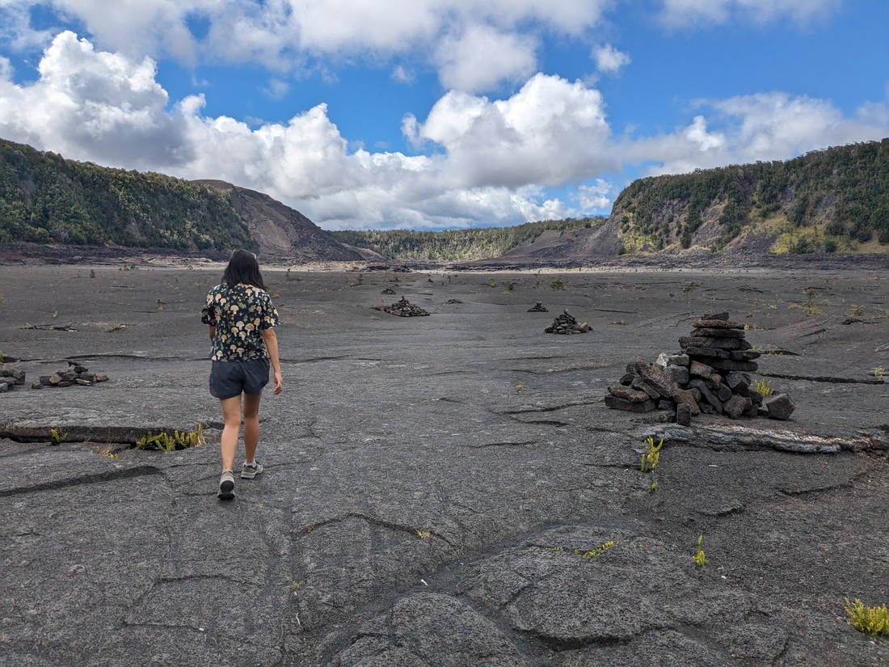

Today had a bit of a delayed start. The main reason was that I had to do a video call with my old employer in New Zealand. Yah for potentially having work again when we return. However another reason was to do with cats.

Today we plan to visit Hawaii Volcanoes National Park. This will be our 26th and final national park for our trip. We're coming to the end now - there will be no more after this. There is one more national park in Hawaii but it is located on a different island so we won't be visiting it. This park was kind of the main reason we came to this island so we may as well see it today. And being a US park, naturally it had a big sign out front.

And naturally there was a geocache located at that sign. Except we couldn't find this one. Apparently there was a really small container somewhere. Our search kept being interrupted by other tourists stopping to take photos with the sign so eventually we decided to move on.

Our first stop in the park was at the visitor's centre to find out what's good. They had a couple of itineraries for people who only have a day, half a day, or only a few hours to spend. As we were looking I overheard that the rim of the crater is actually nearby so we first set out to see it.

> Also is it a "crater" or a "caldera"? Apparently there's a difference.

It was quite large. The far side was a lot lower and there seemed to be some volcanic activity. Or at the very least it was a bit steamy.

The name "Volcanoes National Park" might be plural but there's really only one volcano here to see. Its name is Kilauea and it is one of the most active volcanos in the world. When people come to Hawaii, something they often want to see is lava and Kilauea is one of the most likely places to find it. We certainly wanted to see lava.

Except it's not erupting at the moment. We hadn't missed an eruption by that much - Kilauea was erupting back in September - but the park's website noted that it had now ended and was unlikely to restart any time soon.

So no lava. But that doesn't mean there isn't other stuff to see. We drove around to another viewpoint, this one a bit more elevated.

It was closer, but it still felt like we couldn't see much of the lowest part of the caldera - where most of the steam was coming from. So we walked along a trail that along the rim to another viewpoint. This one had a better angle to see down into the deepest part of the crater.

As you can see it was steaming a bit in places, but otherwise it seemed very lifeless. This rim was no Grand Canyon or Bryce Canyon

Betty and I decided to walk further along the trail. Dad kindly offered to skip the walk so that he could go get the car and meet us further along.

It's still warm but it certainly isn't as hot as it was back on Oahu. Perhaps that's because we're higher in elevation here? We're about 1,200 metres above sea level - is that enough to escape some of the humidity of being so close to the equator?

Once we'd met up again, we drove along to the other most popular spot on the park. We parked in the overflow carpark, just a short walk from the short walk that we planned to do. However on the way we spied a bit of something to the west.

I thought to myself, "I want to do that." But despite my earlier comments, it was still warm and humid. With Dad here there were also three people's needs that needed to be satisfied and so compromises need to be made. It also wasn't that long before lunch (so likely tummies would be getting hungry) and all we had with us was the last muffin from a former four-pack.

But anyway, we were here to do a different walk. This one was to and through a lava tube.

A lava tube is what happens when the outside of flowing lava hardens into rock, then the lava in the middle flows out. I find lava tubes often don't feel like caves because they're usually quite straight. At least, that was how the lava caves on Rangitoto felt.

This one felt very different. While it was relatively straight, the walls, ceiling, and floor all seemed a lot dirtier than the volcanic rock tunnels that we'd encountered on Rangitoto. Perhaps this one is a lot older than Rangitoto's and therefore has had more time for dirt and sediment to take over.

And this tube wasn't very long. In about 10 minutes we had looped back around to the road.

This point was also the start of the trail down to the Kilauea Iti trail which was the one we had spied earlier. Perhaps because the lava tube walk was so short, Betty agreed to do this one. We left Dad behind to do as he pleased (probably geocache) and we began the hike that he hadn't properly researched so didn't really know how long it was going to take.

Well it didn't take too long to wind down the crater side to the bottom.

As you could see, from here the trail ran straight along to the far side of the crater. We were walking on what I can only assume is solidified lava rock. It was definitely a crust of some sort, bulging in places where it had been pushed from underneath.

Fortunately it was rather cloudy when we walked this of the trail. I imagine it could get quite hot out in the sun, sheltered from most of the wind inside the crater. Overall it did feel rather neat to be down here and I don't really know why. Perhaps because these rocky terrains feel very alien? Like we're on another planet? Regardless we got a bit giddy.

We don't do many silly poses when there are other people around and now that we're travelling with Dad, we have an extra reason not to embarrass ourselves. However Dad is not here right now, so here's me trying to photograph Betty mid-jump.

Upon seeing what I had captured, Betty exclaimed that it didn't look like she was in the air at all. So here's a comparison photo of me trying to copy Betty's mid-air pose.

By the time we got to the far side of the crater it was getting much sunnier and hotter. From here we had to climb back up a steep trail and then walk back along the rim of the crater

Overall the walk was about five kilometres but it didn't feel like it took that long for us to hike. In our absence Dad had taken the liberty of polishing off the muffin. I can't blame him since I specifically said he could, but a small part of me was disappointed. There's just something about banana + chocolate chip muffins that taste so good.

From here we drove back to Hilo (the city about 20 minutes from Pahoa village).

While in Waikiki Betty had learned about a local dish that she was dying to try. It was called a Loco Moco. We hadn't gotten round to trying it on Oahu, mostly because it was so hot and partly because 7-Eleven was so nearby. However Cafe 100 in Hilo holds claim to being the birthplace of the Loco Moco - so of course we had to go there for lunch.

A Loco Moco is a bowl of rice with a burger patty, fried egg(s), and gravy. That's it. I was like, "surely such a thing exists elsewhere" but perhaps not in the right combination of flavours that make a Loco Moco what it is. So I didn't completely understand Betty's enthusiasm but I had no better ideas for lunch. The cafe did have a wide range of different types of Loco Mocos, with chicken, pork, tofu, veges, and several types of fish being substituted for the burger patty. There were also several different types that had multiple types of meats. Whatever you want - there'll be a Loco Moco to suit your tastes.

I don't know if I can describe exactly how Betty felt about the Loco Moco but I imagine it was similar to how I feel about banana chocolate muffins.

It had started raining on the drive to Hilo. Then it started raining harder. Then even harder. I mentioned in the last blog post that Hilo apparently is quite a rainy city and here's the proof. We had to run from our car to the Loco Moco place. Fortunately there was no queue, despite signs indicating the place gets busy enough that the queue can stretch out the door.

And that was about it for the day. From Hilo we drove back to Pahoa and other than some traffic woes, I have no further notes for this day. Well, other than Pahoa seems a bit dodgy. There seems to be a lot of people hanging about on the street at night and during the day. We'd care less but that's where our rental car is parked so it does make us a bit nervous that it might get damaged.

Fortunately the other guests at the hostel are very nice. We got talking to a German and French couple staying in one room and a young New Yorker staying in the other. We also watched Bob Cat wander about and get annoyed at the giant toad that had taken up residence in his water bowl. I guess this is what happens when your rooms don't have air conditioning - you end up hanging out in the outside communal area getting to know everyone else. And everyone usually is very nice because everyone else will also be on holiday. Perhaps we should have done more of this throughout our journeys.

Well, it's too late now to get to know more people. But hey, despite all our travels Betty and I are still COVID-free so perhaps there are advantages to keeping to ourselves like we do. And if we're ever too shy to go talk to people, we can always rely on Dad to get chatting with them.
