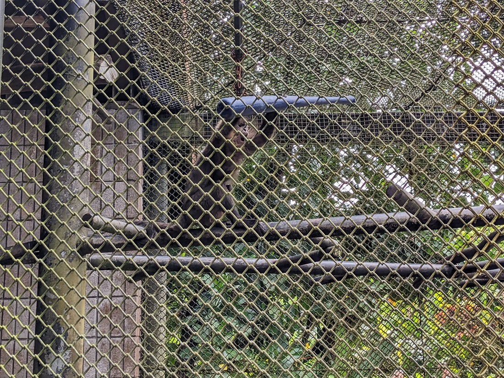
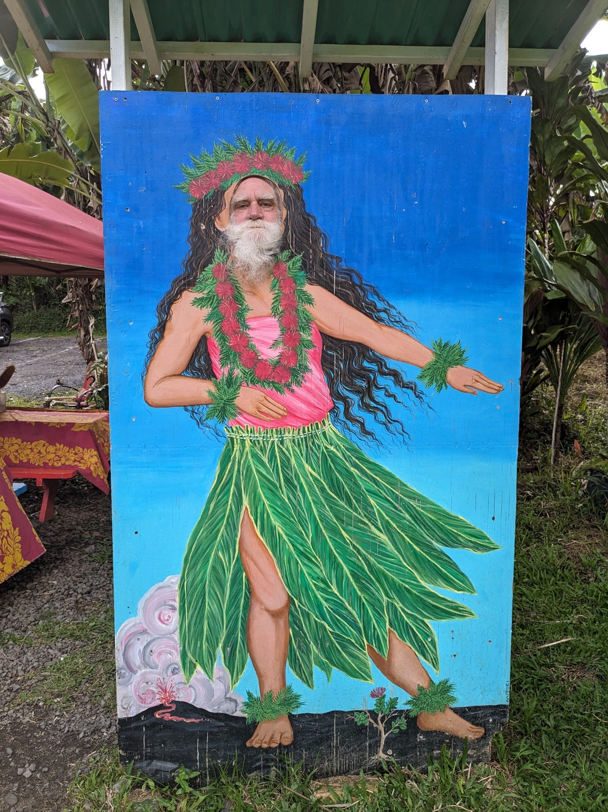

We decided that for today's activities we would spend the day exploring the area around Hilo. I had saved a bunch of attractions most people seem to think are quite popular and then off we went.

Our first stop was the Pana'ewa Zoo. None of us had any great interest in paying a lot of money to go see a zoo in Hawaii, but this one sounded different in one particular way. The zoo had no entry fee. Of course we're not here to be that cheap so we enquired about what was the recommended donation. The reply we got was, "Why don't you go see the zoo first and then decide what to donate?"

So we just walked in.

As zoos go it was decent. It felt like the Hamilton Zoo in many ways. This is because it will inevitably feel small when compared to the big city zoos but it still has a reasonably varied range of animals.

> Like a bird with a fancy hairdo

It even had an animal I'd never seen before. It was called a Biturong, but it is also often known as a "bearcat". It kind of walked like a cat or a red panda, but had a face more like a seal, and was covered in thick bear-like hair. After visiting many zoos over decades I had assumed I now knew all the animals of world so it was a surprise that there was still at least one notably different creature I hadn't seen yet.

> Though its a shame I couldn't get a good photo due to the caging being so thick

Another sight that caught our attention were the monkeys. We were walking past and we noticed they had some objects in their cage. These objects turned out to be plastic baseball bats.

> Sometimes they used their tails to carry the bats as they climbed

Even though they were in a cage, seeing a monkey with a baseball bat gave me a momentary "Oh sh\*t, the monkeys have armed themselves. This is how Planet of the Apes started". But no, the monkeys weren't interested in world domination. They were only interested in trying to break apart the plastic bats, probably expecting something to be inside.

As well as bearcats and monkeys, there were tigers, lemurs, parrots, macaws, turtles, anteaters, snakes, and more. There were also a lot of seemingly wild peacocks about.

> Luke likes peacocks - they're like fancy ducks

There was a building which held a few reptile and amphibians. It became a game of "spot the animal" as we peered through the glass trying to spot the frog or lizard. Half the time we stood there for five minutes before realising the creature was on a leaf really close to the glass, and we just hadn't seen it because it blended in so well. However there were also some frogs which didn't blend in. These had bright colours to warn other animals that they are poisonous and it was quite amazing how striking some of the colours were. One type were called bumblebee frogs because they were yellow and black exactly like a bumblebee.

Another thing the zoo had were benches in the shape of many of the animals of the park. There must have been about 10 - 20 different bench designs and while they were not as practical as a more standard shape, they were impressive.

There was one last animal we wanted to try and see. It was called a Miniature Zebu. It was described as being like a cow. Like the Biturong, if it's an animal we don't know then we want to see it. Well we missed its enclosure when we went round the zoo the first time, so we had to make another lap. Then we found that it was hiding up the back, behind some of the other enclosures.

Well the Miniature Zebu turned out look very much like a regular cow. So perhaps not worth doing another lap round the zoo to see. But as you can see, there was a lot in this zoo that was new to us so it was definitely worth a trip and definitely worth its entry fee. I can't remember exactly how much we donated but the zoo probably deserved more.

After the zoo we headed to a small park to see Rainbow Falls.

I don't know why but I wasn't feeling this one. Perhaps on a fine day this waterfall might have looked quite nice. After all, it's named "rainbow" because of the regular rainbow that can be seen. Well, clearly that rainbow doesn't happen on cloudy days.

We walked up a path to the top of the falls to get a better view, and found a much worse view. Then we noticed some of the trees nearby.

It was a kind of grove / thicket with a few very tall trees that created a canopy of twisting branches way up in the air. The previous picture didn't really do it justice so I tried fiddling with the camera settings.

> It was very dark under here

We all collectively agreed that these trees were more interesting than the falls. I suppose it's like the walk we did yesterday that I described that as feeling very "alien" and I guess that's the key. We want to go places that aren't like what we're used to. The waterfall may be impressive, but we've seen them many times before. Weird (to us) trees are more appealing right now.

So it's lunchtime now and we're in Hilo. Where do you think we went? Yep - back to the Loco Moco place.

Afterwards we set off north along the coast to a state park. Driving along we saw signs for a scenic route, and we figured we may as well take it. The road was rather narrow, regularly wedged between cliffs and trees with plenty of one-lane bridges. It probably wasn't the type of road Dad wanted to be driving in such a large vehicle.

Anyway, we were driving along when we came across some cars parked on the side of the road near a trailhead. We don't have that many pre-planned activities for today so we stopped to check it out.

We found out that we could only walk a short part of the trail as the rest went through the Hawaii Tropical Bioreserve and Garden. This sounds like a neat place to visit, but the entry prices were higher than we would have liked. Plus, we can see many of the trees from here.

The free part of the walk led down to a kind-of beach. It was scenic but it was also small - and rocky enough that you wouldn't want to swim or sunbathe here.

I guess I didn't need to mention this part of our day. Overall the walk wasn't anything special but it was worth a stroll. Plus we did get to see more strange Hawaiian trees.

The park we were heading to was called Akaka Falls State Park. Here we found another walk to a waterfall.

Akaka Falls was a bit more impressive than this morning's Rainbow Falls. It was certainly a lot taller, to the point where we couldn't even see where the bottom was. However likely it was nicer because it was sunnier away from the cloudiness of Hilo.

The walk to the waterfall was also nice, despite being short. It was a loop and we basically walked it twice. Since we couldn't see the bottom from the viewpoint, we didn't know whether there was a better one further on. Then when we later realised that it was the only viewpoint we were going to get, we decided to backtrack to get another look at it.

> And also smell the flowers again

On the drive out of the park I spied a roadside stall selling coconuts, pineapples, and sugarcane. I insisted we stop so we could buy a coconut. It might have been a whopping $16 NZD for a single coconut but this seemed like something worth trying. Perhaps we could have got a better deal elsewhere but we weren't elsewhere right now.

The stall owner took a coconut and using a machete, chopped a some of the husk off so that a straw could be stuck through. We then shared the coconut around. The coconut water wasn't as strong as I was expecting. Dried coconut is very flavourful but this was almost bland. That being said, it was very refreshing - although there wasn't a whole lot of liquid in the coconut.

If this was all we would have gotten then $16 would have seemed like quite a waste but after all the liquid was gone, the machete guy then proceeded to remove the rest of the husk and cut up the flesh into bite-sized pieces, which he put in a zip-lock bag for us to take away. Like the coconut milk, this proved to be quite an enjoyable snack and we ate most of it on the way home.

So obviously we were overcharged for a fruit which probably can be found lying around all over the island - but I couldn't have us come to Hawaii and not try it. Plus that husk looks strong. It's not like we have machetes. Also, while we were sitting and waiting for the chopping to finish, I told Dad to stick his head through a nearby piece of wood.

> He knew it wasn't going to be a good thing, but he did it anyway.

The last thing we did for the day was to visit Liliuokalani Gardens and Coconut Island in central Hilo.

> Some more interesting trees

One of the first things we noticed after parking was that there were a lot of cats about.

> Perhaps cats like the interesting trees too

We also spied some mongooses. They had been something we had been keen to see in Hawaii since we don't tend to see them elsewhere. They are a large rodent or ferret-like animal. One particular mongoose was getting far too close to the cats. But I had worried for nothing. The mongoose was after the cats' food and the cats were clearly very well fed and had no interest in hunting mongooses.

Unlike Magic Island from a few days ago, Coconut Island was actually an island. However it wasn't much of an island. It was kind of just a place for picnics.

> Apparently people did reside on this island but their houses kept getting flattened by multi-story high swells or tsunamis. Which seems kind of obvious. People are stupid sometimes.

Liliuokalani Gardens is a hundred year old Japanese inspired garden. It wasn't much but it was a relatively calming place to be.

> Well, only calming if we don't have any of those multi-story high swells

There was also a Hawaiian fish poster.

> It needs a shed

And finally today, ended in much the same way our days tend to start and finish.

> Bob Cat enjoys company and we enjoy Bob Cat

Not every place visited today was a winner, but looking back there were quite a few sights and experiences that were new to us. And that's why were here, isn't it? That's why we left the main popular island to this volcanic land of chirpy frogs, isn't it?

Despite six months of travelling, I don't think we're sick of it yet. The world is such a huge and varied place that six months still doesn't feel like we've covered that much of it. However obviously we've still seen a lot and it's almost about time we came home.

Two more days.
