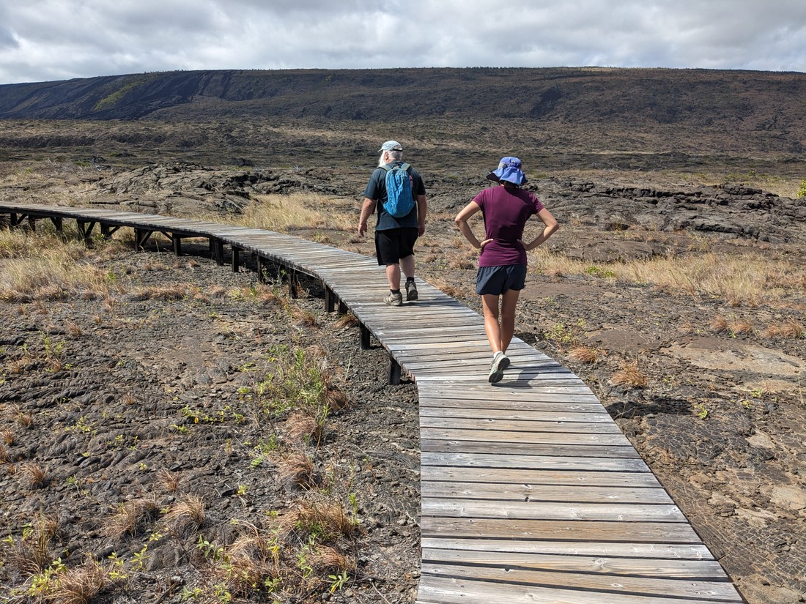
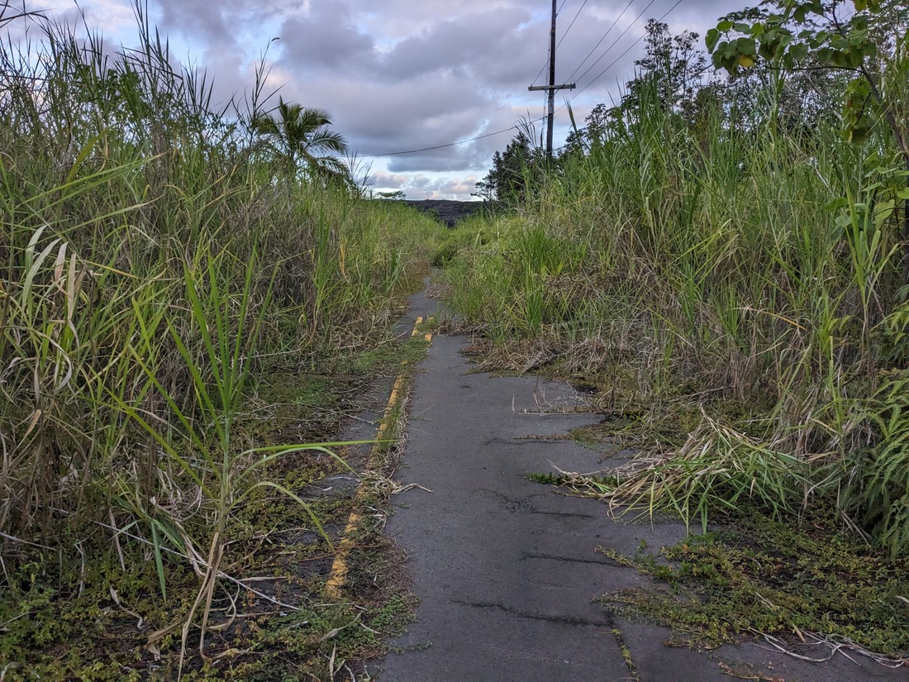

// Nothing really planned for today. Decided to drive back to Volcano National Park and drive the Chain of Craters road.

// First was hiking the Devastation area. This wasn't that great. Then we walked along the old Crater Rim road to get to a couple of viewpoints. This was perhaps the best viewpoint of the main crater, as we were able to see right down where it was steaming.

// Drove down the Chain of Craters road, stopping regularly for quick picture stops. Many were not all that amazing, but further down we came to areas covered in lava rocks. We also began to see the sea. Near the bottom were areas where some lava was clearly newer than others.

// Got to the bottom and time for lunch - Subway we had bought on the way. Actually quite hot down here.

// Walked along to the arch viewpoint. Not that amazing

// Walked the petroglyphs hike. These were interesting, but boy was it hot

// Drove back up.

// Stopped somewhere so Dad could find a geocache. It ended up being a marker for a hole called Devil's Throat, which was a really deep pit crater that was perfectly round and rather deep.

// Before heading back to our accommodation, we stopped at Lava Tree State Park. It wasn't all that scenic but it had some interestingness. Also a geocache, which we had to return to get.

// Nearby was an attraction labeled on Google as "The End of the Road" which was an abandoned road that had been overrun by lava, and then nature.
