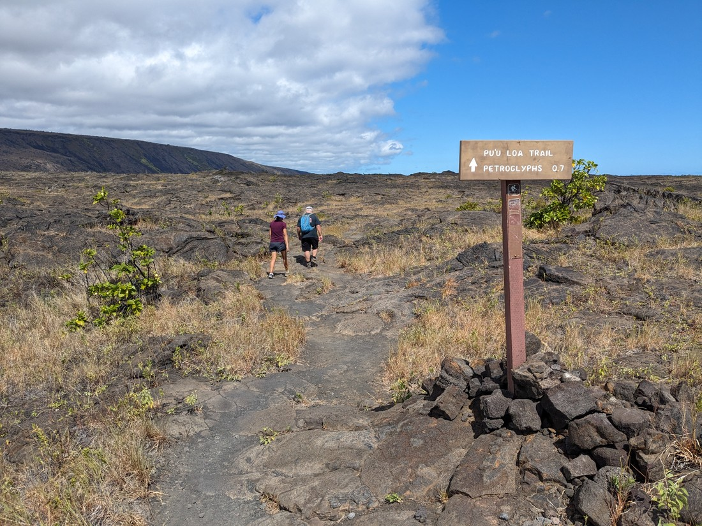

Today began with no solid plans. We'd already done the three things we most wanted to do (Mauna Kea, Volcanoes National Park, and Hilo) but nothing else was catching our attention. So we decided to return to the national park. On our first visit we hadn't actually strayed that far from the visitor's centre. However the park ran all the way to the coast and there was a scenic drive down there - so that's what we decided to be doing.

Our first stop was to a supermarket to pick up some lunch. However somehow each supermarket we visit in Hawaii keeps having increasingly pricey prices. So instead it was across the parking lot to Subway for us.

Our next stop was at the park sign again. Dad wanted another go at finding the geocache here and this time he found it. It turned out to be a container the size of a marble, magnetically stuck to the underside of one of the info signs. That's a tricky one.

Our first actual stop was a trail called the Devastation Trail. This trail ran through an area which had covered by falling cinder during the 1959 eruption of Kilauea Iki (that crater we walked through two days ago). For a trail with such a name and history, the scenery was strangely... boring?

> Very gravelly

The trail also didn't last very long. So we decided to continue walking along Old Crater Rim Drive, which was a former road.

> Poor road - lost its job and is now has to settle for being a hiking trail instead

This road took us to the best viewpoint of the main Kilauea crater.

It's weird that the viewpoint on the other side was the place most recommended by the visitor's centre. We felt like we couldn't see any of the lower crater from there. But I suppose there were stuff like parking and toilets and all those other things that humans care for. This viewpoint wasn't much more than a rocky area fenced off from the rest of the rocky area.

> Like father, like son

On the other side of the road was another crater - but not quite as big this time.

> Keanakakoi crater

And further along was the likely reason why this was no longer a driveable road.

I imagine this is quite a changing park. Its seeming to be that every decade or so the volcano erupts and destabilizes a viewpoint, covers part of a trail in rocks, or smothers a road in 3-4 stories of lava. Well, since we couldn't go on so we had to go back.

Back at the parking lot was something I haven't talked about yet. As we drive throughout the island we sometimes see "Nene crossing" signs. Well, this is a nene:

If they look a bit familiar, that's for good reason. They evolved from the Canada Goose. Basically, some geese half a million years ago arrived in Hawaii and liked it so much that they never left. I'm not even sure they can fly anymore. Apparently they can but they clearly prefer not to - hence why there are signs warning motorists about them.

As I mentioned, from here we would be driving towards the coast. The road we were on was called the Chain of Craters road and at rather regular intervals there'd be a stop on the side of the road to see a crater. Except these seemed to be somewhat older craters than the ones seen already. Some resembled the Keanakakoi crater but a bit overgrown. Some resembled it, but even more overgrown. And some were so overgrown that for all I know they may not have been craters at all. After a few stops I gave up asking to stop to take a look.

It wasn't long before the forest gave way rock:

This was the landscape all the down to the ocean. In fact, along this road you can somewhat see the history of Hawaii. The volcanoes erupt rather regularly and the lava flows down to the coast, enlarging the island.

> A range of colours indicates a lot of different flows

We were now back down near sea level and the sun was out in full force. We lunched on a park bench between a couple of toilet buildings. This may not sound like an ideal place for lunch but this was literally the only place around with some shade. Also at the end of the road was a short walk to an arch. This was the view of the arch from the viewpoint:

> It's not the most amazing thing we've seen

> The sea is more attractive than the coastline

There was also one more walk nearby to some petroglyphs. We were quite impressed by the petroglyphs we'd seen at Capitol Reef so we set out to make the walk. It was only a kilometre, but it was a long kilometre in the the low altitude heat.

> You can also see the clear difference in weather between the coast and inland

Often it seemed quite difficult to tell what was man-made drawings and what was volcano-made patterns.

Ultimately the petroglyphs were quite obvious once we knew what to look for. They somewhat resembled Spongebob doodles.

> Apparently they were carved while the rock was still hot and malleable

Now we started the drive back up the Chain of Craters road to get back to the highway. However there was one more stop for us. Dad had missed a geocache on the drive down and wanted another chance at it. We spotted a small, unmarked trail into the trees and so we followed it. Then we realised we were on the wrong trail and had another go 40 metres further down the road.

What we ended up finding was something I can only be described as a giant hole.

> It was called the Devil's Throat

It seemed perfectly round with perfectly vertical walls. And it went deep. It was hard for us to to see how deep. We dared not go to close to the edge as I suspect the reason why this is not an official trail is likely because the ground is somewhat unstable. So to test the deepness Betty tossed a rock in. That looked like fun so I tossed one in, listening to hear the inevitable thud of rock on rock. About 10 - 20 stones ended up being tossed in.

So this turned out to be quite an exciting find. Apparently that's what the geocache was here for - to take us somewhere we might otherwise not have gone.

Before turning in for the night we decided to fit in a couple more stops. The first was Lava Tree State Park. Like what we've seen earlier (and most of Big Island it seems), a lava flow swept through this part of the island. However the molten rock wasn't strong enough to uproot all the trees and instead some petrified husks of tree trunks still remain.

The last stop was to a place literally titled "The end of the road". This unofficial tourist attraction was previously just called Pohoiki Road until 2018, when Kilauea erupted. This is just one of many places where a road was covered in 10 metres of lava.

> And then left for nature to retake it

This stop was actually quite far from Volcanoes National Park, which is where the Kilauea crater is. The spot is also quite close to our hostel in Pahoa. So how did an eruption cover this part of Hawaii? Well apparently when the eruption happened, the lava flowed underneath the ground before emerging in the Puna district. 35 square kilometres of land was covered in lava, destroying 700 homes and evaporating the largest freshwater lake in Hawaii. Since the lava also flowed into the ocean, 3.5 square kilometres of new land was created.

Looking back, today was the day we most got a sense of the history of Big Island. We came here knowing the state was volcanic but it was quite the sight seeing how often the landscape gets reshaped, and also how recently. While we would have loved to see it happening live, the impacts are certainly significant that we should perhaps count ourselves lucky that all we have to complain about is some rain and heat.

As I've said before we've been quite lucky on this trip. I don't think anything has gone majorly wrong in this entire trip. Canadian wildfires had turned the sky orange in New York at one point but somehow we avoided most of it. Snow locked us out of a couple of parks, but that was only in places where we had ample other sights to see. 90 reservations, and yet not a single missing booking or accommodation unexpectedly cancelled on us. No injuries or illnesses. No breakdowns... well, only a little one. And only one night sleeping in our car.

Okay, sure - we were a bit unlucky not to get jobs. However it's now been quite a while since we left Ontario and those memories have been solidly replaced by more happy travelling memories. All that "bad luck" has meant is that we've had to come home a bit ahead of schedule.

Still, there's still one more day of travelling ahead of us. One last day of adventure.
