This is the last day. Day 181 of our journey - almost six months to the day since we set out from New Zealand. If blogs are adventures then we have had 120 adventures across two countries, 19 US states and five Canadian provinces. If images are memories then we have 1,500 memories to look back upon. And if words are... okay, I've run out of metaphors.

Okay, I counted it up and by the end of this blog post I will have written 145,000 words. So yeah, that's too many words. That's 50 times longer than anything I wrote at University. It's also almost double the number of words of Harry Potter and the Philosopher's Stone. Why did no one tell me I was writing too much? Probably because everyone gave up after the first thousand - and if so, I can't blame you. Perhaps instead of writing this I could have written a novel. But then I wouldn't have anything to look back on to reminisce about the good old days.

So what happened in this good old day? Well, I'm going to spoil it early and say that nothing too special happened.

The day started with Dad being forced to consume the last remaining Snickers Ice Cream bar. Someone had to after all and it ended up being him. I don't remember why it wasn't me - they were pretty tasty.

Our mission for today was to drive back across the island, in preparation for our morning flight tomorrow. But this time we'll be taking the long, scenic route - which would take us through Volcanoes National Park for the third time. On the drive there I opened Dad's geocaching phone and noticed that there was a cache similar to the Devil's Throat one from yesterday. Since that one had been a surprise hit, we decided to stop and find this one.

The walk was a bit longer this time.

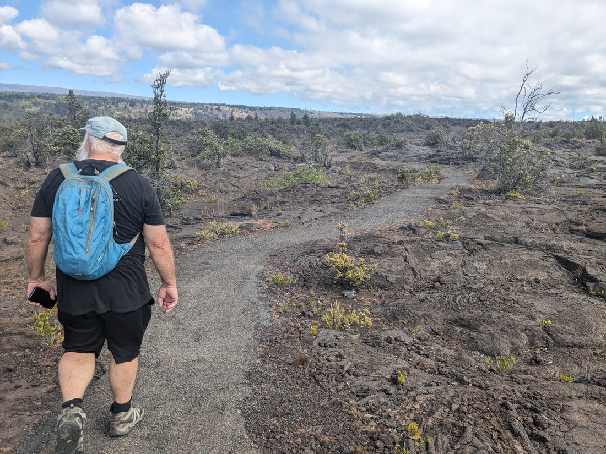

Like Devil's Throat, this geocache was to attract us to somewhere we might not otherwise go. This time the attraction was the site of a battle between Hawaiian tribes in 1790. Apparently the battle was interrupted by an eruption, which the soldiers took as a sign that their battle had displeased the gods.

There wasn't actually much to see this time - just some moulds of some footprints. That's not as fun as tossing stones into a big hole.

Our next stop was just a random viewpoint on the side of the road.

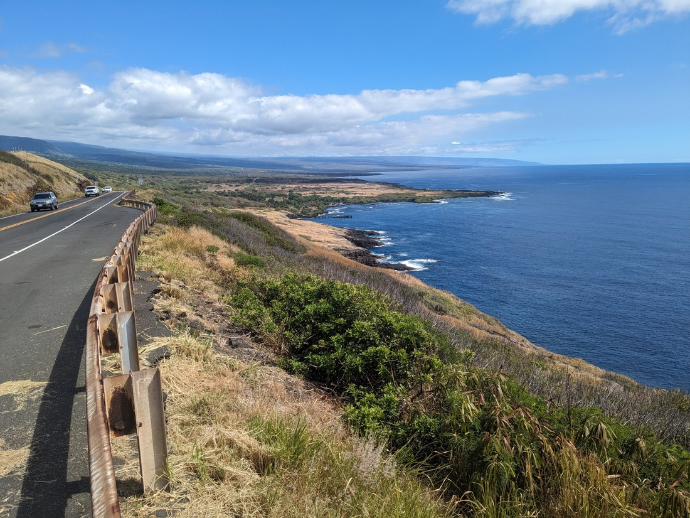

> It was on Google Maps so it must be good - 72 reviews averaging 4.8 stars out of 5

We figured we'd break up the driving with semi-regular stops. Naturally upon stopping I asked if there was any geocaches here. It turned out there was one less than three metres away. Fun fact - watching Dad find this cache would later help me find a cache in Auckland two months later.

Next we stopped at Volcanoes National Park - again. This was a separate unit and while we knew nothing about it, what else are we going to do if not stop here? So we went for a walk.

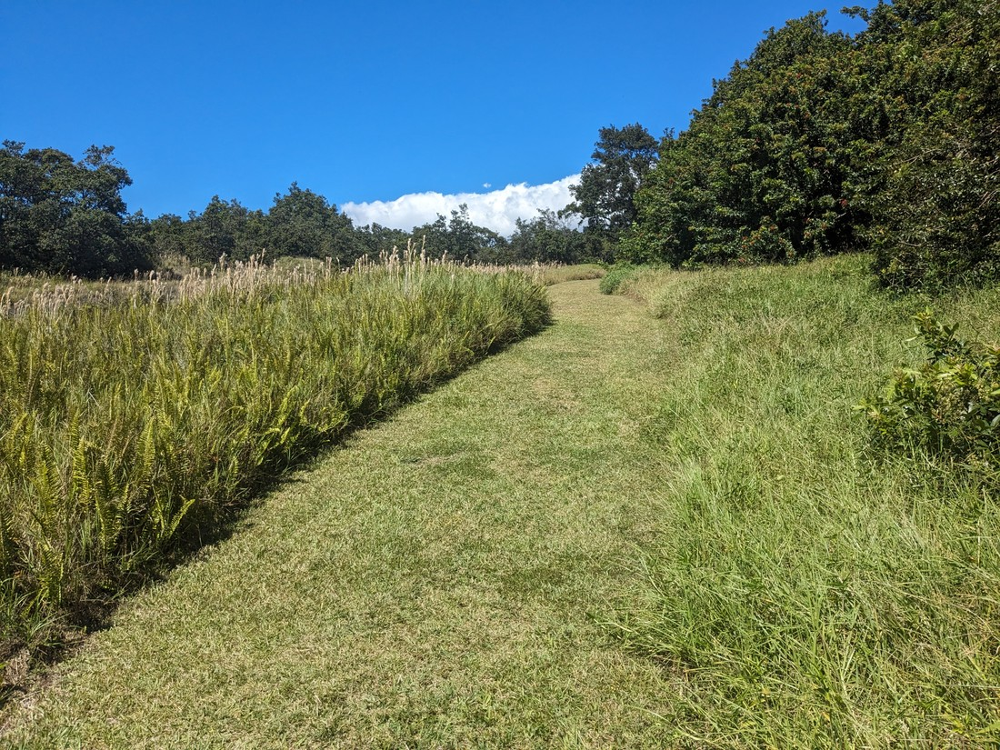

> Through grasses...

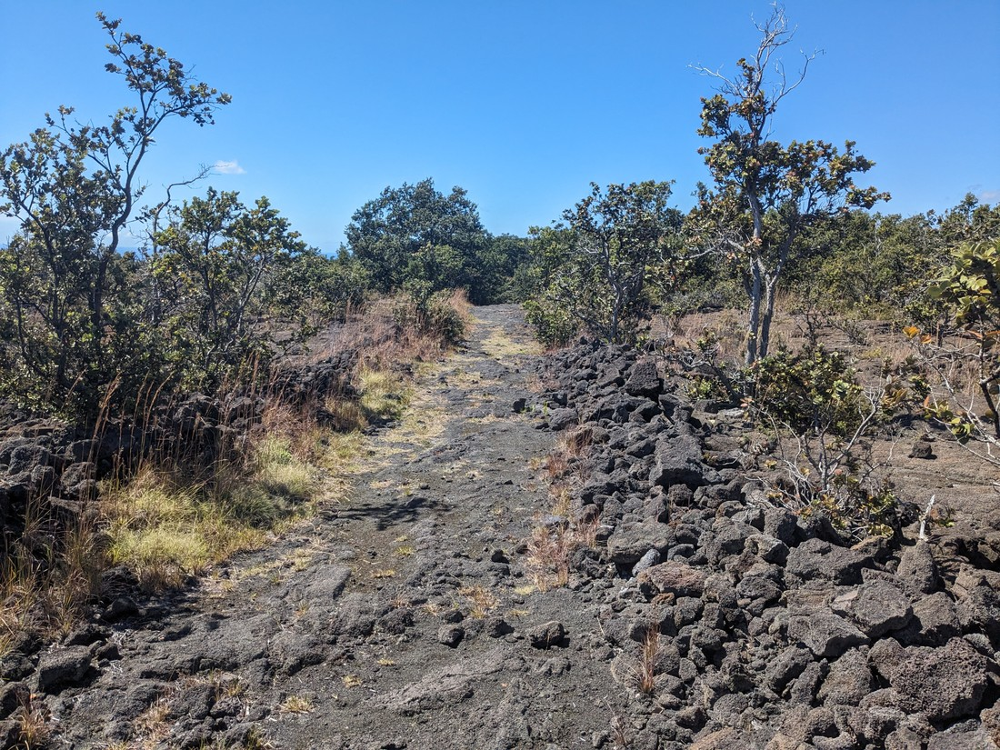

> ...and over lava...

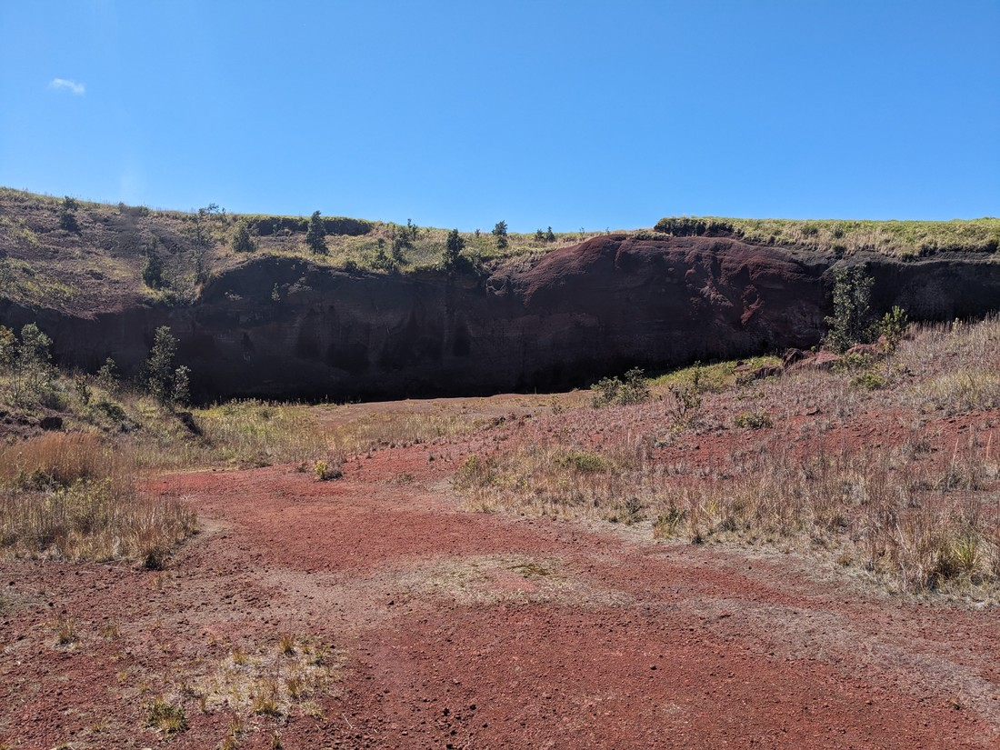

> ...and up a red hill

There didn't seem to be much to this part of the park. It sounds like this was once a farm and then the volcano covered much of it in lava so the farmers were like, "We can't be bothered with it now - we'll just gift it to the nearby national park".

Next on the agenda was The Southern Most Point of the United States.

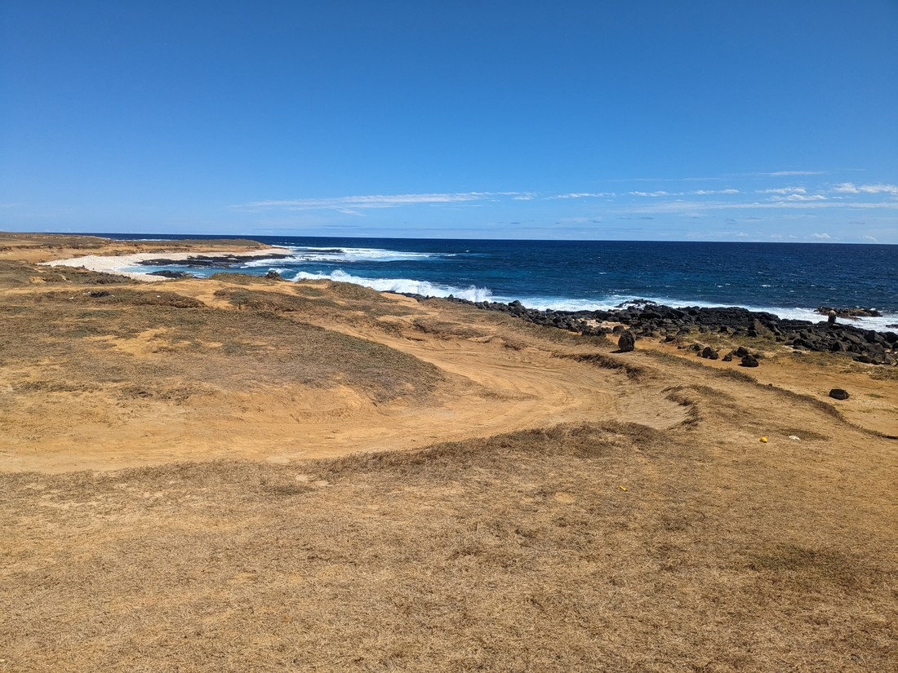

> You can probably tell by the colour of the landscape but boy was this hot

It feels almost symbolic that we'd find ourselves here. Since leaving Niagara Falls our journey was literally and metaphorically bringing us towards home. We stood on the black cliffs and gazed out over the bright blue water... mostly because it was too hot to do anything else.

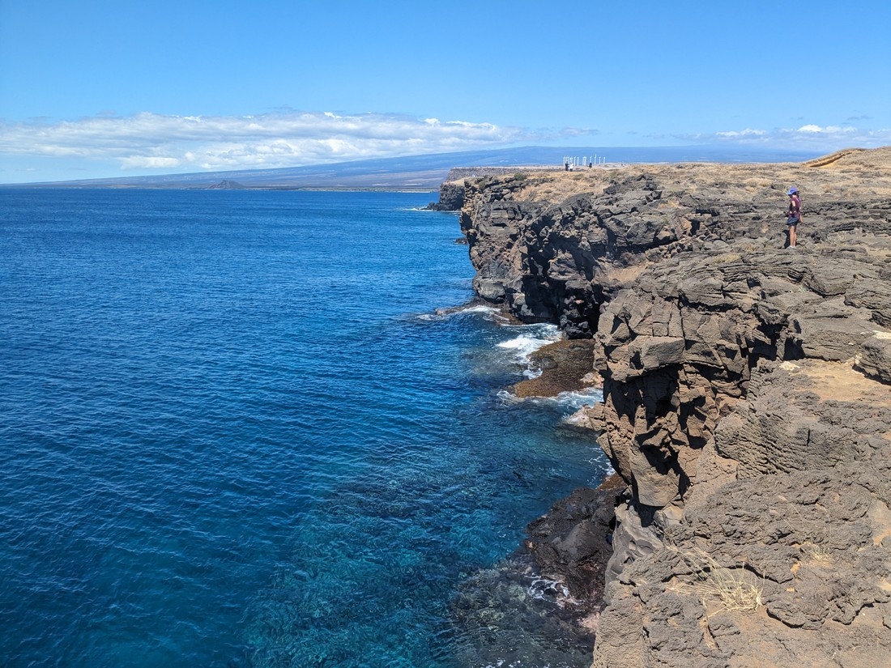

There were a lot of people about. Lots of locals fishing and picnicking. I had heard that there was a nice spot to jump off the cliffs into the ocean. It had been several days since I had been in the water and I wanted in again. Unfortunately the jumping spot was covered in fishing lines and had big warning signs advising against jumping - so it sounded like it wasn't worth the trouble. Which was disappointing. The water looked inviting. So clear, even from on top of the cliffs we could see fish in the water.

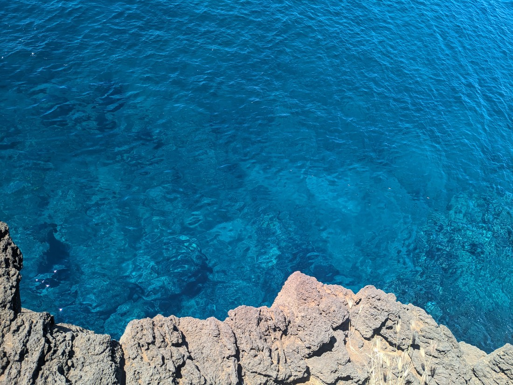

> Though not in this picture of course - the fish were very small

Civilisation was a bit sparse at this end of the island so it was another simple lunch from a convenience store for us. I bought my last giant can of juice tea. I'm going to miss these back in New Zealand.

From here we drove west to a National Historic Park. Our annual parks card meant we would have got in free, although there wasn't actually anyone about to take our money anyway. This place had some history of Hawaii as well as some replica huts.

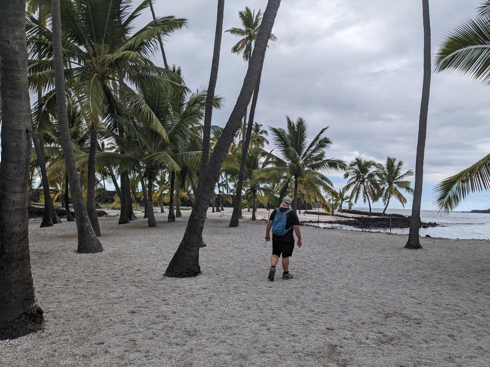

As I indicated at the start of this blog post, this was another attraction which wasn't anything special. We didn't really pay much attention to the info boards. Seems like we're potentially tired out.

One more stop was made, this time to downtown Kona. There was a market going on and a cruise ship parked in the harbour, but we were actually just here for a geocache.

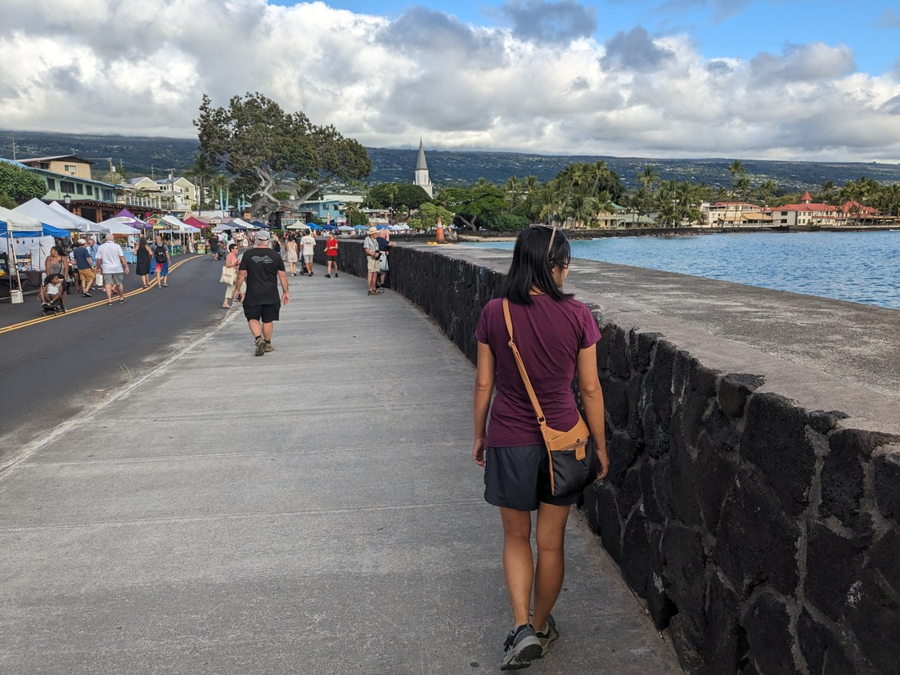

Our day ends with a walk from our AirBnB to the nearby convenience store where we bought one of the most unsatisfying dinners of our trip. We walked back through the dark streets as the sun had set long ago and that was basically the end of our journey. For me, it was a couple of frozen bean burritos bought while trying to avoid conversation with a conspiracy theorist buying a six pack of beer.

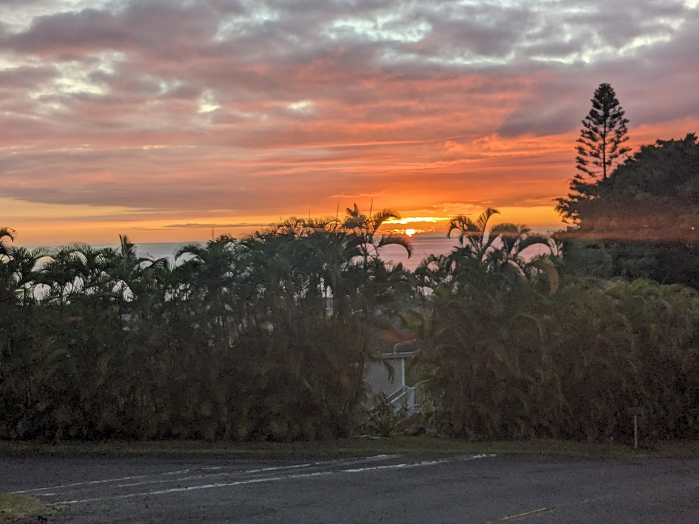

Today seemed like a series of missed opportunities to do something special. What went wrong? Well, nothing in particular. The issue was simply that nothing was as special as what we were hoping. Any one of our stops today could have been a unique experience but they all somewhat fizzled. However it was probably still a day of activities worth trying. Because that's the point of this entire trip right? To try things.

I believe it was in March 2022 that we decided to undertake this journey. It took a whole year to get everything in order. I researched every Canadian national park and perhaps half the ones in the USA. I made summaries of the sights and trails that we might want to do, and made estimates of how much time we would need at each park. I researched every campground including their facilities, and when their bookings would become available. I looked up weather reports to try and identify what places would be suitable to visit in what months. Then for the next year we booked and planned. On a dozen occasions I had to get up in the middle of the night to secure accommodation bookings that would sell out quickly.

This is the Luke and Betty formula for travelling. We did it this way because it worked out really well back in 2019. Don't change what ain't broke. For the whole year prior I was excited.

Back in 2022 job prospects in Canada were really good. It's a shame things turned out different in that regard in 2023. So our "holiday then overseas work experience" just turned into a "holiday then holiday". As you probably know, I am writing this having been back in New Zealand for over two months. Since I was committed to immortalising our journey in blogs, I have had to think about our holiday a lot since we flew back in. I have no hesitation in saying that we made the right call to come home when we did. The only regrets I have is that maybe we could have squeezed in some more holidaying in some certain places on the way back. We travelled for six months and yet my most lasting feeling is a wish we could have travelled more.

So, in summary - it was a very good holiday.

And here we are. This is it. It's been eight and a half months of writing blogs. Thank you for reading them. You didn't need to but you did it anyway. Thank you to those who supported us when we decided to uproot our lives to go chasing adventure. Thank you to Dad for coming along in the last part of the journey.

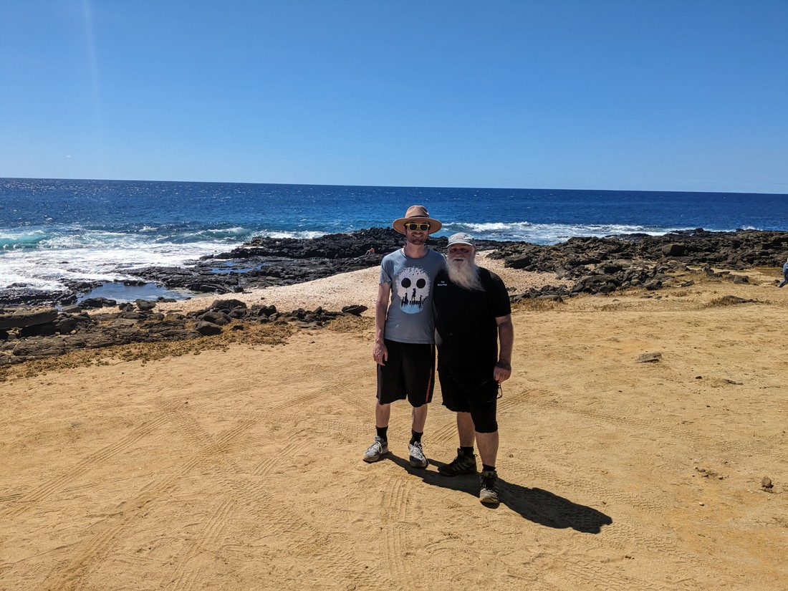

And mostly, thank you to Betty. Without you none of these adventures would have happened. Thank you for coming along this journey with me. Thank you for sticking with me through all the rain, sand, and heatwaves. Thank you for being there for all the highs and being there for all the lows. Thank you for making every day that much more special because I got to share it with you.

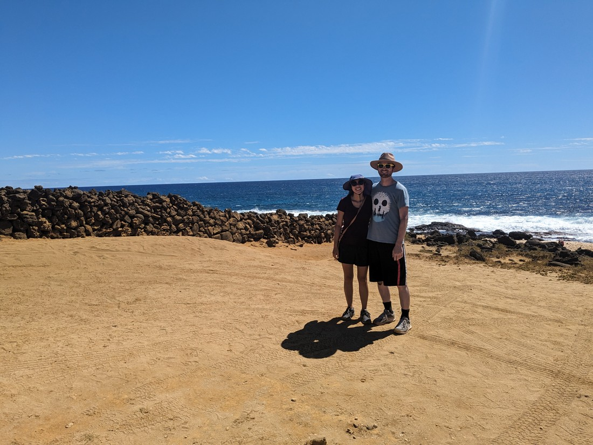

This is me, signing off.

Until next time.
