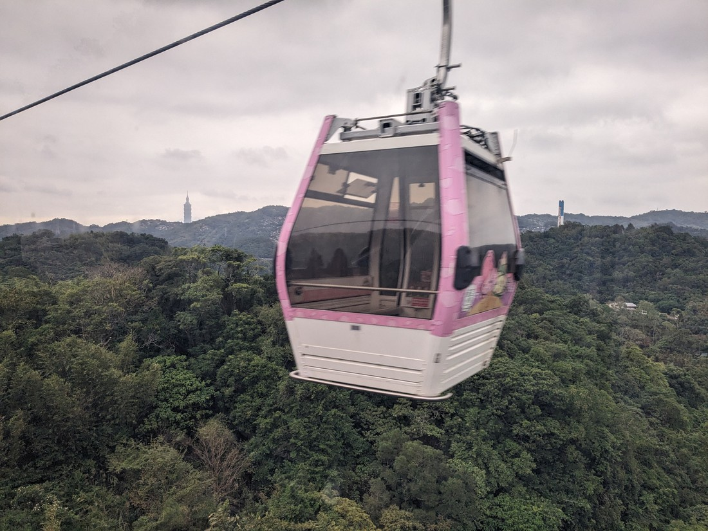
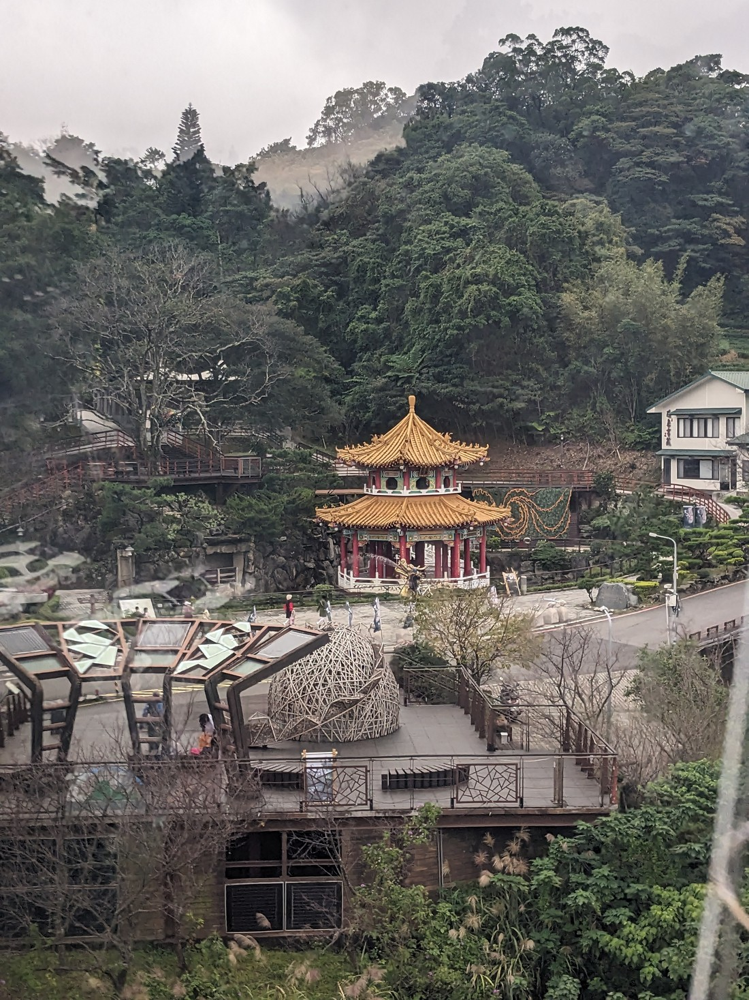

We finally arrived at our Taipei hotel at around 3-4 pm (it actually took almost an hour just to get from the airport to the hotel) and we were so exhausted from our journey that we slept on and off for the rest of the night, and then didn't get up until the next morning. Good thing we had a buffet breakfast - we were there when it opened at 6.30am and proceeded to eat so much that we ended up not needing lunch later.

> Welcome to Taipei. View from hotel room, 29 floors up.

The plan was to spend the day at Taipei zoo. The online reviews describe it is as busy and very big, maybe too big for families even. The main attraction was of course, the pandas. Initially we wanted to take public transport but it would have involved navigating stations and changing lines, and Google estimated it would take an hour. So we opted for a taxi instead, which was definitely much more pricey but took only 25mins, which was good as we arrived just as the zoo was opening.

The zoo is on a bit of a hill (80% of Taiwan’s landscape is hills or mountains). The internet recommends taking the zoo shuttle to the top and then walking downhill back to the entrance. Very sensible advice, except the two things I wanted to see the most, the giant pandas and pangolins, were nearer to the entrance so we didn't opt for the shuttle ride (and also save us the 5 bucks per ticket).

Because we got there early, it didn't feel too crowded. We made a beeline for the pandas and yes, they were indeed super cute, munching away on the bamboo.

Happy with what we saw, we moved to the pangolin exhibit. The enclosures were very sizeable with lots of potential hiding places so unfortunately pangolins weren't spotted.

I think another reason it didn't feel so crowded was because people were instead gathered at the large entrance plaza to watch an all-girl dance group, and also a children's orchestra on a different stage. I had no idea why they were there, and also no idea why people would bother watching that when they’re at the zoo?? But if it meant we didn't have to be elbowing other people to get good views of the pandas then I wasn’t going to complain.

However it definitely got much busier after noon. We tried to go through the indoor reptile/amphibian exhibit but this proved to be near impossible. The first issue was the numerous strollers blocking the already narrow walkways and causing bottlenecks. They really should ban those from that particular exhibit and provide stroller bays outside. The other problem is that the type of creatures here are typically stored in tanks with small viewing windows, and are also often difficult to spot. Cue long queues (haha) waiting for your turn to get a look in. We got outta there quickly.

Another highlight was the impressive Pangolin Dome, which is a tropical rainforest area. Confusingly the pangolins aren’t housed here, it’s just named as such as it was designed to resemble the shape of the Formosa pangolin.

It's a beautiful zoo, with very forest-type surroundings. We saw almost everything, not counting the animals that were out of sight. It’s hard to compare the size with other zoos I'd been to, but we spent 4 hours here and didn't do much double backing. It was definitely worth the TWD$60 / NZ$3.15 ticket price.

We still had more energy as we exited the zoo. The Maokong Gondola was conveniently located 5mins down the road so off we went. The ride took about 25mins, endpoint being a small village with some old temples and tea farms. We didn't try the tea the area is renowned for but did grab an early dinner.

> Taiwan’s most famous attraction in the background, the Taipei 101 tower.

Fun fact: Maokong literally translates to cat void (according to mum). It doesn't make sense as there were lots of cats around, and lots of cat-themed eateries. One place offered cat-shaped toast, which made me wish we had explored more options before choosing where we ate. We puzzled over the meaning of maokong but I guess we'll never know.

After having a stroll around we took a taxi back to the base of the mountain and then back to the hotel.

The last thing I had planned was to go see a Xmas light show display. This time we thought we'd take the train. It was so much cheaper than the taxi, but we were packed in like sardines. It was very nerve wracking for me, post pandemic.

We were grateful to get off after just one stop but unfortunately it didn't get much better. The lights were situated around the station but the crowd was crazy, I couldn't believe it. We held on to each other so as to not get separated and lost. There were traffic marshals blowing their whistles non-stop, they were just directing as the traffic lights were indicating but I guess they could enforce it better. So we went around the block and had enough. It actually took ages cos of all the people.

I was pleased by how much we packed in today given that we had somewhat lost a day to recover.
