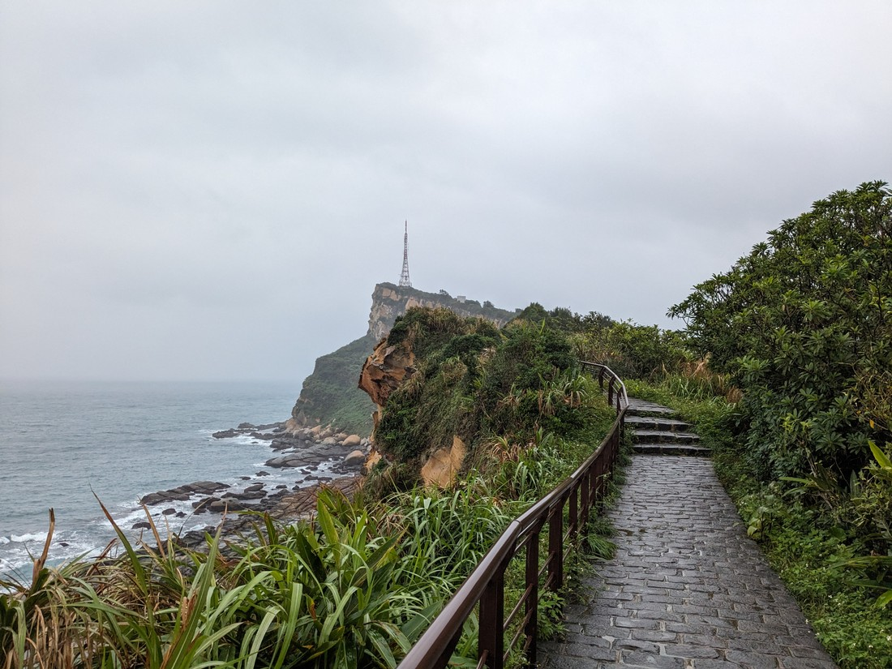
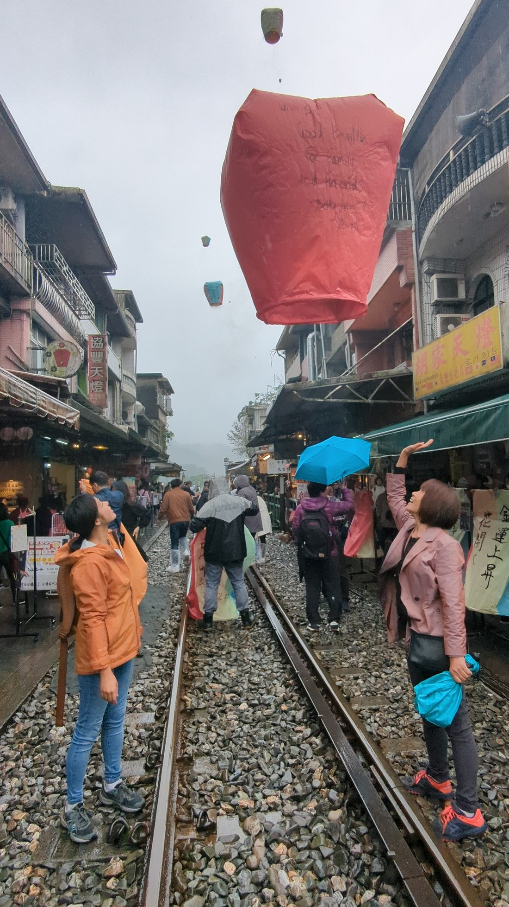

Today's the official start of tour. Unexpectedly it was only us two, essentially a private tour. We were picked up and driven to Yehliu geological park, a northern coastal area featuring interesting rock formations caused by wind and sea erosion.

> The most famous one is the Queen's head

We then to Jiufen, an old village with interesting history. It used to be home to people working in the gold and charcoal mines but over time they all moved on, reasons being:

1. Job is dangerous and low paying
2. No dating prospects nearby
3. They ran out of gold to mine
4. They can just buy charcoal from Australia

People moved away and it became a mostly abandoned city, but in recent times the government has tried to convert it to a tourist attraction. Locals and tourists alike flock here for the multitude of shops in these narrow alleyways selling Taiwanese food and souvenirs. I can sort of see the charm, but we did find the crowds overwhelming. The steady rain was not ideal as umbrellas and narrow alleyways don’t make a great combination.

We stopped in one of the shops to have a snack, but mostly just to sit somewhere to take a break from the people and rain. Our tour guide allocated way too much time to spend here, perhaps not knowing that we’re not really shoppers. It was a really nice place too – downstairs was too busy so we were taken upstairs to a tiny area that had only 3 tables, and it had the feel of a traditional old tea house. There were also rooms down a hallway, so I guess the place doubled as a BnB. I wish I had taken a photo here, but the space was so tight and I didn’t want to be encroaching in other people’s spaces. There were more stairs going up and I spotted a sign there with instructions on how to use an emergency escape sling. I guess the nature of compact housing here means there isn’t enough space to build proper fire exits? Anyway we had some of Taiwan's famous milk tea. Again we had stuffed ourselves at the buffet breakfast so we weren't too hungry.

The next activity was to do with sky lanterns. Traditionally they are released during lunar new year, where you write your wishes on the paper lanterns. Then they are then lit on the inside, and released in to the night sky above. Of course, now they have government permission to do this everyday in order to bring in the tourists. I asked the tour guide whether this created a lot of trash, as I could see bits of old lanterns lying in the river and banks. He informed me the lanterns are made of bamboo paper and are organic, but it still seemed a bit wasteful to me. It really wasn’t a great look for the environment (literally).

> Goodbye, hopes and dreams! Just kidding, supposedly this is how to make them come true.

Oh, and apparently these train tracks are still in use - the tour guide warned us we need to get away quickly if we hear the trains coming. Luckily this didn't happen but it seems a rather perilous situation for such an innocuous activity.

Last stop today is the Shifen waterfalls. They were ok, but not particularly special. After a wander around it was back to the hotel.

After a rest we went out to dinner at a nearby restaurant. Here I noticed something odd. What appeared to be a regular cabinet actually housed a small hole in the wall, other side of which was the kitchen. We watched as the meals were passed through, picked up by the waitress standing by and brought to the tables. It was a very filling meal and very reasonably priced, about TWD$280 for the both of us. It was such a nice change from North America. And best of all, no tipping!!!
