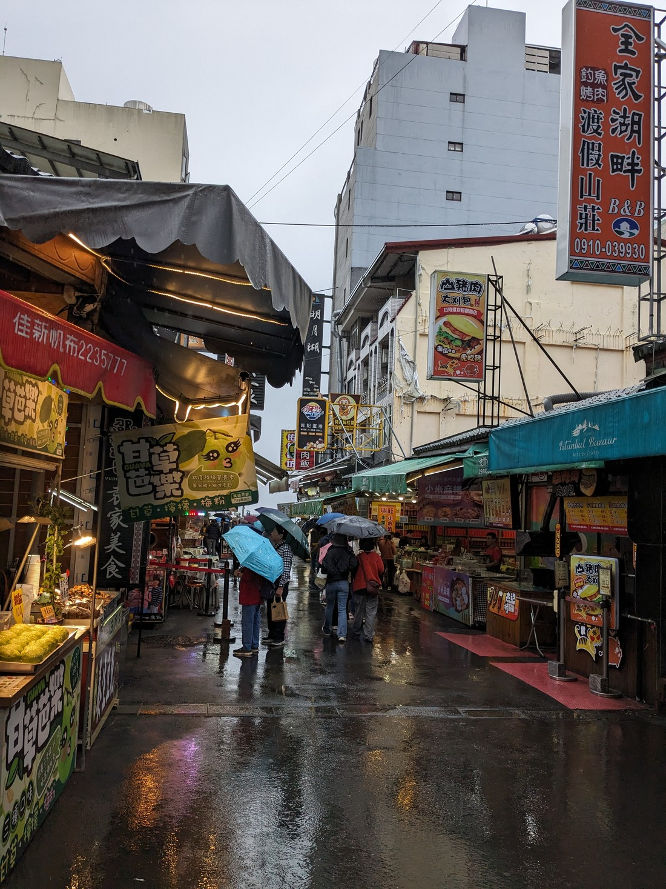
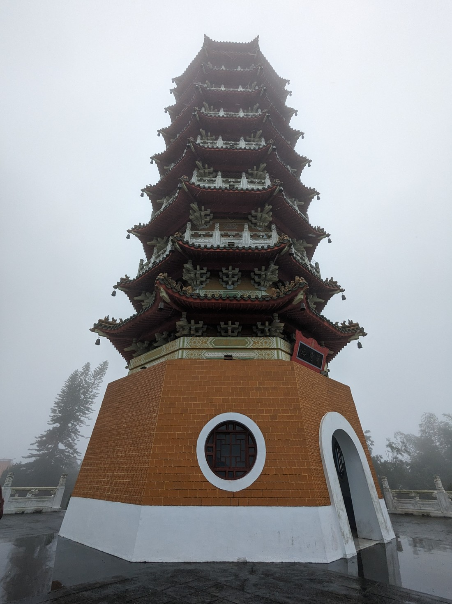

OK so it turns out that the trip is essentially split into two separate tours. Yesterday was just a 1-day tour, and today is the beginning of a 5-day tour. And no, it wasn’t just the two of us. This time, we were on a big bus with 35 people in the tour group, plus tour guide and driver. Unexpectedly the bus had free wifi, hooray! This was so nice to have. It meant I could message Luke every now and then. Because by the time we get back to our hotel at the end of the day it is way too late in NZ to talk.

> They have fancy powerpoint presentations on tours now. These were actually really good though.

First stop was a shop specialising in Taiwanese sweets. The advice from the tour guide was to try lots of the free samples and then pay for a smaller lunch later, haha. I don’t know about the others but Mum and I weren't too greedy, we just tried the pineapple pastry and lemon cake. Both were delicious but the lemon cake was the best – I don’t know if it had been chilled or something but it had almost an ice cream-like texture to it. Yum.

Next was Sun Moon lake, Taiwan's biggest freshwater lake. Located in the centre of the country, it's also home to the indigenous people, of the Ita Thao tribe. It looked like it would be beautiful on a fine day.

> Not today

It reminded me of Queenstown, it even had a gondola going up one of the hills. We were advised to get lunch here. The food shops were reminiscent of yesterday's old style shops, albeit the paths weren't as narrow.

> Doesn’t the zucchini look so lame compared to the options? Though I’d probably choose that over the cuttlefish sausage, I don’t know what that is and it looks weird

Taiwan is famous for its street food and night markets, but we had been avoiding these due to our dislike of crowds. Today was the day. The tour guide gave a few recommendations, one of which is a chicken wing stuffed with rice. We spotted this so decided to give it a try. I have no idea how they stuff a wing but it was delicious. I think it's grilled but not sure. They sit cooked in a warmer, and when you want one they cut slits in the wing to expose the rice inside and then add seasoning and chopped spring onions. So good. And only TWD80 bucks each! We walked to the pavilion so that we could eat sheltered from the rain. Not much of a view.

> Where have you been all my life??

Still peckish, we walked around some more and spotted a stall selling cakes with custard filling that are baked then grilled, we think? They were nice but nothing special.

Next stop around the lake was Ci'en pagoda. We had to walk many steps to get to it but It was nice to get some exercise. And then more steps to get to the top of the pagoda.

> Ci’en pagoda

> View from the top. On a clear day Sun Moon Lake would be visible.

Followed by a Xuanzang Temple, which is a holy monk shrine. It wasn't actually that interesting so I’m not going to say much about it. The rain did cease a bit here though, so here’s the clearest shot I got of the lake:

The last stop was a different story. This Wenwu temple was so beautiful to look at. I have no idea how this one compares to others like it but I was so impressed.

I don’t think I successfully captured all the details or the grandness of the place. I’d say it was the highlight of the day (ok ok, second best after the chicken wing). There were shrines dedicated to the god of literature, gods of war (apparently not like battle war, but like competition i.e. business owners come here to pray for victory against competitors), and confuscious. But like so many other global attractions these days, this temple only became famous and popular after it was showcased by social media influencers. Specifically, by “Followme to”, with this photo:

This previously lesser known spot is now visited by many who try to recreate that shot.

> Our version.

As we were heading back to the bus a wild monkey walked right by us on the fence too, jumping from post to post. It was really cool to see. I later learnt that it was a Formosan rock macaque.

By the time we got to our hotel in Taichung it was already 6.30pm. The first part of the travel took 30mins longer than expected due to heavy traffic on the freeway. We had a quick rest, and then headed out to grab a quick dinner. After which, we went to check out the nearby rail stations. The old and new are right next to each other. The old one is almost 100 years old. I wanted to see more of the inside, but decided against after seeing it's now home to the otherwise homeless.

New station in contrast:

There were some cool arty looking installations around too.

> An old train converted to an information centre

Taichung is the third most populous city and from what I've seen I much prefer it to Taipei, probably because it didn’t feel nearly as crowded.
