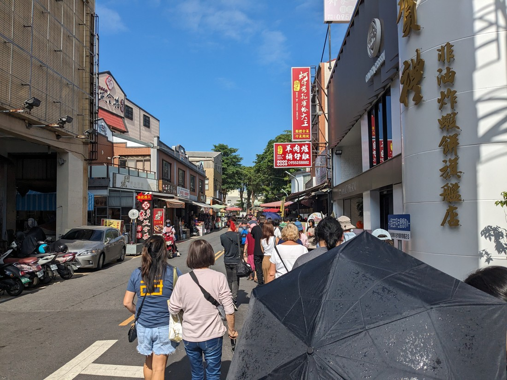

Today we drive south to Tainan, Taiwan's oldest city. It was once the capital city and it will be 400 years old in 2024. We’re here to visit Anping fort a.k.a. fort Zealandia. It turns out Taiwan was occupied by the Dutch in the 1600s, and this was built by them. It was the Sika deer that drew them here. The Sika deer were hunted for the skin/pelt, which was sold to the Japanese who used it to line helmets and armour because of the softness. Later on, the fort was almost entirely destroyed by the British, before being rebuilt by the Japanese. Yeah, Taiwan’s history is rather complicated. On a side note, evidently less is known about Taiwan’s past prior to Dutch colonisation because they lacked reliable tools for documenting things.

> Anping Fort. Just like these school kids we’re also getting our history lesson here too, albeit not in uniform.

This brick wall is all that’s left of the original fort that was built:

You'd think that the mortar would be made from cement, right? Well, sort of. The mortar here was made from a mixture of sand, sugar, glutinous rice, and crushed oyster shells (which you can actually see up close) Supposedly it’s longer-lasting than modern day cement. I wanted to know if said recipe would attracts ants, but was I about to ask that question in front of everyone? Nope.

Now might be a good time to describe the tour group. Since we've now spent more time together I can tell you that there’s people from Japan, Singapore, USA, Canada, Australia, and Sweden. I'm going to guess our ages range from 25-75, median being 45-ish, maybe. A very diverse bunch anyway.

> Don’t bother trying to spot me, I was there but I decided to hide

Afterwards, we walked around the surrounding so called Anping Old streets, ate snacks and had more milk tea.

> Beef dumplings and taro cakes.

Second and last stop is the Fo Guang Shan buddha museum, featuring the highest sitting statue in Asia. Buddhism is the predominant religion in Taiwan, followed by Taoism. Only 4.5% of the population is Christian, and the majority of the younger demographic identify as non-religious. Or as the tour guide put it, the internet is their religion. I was surprised to learn that the nun to monk ratio here is 10 to 1.

Then it was off to our hotel for the night in Kaohsiung, which happens to be the 4th tallest building in the city. We had dinner and then went off to bed.

Not so much to report today. I’m not sure I would have picked the same attractions myself. And whilst informative, there's only so much about history and religion I can take in before I start to tune out. Also, I was very tired from not sleeping well so perhaps that didn't help.

Another factor was the weather. On the first day, at the zoo, the weather was perfect: Overcast with very light drizzle, so very comfortable temperatures for lots of walking. Then we had two days of horrendous rain that didn't really let up (though this is considered the dry season and apparently the rain is even worse in summer). And yes we did go from northern to southern Taiwan, but I still hadn't anticipated the sunny day with balmy temperatures in the high 20s. Not a good day to be wearing jeans like I was, but oh well.

I’ll finish this blog entry with a couple of tidbits. Firstly, the toilets. All the public toilets we've been to so far have been pretty clean. Probably because the tour company knows where all the good ones are. And they're very considerate in this regard - they plan stops so that there’s at least one every 1.5 hours. Most public bathrooms have both sitting and squatting options. And unlike the ones in north America there are no big gaps in the doors, yay. Squatting toilets can take getting used to but in a way they feel more hygienic because no part of you is touching anything. Even flushing is often done by stepping on a pedal, rather than pushing a button. Infact, we were gathered at the visitor centre listening to the tour guide when we suddenly hear an alarm go off - someone in the ladies bathroom mistook the emergency button for the flush button. I imagine the so called squatty potty might not be very comfortable for those with weak knees though.

Sometimes there would be no toilet paper available inside the stalls - there'll be one big roll at the entryway for you to take from as you go past. I guess it's to help save paper, but I always take more than I think I'll need cos it’s better to be safe than sorry.

All the hotels we've stayed at so far have had bidet toilets, and I know they are typical in Japanese households so I wonder if it's the same here. I finally tried the washing function (not today, but later on) and while it took getting used to, I did end up using it frequently. I even got used to the heated seating, which I initially hated.

The second tidbit is to do with the shopping receipts.

They all have a lottery number, and a draw takes place every 2 months. The prize is TWD$10 million, or 8 million after tax. I don't know what the chances are of winning, other than that they are miniscule. The tour guide also says it's nowhere near enough to buy property in Taipei. For context, he lives in the very outskirts of Taipei and his condo unit cost 13 million. The lottery was designed to encourage the keeping of receipts as part of the ministry's efforts to prevent tax evasion by vendors. So a virtually-impossible-to-win prize that's not huge anyway... Do the locals really store all their receipts, then once every 2 months go online to look up the winning number, and then check their receipts to see if any match? I don't know the answer but I know we didn't bother keeping ours.
