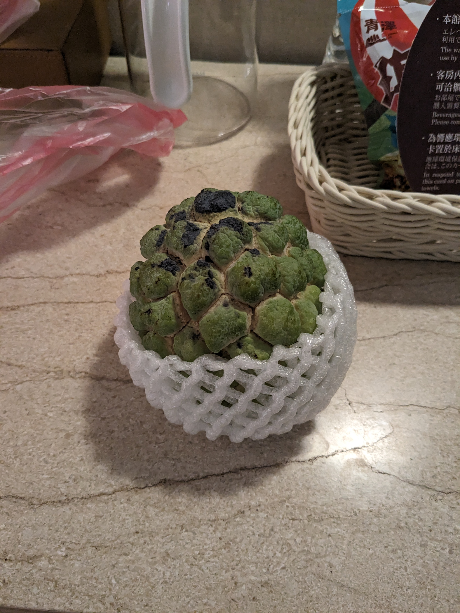

Good morning, Kaohsiung City.

> Morning view from hotel room

Today we travel to Kenting National Park, and to Taiwan's southernmost point. First stop is to see the Cat Rock, a piece of coral rock at a peninsula that has broken off and is now shaped like a cat… Looks like we’re gonna need a lot of imagination today, folks.

We then drove further before stopping at Kenting bay for lunch. There really weren’t a lot of options here. Sure here were lots of restaurants, but they didn’t seem to open till later. Eventually we just settled for whatever we could find that was reasonably priced. Mum had some Korean noodles and I had a Taiwanese platter, which consisted a Corn salad, fries, Taiwanese sausage, radish cake and Taiwanese omelette.

We still had some time to kill before going back on the bus so we walked around the area.

> Spot the two macaques

Next stop was Sail Rock, which had the same story as Cat Rock except it’s shaped like a ship sail, of course. I think this one’s actually even worse than Cat Rock, in terms of likeness.

Finally we made it to Eluanbi cape, Taiwan’s southern-most point. The lighthouse is the oldest and brightest on mainland Taiwan (turns out Taiwan isn’t just one island, who knew), and is still in use today. It was built by the British empire under the Qing dynasty, and it was fortified to prevent attack by the indigenous people.

The last stop is Longpan Park, known for its slumping cliffs caused by the waves from the Pacific Ocean.

Then it was time to get to our next hotel, 2.5 hours away. It was a nice scenic drive along the east coast, but we’re just so spoilt with similar but better views in NZ so I didn't quite feel as wowed today.

There weren't many dinner options. Buffet dinner at the hotel, Family Mart (a convenience store), or a restaurant specialising in indigenous Taiwanese cuisine. We went with the last option. It was ok, a bit different but it was good to try.

The local folk here are so welcoming. One elderly man (I think he was of indigineous ancestry) came over for a friendly chat and asked us where we were from etc. He hadn't heard of NZ and when I said it's next to Australia he asked why I didn't have yellow hair. I guess dad humour is common everywhere. The tour guide said it used to be that the tribal people would hide their ancestry because they were looked down upon, but nowadays they are very proud to be known as such.

On the way back there was a street stall selling locally grown fruit known as custard apples. I'd never heard or seen it before. We bought one to try and man, it tasted amazing. The flavour is really hard to describe, other than sweet. I guess a mix between a pear and feijoa might be close-ish. It also has a very mushy texture. You just peel bits of it away and take bites of the inside, spitting out the seeds. It’s a little messy, but so good.

> Steam rising out of the ground vents

Our hotel is actually a hot spring resort located in Zhiben, a city renowned for its carbonate hot springs. I guess it's nice to be able to have a soak in the privacy in your own room, but it feels so solitary. You can't relax and chat together. And the bathtub feels awkwardly small. I couldn’t submerge my legs and upper body at the same time, so every now and then I’d shift around to switch it up. Maybe that’s why they provide a cute koala bath toy that bobs around in the water with you (and doubles as a temperature sensor).

