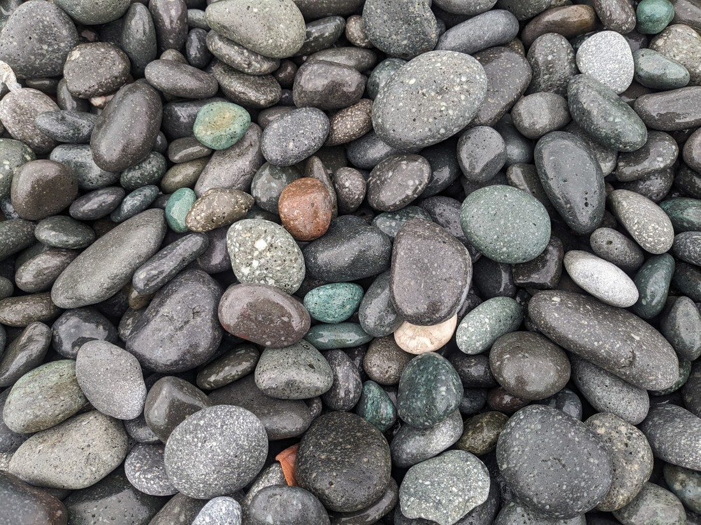

This morning I went for a short walk to check out the area, since we arrived late last night and couldn’t really see anything.

And before we left on the bus for the day we made sure to buy another custard apple from the same lady at the road side stall.

Today we are making our way up the east coast and making stops at places of interest along the way. The first is Little Yehliu park, which is basically a coastal scenic area featuring some rock formations similar to the ones we saw at Yehliu Geological Park, hence the name. It is also a conservation area for the hermit crabs.

Due to the limited food options at where we’re going to be around lunchtime, the tour guide advised us to buy some steamed buns at the nearby restaurant to takeaway with us (Family Mart was also an option). I got one with pork and bamboo, and one with pork and pickled mustard. These were so yum! They were supposed to get eaten later but pretty much everyone started eating when we got back on the bus – they just smelled so good, and plus they weren’t gonna be nearly as nice when cold.

The next stop was the Three Immortals Rock, which sits across from an 8-arch bridge that was designed to resemble a Chinese dragon. It’s actually really cool. Unlike yesterday's rock formations which were coral rock, today's are made of volcanic rock.

It’d be even more cool to walk across - I think there’s short walks and a lighthouse on the island - but access is no longer permitted following a serious earthquake last year.

Remember magic rocks? I don't recall the name of these pebbles but they also change colour when wet. Unfortunately we’re not allowed to take anything from the area.

At the next stop we visit the Stone steps, which are essentially just potholes in the rock.

This area is also known as the Hawaii of Taiwan because of the likeness of the mountains.

> I can kinda see it

Then it was back on the bus to an area called Fanshuliao, where we stopped to admire a gorge. I don’t quite remember the significance of the bridge – I think we’re meant to be able to see the contrasting landscapes on both sides or something, but it just looked like a normal gorge to me.

So I didn't really care for Taipei but I have to say Taiwan's east coast is rather nice. It makes for a very nice scenic drive, overlooking the Pacific ocean.
The next stop was a marble factory and showroom which was essentially a big sales pitch for jewellery and carvings. The less said about this stop the better, really. It started out with a lady giving us a “tour”, talking about the marble and greenstone that the area is renowned for, and then showing us some jewellery and teaching us how to spot the fakes from the genuine pieces. Then we got to taken through to this huge shop, where there were dozens of uniformed sales staff waiting to pounce. It almost felt like a horror film - they definitely had an intimidating hungry-for-prey look in their eyes. Not even exaggerating.

> Doesn’t this look like it’s from a horror film?

Mum and I got out of there quickly, and I walked around the parking lot until time was up. I feel like they really ought to drop this stop from the tour itinerary. We definitely weren’t interesting in this kind of shopping and it took time away from seeing other, better sites. This seemed so obvious to me but I later found out that other people in our group did indeed make purchases. I don’t know how many but clearly not everyone felt the same way as me and they did get some value from the visit. And yeah I guess I did end up talking quite a bit about it, oops.

And finally, last stop of the day – we’ve had so many today I know, but this one was really something. We drove into Taroko Gorge to visit the Eternal Spring Shrine. This was built as a memorial to the 225 workers who died in the process of constructing the central cross-island highway, also dubbed the miracle highway. It’s not hard to see why – it’s almost 200km long and runs through the central mountain range, hugging the cliffside. The perils of rock fall are always present.

This attraction is the most recognisable of Taroko Gorge, perhaps thanks to an anniversary Google doodle from a few years ago:

This place is absolutely stunning. I've seen many amazing canyons and gorges and I didn't expect to be so wowed, but it really was a sight to see. It's a shame we got there around 4pm, so it was already getting dark. The good thing is we'll be exploring more of the park tomorrow.
