Last day of tour today, yay. And it looks like they saved the best for last.

The first stop is Cimu bridge in Taroko Gorge. Remember these guys?

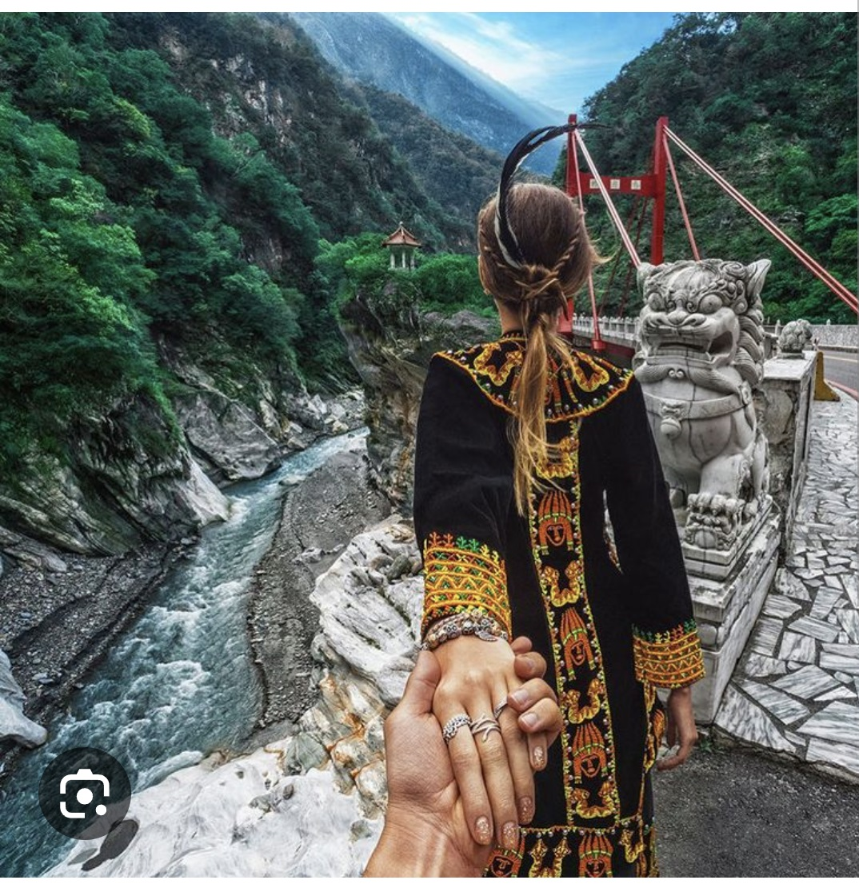

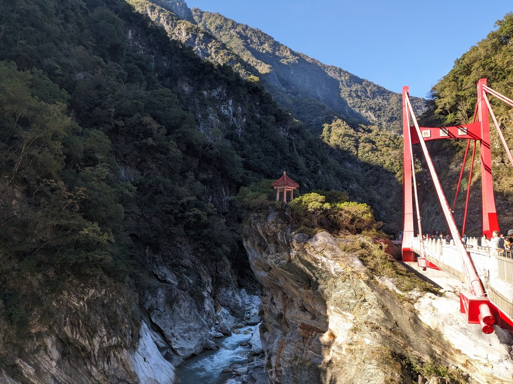

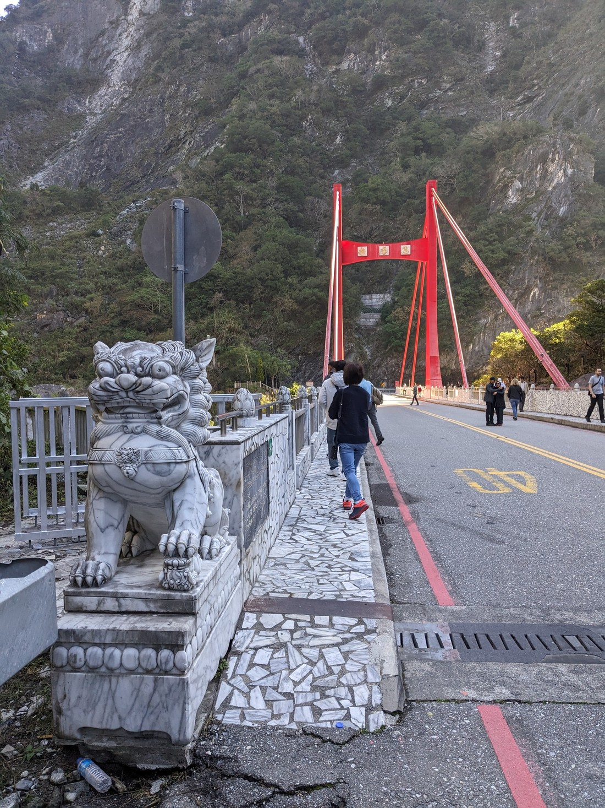

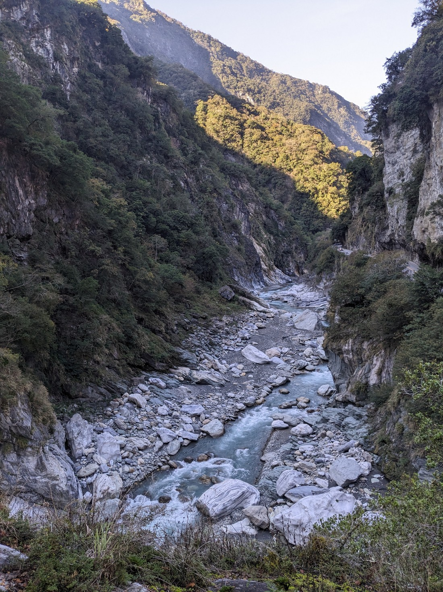

After that we visited the Tunnel of Nine Turns. It’s a trail along an old road, which makes for really easy walking, and really showcases the marble cliffs.

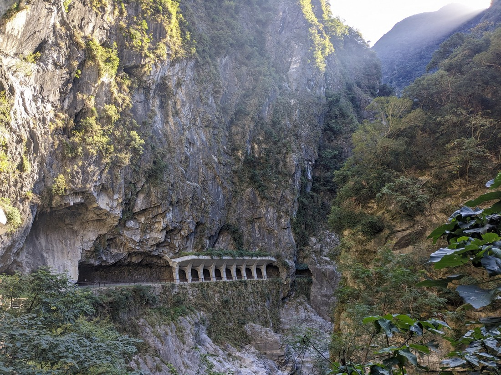

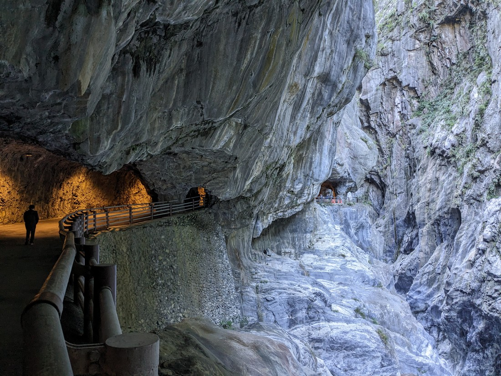

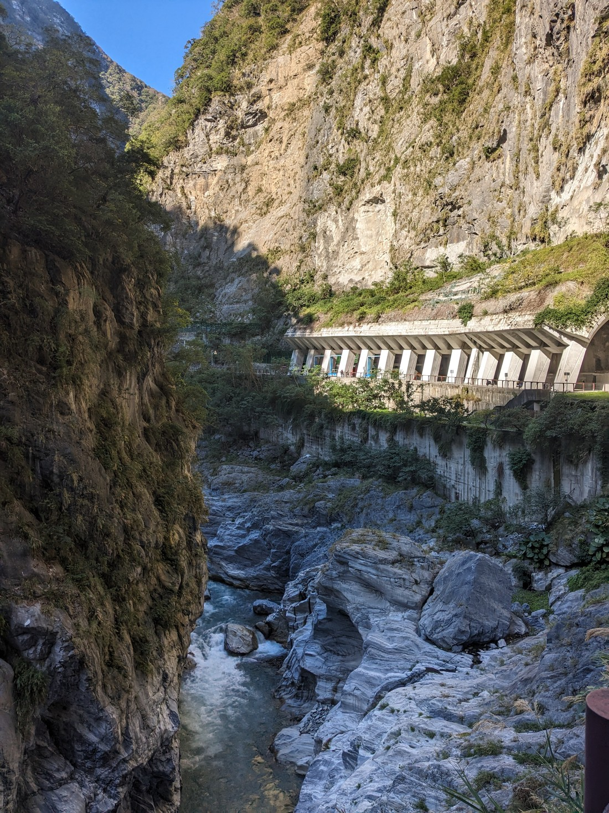

Then we drove further on to walk the Swallow Grotto Trail.

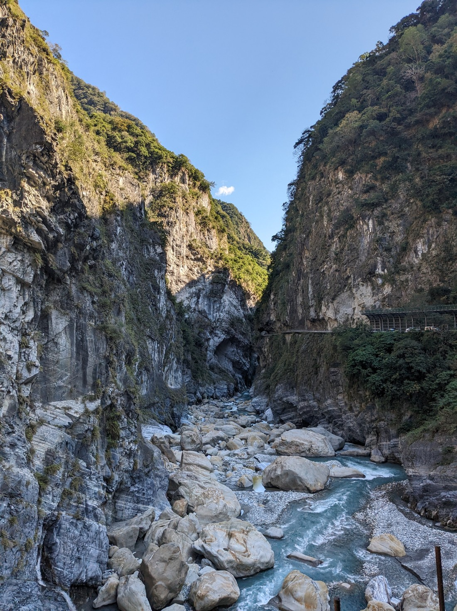

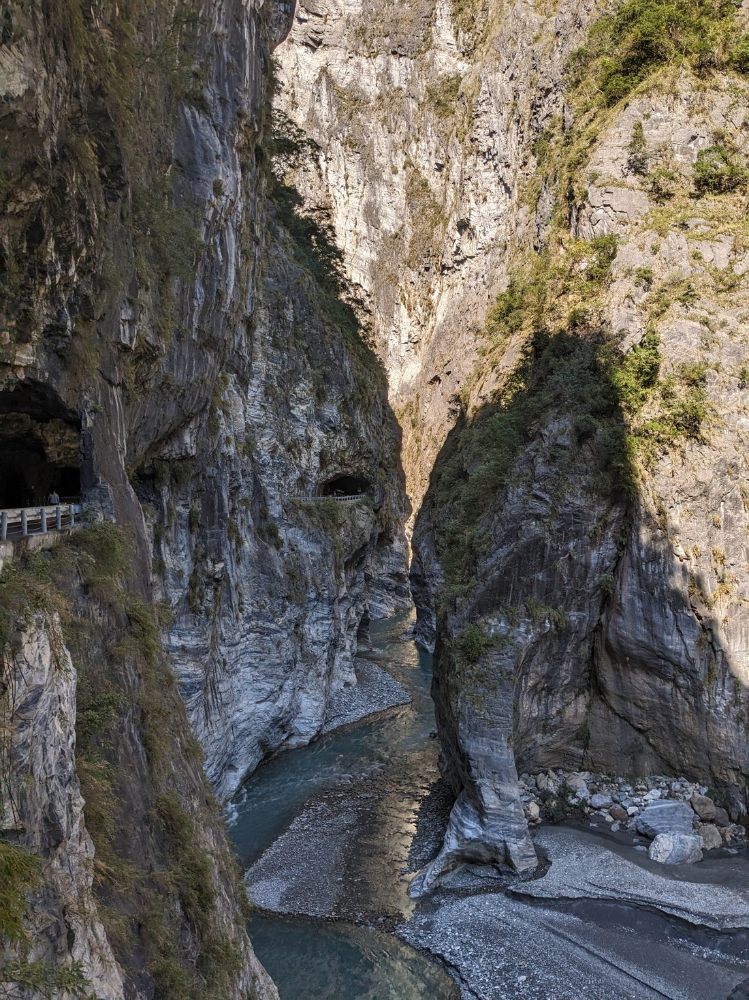

Then we went to Buluowan Suspension Bridge. It didn’t feel like one though, it felt very sturdy and there was a visitor counter to make sure we don’t exceed the limit of 280 people. I was talking to one other tour member from Sydney and she expressed disappointment that it wasn’t shaky, much to my amusement. She really likes suspension bridges and supposedly they don’t have any in Australia. She said she really enjoyed the Capilano suspension bridge in Vancouver, which Luke and I never ended up visiting due to crowds and cost.

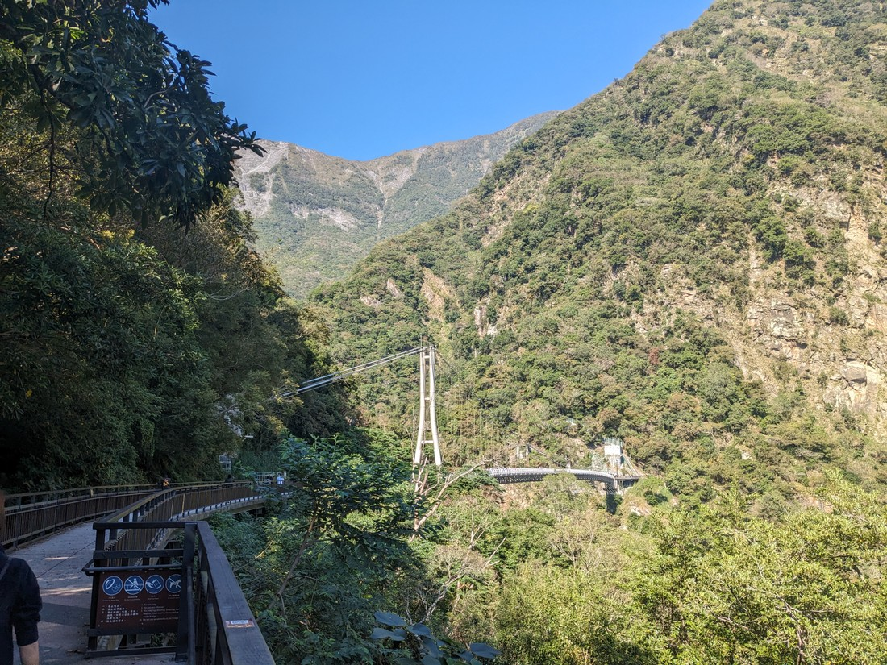

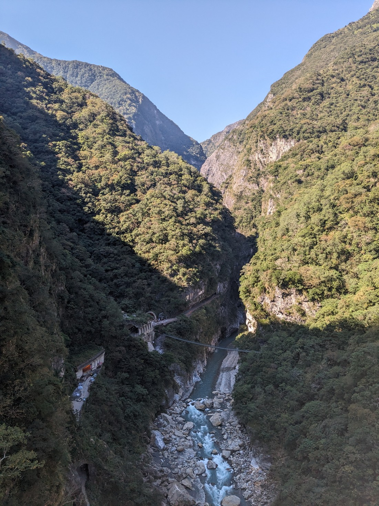

> The lady might have enjoyed this bridge more

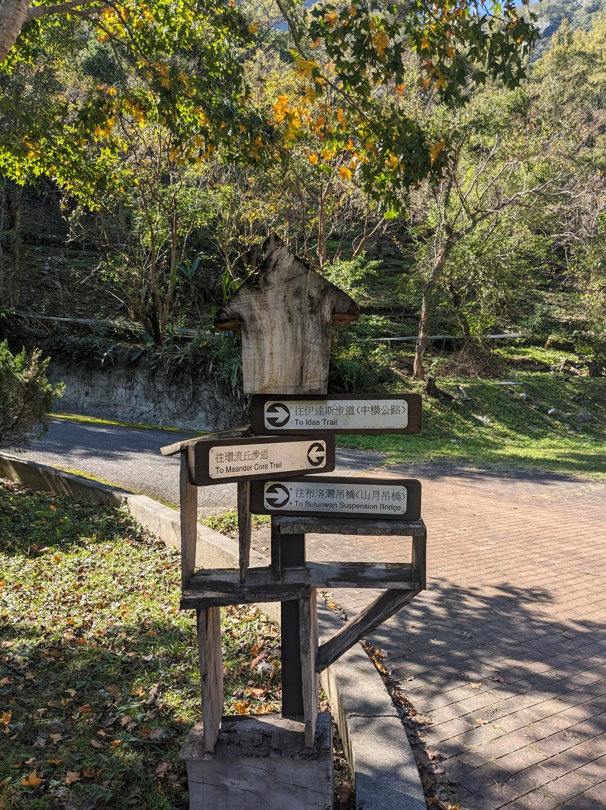

> Oh national parks, it hasn't been that long but I've missed you so.

Seeing these signs made me a bit sad to not be able to explore the other trails. You don’t get to do that when on a tour, and actually our tour guide was always conscious of people’s abilities, telling us how many steps there would be etc. He’d often say, “Don’t worry there’s no/not many steps today”, which pleased others but I did miss doing walks in national parks.

After this it was time for lunch. Again, our options were rather limited. There was a Family Mart down the road, or this one restaurant. Now we’ve been in this situation before, but what was different today was that this restaurant only had big tables so we were forced to sit with others. It was a bit of a shame we didn’t do something like this sooner, as the people we sat with were so nice and it was interesting to hear about their different backgrounds. We shared a table with two young Singaporeans from our group, and an Italian couple who were originally from Rome but now live in Prague. I’d have said maybe they were my age but who knows, as they did later reveal they had a 10 year age gap. They’re from a different tour group but doing the same tour, as we would bump into each other at the same stops. They ended up being a bit late back to their bus due to the restaurant being so busy with multiple busses stopping there at the same time. It took us probably fifteen minutes to queue to order and then longer to get our food.

Something I also found really interesting from our conversations was that they’d all been on many tours and consider it the best way to travel. They talked about how it takes the stress out of planning, how it would have cost more if we were to organize the same hotels and activities ourselves, and the journeys would have taken longer. I’m still on the fence – I can certainly see the advantages, like in addition it felt safer (especially so if you’re not familiar with the main language), and ideally you’d get to meet friendly people as well. But I don’t know that it would be my go-to option, and I do feel like you pay a premium for it.

Later on I mentioned to the two Singaporeans, who knew each other from school, that I thought it was so nice that they travel together as friends. They replied that it’s so nice of me to travel with my Mum, which made me laugh. That was really nice to hear, I’m not sure she’s as grateful. There were a few other parties in the tour that were (adult) children and parents though.

Anyway our last stop Qingshui Cliff, which was just a quick stop really.

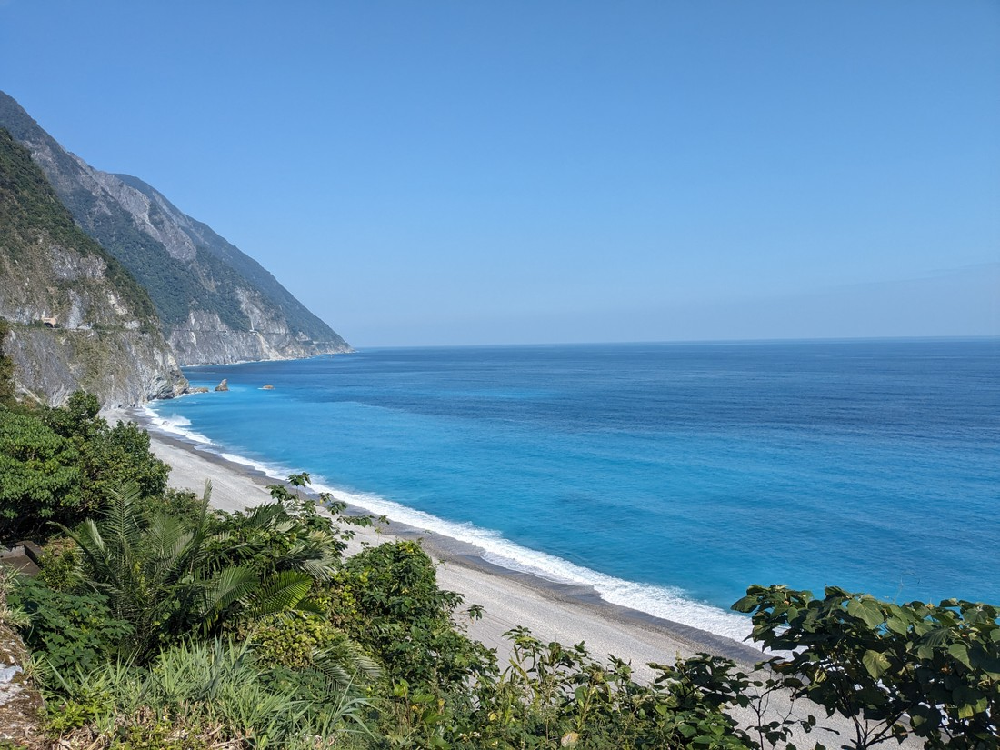

It's worked out really well that we sat on the right hand side of the bus, as everyone stayed in the same seats the whole tour. We definitely had the better views as we were driving alongside the Pacific Ocean for so much of the last couple of days.

We returned to Taipei and that was the end of the tour. It was really nice to visit a national park that evoked the same feeling of being in parks in North America. I felt like there was so much more to explore though… why are we returning to our working lives again? Oh that's right, money. Let's visit some more parks when we save enough money again - hopefully with Luke in tow.
