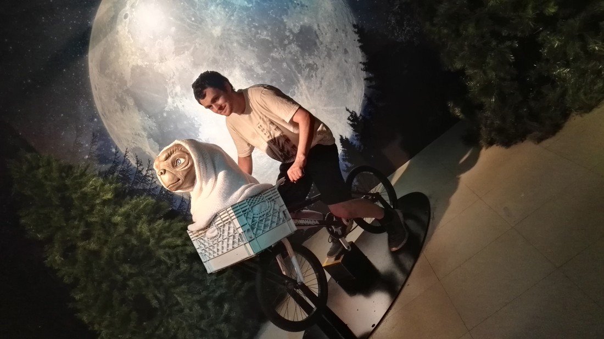

> Hu Jintao (I think)

> Her majesty Queen Elizabeth II with William and Kate, Prince and Princess of Wales

> Elizabeth (no last name)

> His holiness the Dalai Lama

> Albert Einstein

> Layne Beachley

> Sally Pearson

> Yao Ming

> Jonah Lomu

> Katy Perry

> Taylor Swift

> Rove McManus

> Ray Meagher as "Alf Stewart"

> Steve Irwin

> Alfred Hitchcock

> Bruce Willis as "John McClane"

> Mel Gibson as "'Mad' Max Rockatansky"

> E.T. the Extraterrestrial

> Jackie Chan

> Barrack Obama

> Ryan Gosling

> Leonardo DiCaprio

> Chris Hemsworth

> Brad Pitt

> Angelina Jolie and Johnny Depp

